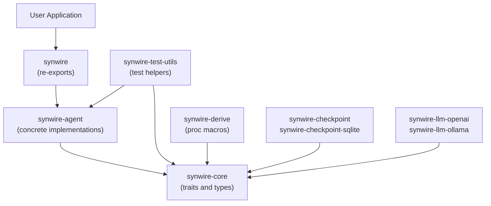

# Crate Architecture and Layer Boundaries

Synwire is a workspace of cooperating crates. Understanding the boundaries between them — what belongs where and why — clarifies how to add new functionality, how to write tests that do not pull in unnecessary dependencies, and how third-party implementations of backends or strategies relate to the rest of the system.

## The Layer Model

The workspace is structured in three functional layers:



The arrows represent dependency direction. `synwire-core` has no dependencies on other synwire crates. `synwire-agent` depends on `synwire-core`. `synwire` re-exports from both. Nothing in the lower layers knows about the layers above it.

## `synwire-core`: Traits and Types Only

`synwire-core` defines the foundational trait hierarchy and data types that the rest of the system is built on. It contains:

- **`AgentNode`**: The trait for a runnable agent. Any type implementing `AgentNode` can be used as a node in an orchestration graph.
- **`ExecutionStrategy`**: The trait for controlling which actions an agent may take and in what order. `FsmStrategy` and `DirectStrategy` are not here.
- **`Middleware`**, **`Plugin`**, **`DirectiveExecutor`**, **`DirectiveFilter`**: The extension point traits for cross-cutting concerns.
- **`SignalRouter`**, **`ComposedRouter`**, **`SignalRoute`**: The signal routing types.
- **`SessionManager`**: The trait for session persistence, with no concrete implementation.
- **`Vfs`**: The trait for file, shell, and process backends.
- **`McpTransport`**: The trait for Model Context Protocol transport adapters.
- **`AgentError`**, **`ModelError`**, **`VfsError`**, **`StrategyError`**: The error type hierarchy.
- **`Directive`**, **`DirectiveResult<S>`**: The algebraic effects types.
- **`PluginStateKey`**, **`PluginStateMap`**, **`PluginHandle<P>`**: The plugin state isolation types.

`synwire-core` is annotated `#![forbid(unsafe_code)]`. It compiles with zero `unsafe`. All public types are `Send + Sync`. All fallible operations return `Result`. This crate is suitable as a direct dependency for anyone writing a third-party backend, strategy, or middleware — they get the abstractions without the implementations.

## `synwire-agent`: Concrete Implementations

`synwire-agent` provides the concrete implementations of the traits defined in `synwire-core`:

- **Strategies**: `FsmStrategy`, `FsmStrategyBuilder`, `FsmStrategyWithRoutes`, `DirectStrategy`.
- **Backends**: `LocalProvider`, `GitBackend`, `HttpBackend`, `ProcessManager`, `ArchiveManager`, `Shell`, `CompositeProvider`, `StoreProvider`, `PipelineBackend`, `ThresholdGate`.
- **Middleware**: `FilesystemMiddleware`, `GitMiddleware`, `HttpMiddleware`, `ProcessMiddleware`, `ArchiveMiddleware`, `EnvironmentMiddleware`, `PatchToolCallsMiddleware`, `PromptCachingMiddleware`, `SummarisationMiddleware`, `PipelineMiddleware`.
- **MCP transports**: `StdioTransport`, `HttpTransport`, `InProcessTransport`, `McpLifecycleManager`.
- **Session management**: `InMemorySessionManager`.

This boundary keeps `synwire-core` stable independently of implementation churn. The core crate can evolve its trait signatures deliberately while `synwire-agent` and third-party implementations evolve at their own pace. A third-party crate implementing a PostgreSQL-backed `SessionManager` only needs to depend on `synwire-core`, not on `synwire-agent`.

`synwire-agent` is also annotated `#![forbid(unsafe_code)]`.

## `synwire`: The Convenience Re-Export Crate

Most application code should depend on `synwire`, not on `synwire-core` or `synwire-agent` directly. The `synwire::agent::prelude::*` re-export provides everything a typical application needs: the builder, all the concrete strategies and middleware, the error types, and the test utilities interface.

The re-export crate exists primarily for ergonomics. An application that imports `synwire` does not need to know which crate in the workspace any given type comes from. It is a thin façade with no logic of its own.

## `synwire-test-utils`: Test Infrastructure

`synwire-test-utils` depends on both `synwire-core` and `synwire-agent`. It provides:

- **`RecordingExecutor`**: A `DirectiveExecutor` that records all directives received, for assertion in unit tests.
- **Proptest strategies**: Proptest generators for `Directive`, `Signal`, `AgentError`, and other public types, enabling property-based testing of agent logic.
- **`executors` module**: Conformance test suites that any `DirectiveExecutor` implementation can run to verify correct behaviour.

Because `synwire-test-utils` depends on `synwire-agent`, it is a `dev-dependency` in most crates. It should never appear as a production dependency.

## `synwire-derive`: Proc Macros

`synwire-derive` provides the `#[tool]` attribute macro (for deriving `Tool` implementations from annotated struct methods) and the `#[derive(State)]` macro (for deriving the `State` trait on serialisable structs). Proc macro crates must be separate crates in Rust's compilation model; `synwire-derive` has no runtime code.

## Checkpoint Crates

`synwire-checkpoint` defines the `CheckpointStore` trait and associated types. `synwire-checkpoint-sqlite` provides the SQLite-backed implementation using `rusqlite`. The checkpoint crates depend on `synwire-core` but not on `synwire-agent`, allowing them to be used independently by applications that manage their own agent implementations.

## LLM Provider Crates

`synwire-llm-openai` and `synwire-llm-ollama` depend on `synwire-core` and provide `LanguageModel` trait implementations backed by the respective provider APIs. They use `reqwest` with `rustls` for HTTP, and are kept separate from `synwire-agent` so that applications can choose their model providers independently of the backend and middleware implementations.

## The Key Design Principle

The layering constraint — lower layers do not know about higher layers — is what makes the system extensible without modification. A new backend implementation in a third-party crate depends only on `synwire-core`. A new LLM provider depends only on `synwire-core`. The agent builder in `synwire-agent` accepts anything that implements the relevant traits, whether those types come from `synwire-agent` itself, from `synwire-llm-openai`, or from the application's own code.

This is not just an architectural preference. The `#![forbid(unsafe_code)]` annotation on `synwire-core` and `synwire-agent` means that neither crate can accidentally pull in unsafe behaviour through a dependency on a higher layer. The constraint is enforced by the compiler, not by convention.

## Example: Implementing a Third-Party Extension

The layering constraint is enforced by the dependency graph. A crate that implements a PostgreSQL-backed `SessionManager` only declares a dependency on `synwire-core`, not on `synwire-agent`:

```toml
# Cargo.toml for a third-party postgres-session crate
[dependencies]
synwire-core = "0.1"
tokio-postgres = "0.7"
uuid = { version = "1", features = ["v4"] }
```

The implementation depends only on the trait definition from `synwire-core`:

```rust,no_run
use synwire_core::agents::session::{SessionManager, Session, SessionMetadata};
use synwire_core::agents::error::AgentError;

pub struct PostgresSessionManager {
    // postgres connection pool would go here
}

// Implementing SessionManager from synwire-core only —
// no dependency on synwire-agent needed.
impl SessionManager for PostgresSessionManager {
    async fn create(&self, metadata: SessionMetadata) -> Result<Session, AgentError> {
        // persist to postgres...
        todo!()
    }

    async fn get(&self, session_id: &str) -> Result<Option<Session>, AgentError> {
        // query postgres...
        todo!()
    }

    // ... remaining SessionManager methods
}
```

Because `PostgresSessionManager` implements `SessionManager` from `synwire-core`, it is accepted by `Runner` from `synwire-agent` without any change to either crate:

```rust,no_run
// In the application (depends on synwire-agent + postgres-session):
use synwire_agent::runner::Runner;
// use postgres_session::PostgresSessionManager; // hypothetical third-party crate

// Runner accepts any SessionManager from synwire-core.
// let runner = Runner::builder()
//     .session_manager(PostgresSessionManager::new(...))
//     .build()?;
```

The application calls `Runner` from `synwire-agent`, which calls `SessionManager` from `synwire-core`. The database implementation in the third-party crate never sees `synwire-agent`. Neither the trait definition nor the runtime need to change to accommodate the new backend.

**See also:** For the `State` trait and how it constrains `DirectiveResult<S>`, see the directive/effect architecture explanation. For how to write a conformance test for a custom `DirectiveExecutor`, see the `synwire-test-utils` reference.
