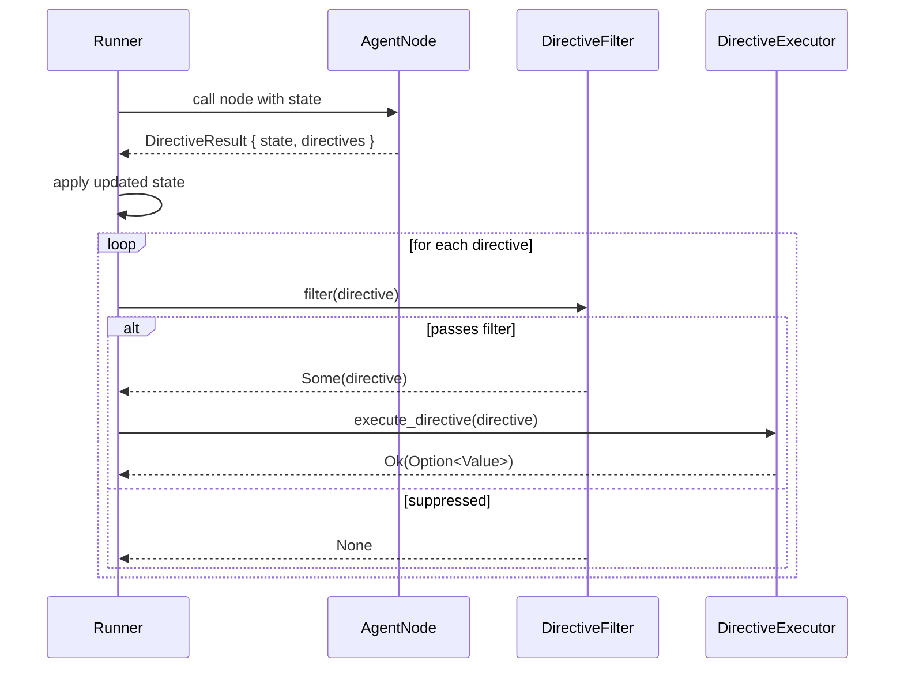

# The Directive/Effect Architecture

Synwire's agent nodes do not execute side effects directly. Instead, they return a description of the effects they want to happen. This pattern — borrowed from the concept of algebraic effects in functional programming — separates the decision of *what should happen* from the execution of *making it happen*. Understanding why this separation exists is central to understanding the design of the runtime.

## The Problem: Side Effects Make Agents Hard to Test

Consider an agent node that, in response to a user message, needs to spawn a child agent, emit a notification event, and schedule a follow-up action in thirty seconds. The naive implementation calls the relevant APIs directly inside the node function. This works, but it creates a tight coupling between the agent's reasoning logic and the infrastructure that carries out its requests.

Testing such a node requires mocking or stubbing the spawning API, the event bus, and the scheduler. Any test that exercises the decision logic also exercises the infrastructure. In frameworks where effects are expressed as untyped strings or opaque dicts, test code cannot verify that the right kind of effect was requested without fragile string inspection.

## The Solution: `DirectiveResult<S>`

Agent nodes in Synwire return a `DirectiveResult<S>`, which is a plain data structure containing two fields: the updated agent state and a `Vec<Directive>`. The node does not call any external API. It describes its intentions as `Directive` enum values and hands them back to the runtime.

```rust
pub struct DirectiveResult<S: State> {
    pub state: S,
    pub directives: Vec<Directive>,
}
```

The `Directive` enum covers the full vocabulary of effects the agent core supports: emitting events, spawning or stopping child agents, scheduling delayed or recurring actions, running instructions, spawning background tasks, and requesting a clean stop. Because this is a Rust enum with named variants, the compiler enforces exhaustive handling. Every `match` on a `Directive` must account for every known variant (or explicitly opt into a catch-all). No variant can be silently ignored.

This stands in contrast to Python agent frameworks where action types are strings. A typo in a string-dispatched action silently produces no effect; a missing arm in a Rust `match` is a compile error.

## The Execution Boundary: `DirectiveExecutor`

The runtime side of this contract is the `DirectiveExecutor` trait:

```rust
pub trait DirectiveExecutor: Send + Sync {
    fn execute_directive(
        &self,
        directive: &Directive,
    ) -> BoxFuture<'_, Result<Option<Value>, DirectiveError>>;
}
```

`DirectiveExecutor` implementations decide what to do with a directive. The canonical test implementation is `NoOpExecutor`, which records that a directive arrived and immediately returns `Ok(None)`. A production implementation might talk to a process supervisor to spawn agents, post to an event bus to emit events, or call a cron service to schedule recurring actions. The agent node itself has no knowledge of which executor is in use.

The flow through the execution boundary looks like this:



## Why This Matters for Testing

Because agent nodes return pure data, a unit test for a node looks like this: construct the input state, call the node, inspect the returned `DirectiveResult`. No mock infrastructure is needed. The test can assert that the directives are exactly what was expected — by variant, by field value, by count. If the node logic changes in a way that produces the wrong directive, the test fails on the assertion, not on an unexpected API call.

The `Directive` enum derives `Serialize` and `Deserialize`, which also means directive lists can be serialised to JSON and stored alongside checkpoints. Replaying an agent run means replaying a sequence of serialised `DirectiveResult` values — the execution infrastructure can be swapped out without altering the stored record.

## The `DirectiveFilter`: A Safety Layer

Between the node and the executor sits the `FilterChain`. Each `DirectiveFilter` receives a directive and returns either `Some(directive)` (possibly modified) or `None` (suppressed). Filters are applied in order; if any filter suppresses a directive, it never reaches the executor.

This makes it straightforward to implement safety policies. A filter that suppresses `Directive::SpawnAgent` when the agent is running in a sandboxed context does not require the agent node to know anything about sandboxing. The filter intercepts at the boundary. Similarly, a filter that transforms a `Directive::Schedule` to add an audit log entry, or that rejects directives from agents that have exceeded their budget, can be applied globally without touching any node logic.

## Extending the Vocabulary: `Directive::Custom`

The built-in `Directive` variants cover the common vocabulary. For domain-specific effects that do not belong in the core enum, the `Custom` variant carries a boxed `DirectivePayload`:

```rust
Custom {
    payload: Box<dyn DirectivePayload>,
},
```

The `DirectivePayload` trait uses `typetag::serde` for serialisation, which allows custom payload types to round-trip through JSON without the core enum having any knowledge of them. Registering a custom payload type requires implementing `DirectivePayload` and annotating the implementation with `#[typetag::serde]`. This is the extension point for application-specific effects.

## Trade-offs

The indirection introduced by this pattern has a cost. Rather than calling an API directly, the node constructs a value, the runtime interprets it, and the executor carries it out. For simple agents that always run in the same environment this is additional ceremony. The benefit — testability, replayability, composability — is most visible in complex multi-agent systems where the same node logic runs in production, in tests with `NoOpExecutor`, and in replay harnesses with a `RecordingExecutor`.

The other cost is that directives are a fixed vocabulary. An effect that cannot be expressed as a `Directive` variant or a `Custom` payload cannot be requested declaratively. This is intentional: it creates a documented, auditable contract between agent logic and the runtime.

**See also:** For how to implement a custom `DirectiveExecutor`, see the executor how-to guide. For how `DirectiveFilter` interacts with sandboxing, see the sandbox reference.
