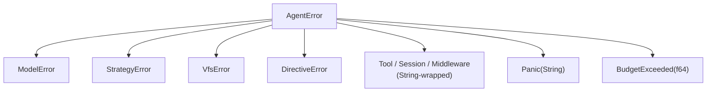

# Error Types and Taxonomy

Synwire's error design reflects a specific conviction: errors should carry enough context for the caller to take a meaningful action, and the structure of error types should reflect the structure of the system that produces them. This document explains the error hierarchy, the reasoning behind its shape, and the trade-offs involved.

## The Hierarchy

The error types form a three-level hierarchy:



`AgentError` is the top-level type returned by the runner and the `AgentNode::run` method. Every error that crosses the public agent boundary is wrapped in or converted to `AgentError`. Callers that only care about "did the agent succeed" match on `AgentError` without looking deeper. Callers that want to respond differently to different failure modes inspect the variant.

## `AgentError`: The Public Boundary

```rust
pub enum AgentError {
    Model(ModelError),
    Tool(String),
    Strategy(String),
    Middleware(String),
    Directive(String),
    Backend(String),
    Session(String),
    Panic(String),
    BudgetExceeded(f64),
}
```

Note that `Model`, carries a structured `ModelError`, while `Tool`, `Strategy`, `Middleware`, `Directive`, `Backend`, and `Session` carry strings. This reflects which errors need structured handling at the runner level. The runner's retry logic calls `ModelError::is_retryable()` to decide whether to retry or fall back. No corresponding structured inspection is needed for tool or middleware errors in the runner loop — they are logged and propagated.

`BudgetExceeded` is an exceptional case: it carries the budget limit as a `f64` rather than just a string, enabling callers to display the limit or make threshold-based decisions without parsing a string. The `f64` is the budget in USD.

`Panic` captures payloads from `catch_unwind` in the runner loop. Library code uses `#[forbid(unsafe_code)]` and zero-panic conventions, but this variant exists for the case where a plugin, middleware, or callback written by application code panics. Wrapping the panic payload in `AgentError::Panic` ensures the error propagates cleanly through the async channel rather than aborting the tokio task.

All variants of `AgentError` are `#[non_exhaustive]`. Match arms must include a `_` catch-all. This is not just defensive API design — it is an explicit commitment that new error conditions will be added as the system grows, and callers must not assume they have seen every possible failure mode.

## `ModelError`: Structured Provider Failures

`ModelError` covers the failure modes specific to model API calls:

```rust
pub enum ModelError {
    Authentication(String),
    Billing(String),
    RateLimit(String),
    ServerError(String),
    InvalidRequest(String),
    MaxOutputTokens,
}
```

The key method is `is_retryable()`:

```rust
pub const fn is_retryable(&self) -> bool {
    matches!(self, Self::RateLimit(_) | Self::ServerError(_))
}
```

`Authentication` and `Billing` failures are not retryable — retrying will produce the same error. `InvalidRequest` is not retryable — the request itself is malformed. `MaxOutputTokens` is not retryable — the model cannot produce a longer response without changing the prompt.

`RateLimit` and `ServerError` are retryable because they represent transient conditions. The runner uses `is_retryable()` to decide whether to retry, switch to the fallback model, or abort. This logic is in the runner, not the error type — the error type only describes the condition, not the response to it.

The `RateLimit` variant carries a string rather than a `Duration` for retry-after because not all providers supply a retry-after header, and the format of those that do varies. Application code that wants to implement exponential backoff based on `Retry-After` headers would parse the string or use a provider-specific error type.

## `VfsError`: File and Process Failures

`VfsError` is the error type for all backend operations — file system access, process execution, HTTP requests, and archive manipulation:

```rust
pub enum VfsError {
    NotFound(String),
    PermissionDenied(String),
    IsDirectory(String),
    PathTraversal { attempted: String, root: String },
    ScopeViolation { path: String, scope: String },
    ResourceLimit(String),
    Timeout(String),
    OperationDenied(String),
    Unsupported(String),
    Io(io::Error),
}
```

`PathTraversal` and `ScopeViolation` are the security-relevant variants. Both carry structured context rather than strings: `PathTraversal` includes the attempted path and the root that was violated; `ScopeViolation` includes the offending path and the allowed scope. This allows audit logging to capture the full context of a security event without parsing the error message. It also allows UI code to show the user the specific path that was rejected and the scope it violated, enabling them to understand why an operation failed.

`Io(io::Error)` wraps standard I/O errors via `#[from]`. Most callers treat this as an opaque infrastructure failure; callers that need to distinguish specific I/O conditions (such as file-not-found vs. permission-denied on the OS level) can inspect the wrapped `io::Error`.

## `StrategyError`: FSM Transition Failures

`StrategyError` is the error type for execution strategy operations:

```rust
pub enum StrategyError {
    InvalidTransition {
        current_state: String,
        attempted_action: String,
        valid_actions: Vec<String>,
    },
    GuardRejected(String),
    NoInitialState,
    Execution(String),
}
```

`InvalidTransition` is the most information-rich variant in the error hierarchy. It carries the current state, the attempted action, and — crucially — the list of valid actions from the current state. This is actionable context: a system that presents FSM state to users can display exactly which actions are available when the agent refuses to execute an invalid transition. Tests that verify FSM behaviour can assert on the `valid_actions` list.

`GuardRejected` carries the name of the guard that rejected the transition. Because `ClosureGuard` requires a name, this message identifies which guard fired, making it possible to diagnose why a transition was rejected in logs.

## The `#[non_exhaustive]` Commitment

Every error enum in Synwire is `#[non_exhaustive]`. This is not just a defensive measure against breakage — it is an acknowledgement that the system is still evolving and that new failure modes will be discovered and named.

The cost is real: every `match` on a Synwire error type requires a `_` arm. For callers that handle specific variants and want to propagate everything else, this means writing `e => return Err(e.into())` or similar. This is a small but real ergonomic cost that is accepted in exchange for forward compatibility.

## Actionable Context as a Design Principle

The error design follows a simple rule: each error variant should carry enough information for the caller to respond appropriately without parsing a string. `InvalidTransition` carries `valid_actions` so callers can present valid options. `PathTraversal` carries `attempted` and `root` so audit logs can record exact details. `BudgetExceeded` carries the limit so callers can display it.

String-wrapped errors (`Tool(String)`, `Session(String)`) represent areas where the system does not yet need structured handling — the string is sufficient for logging and human reading, and the runtime does not inspect it programmatically. As the system matures and specific handling patterns emerge for these error types, they will be promoted to structured variants.

**See also:** For how the runner uses `ModelError::is_retryable()` in its retry loop, see the runner architecture reference. For how `VfsError::PathTraversal` and `ScopeViolation` are raised by the filesystem backend, see the backend how-to guide.
