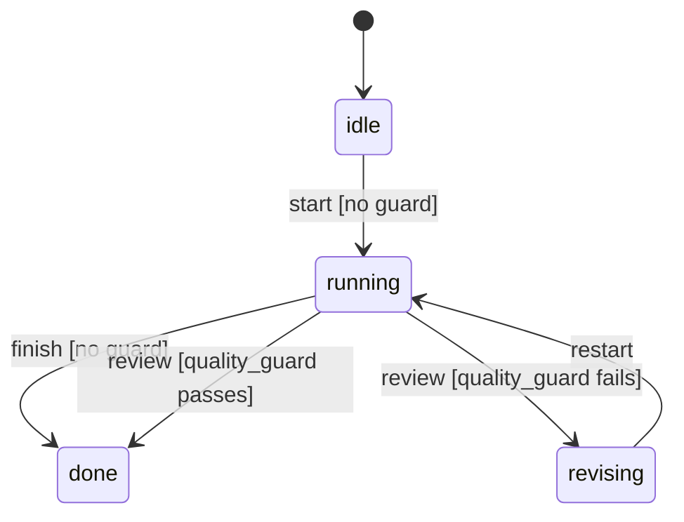

# FSM Execution Strategy Design

An `ExecutionStrategy` controls how an agent orchestrates its actions — which actions are valid at a given moment, what transitions they trigger, and what happens when an invalid action is attempted. The `FsmStrategy` implementation models this as a finite state machine: a set of states, a set of actions, and a table of transitions between them.

Understanding why the FSM is designed the way it is requires first understanding what problem it solves, and then examining the specific choices made in the implementation.

## The Problem: Unconstrained Action Sequences

The alternative to an FSM is a direct execution strategy, where any action can be taken at any time. For simple, single-purpose agents this works fine. For agents with multi-phase workflows — authentication before access, planning before execution, confirmation before destructive operations — unconstrained action sequences create risk. An agent that can invoke a destructive operation at any point in its lifecycle, rather than only after an explicit confirmation step, is harder to reason about and harder to audit.

The FSM strategy makes the valid action sequences explicit. A transition table declares, for each combination of (state, action), what the next state will be. Any action not listed for the current state is rejected with an `InvalidTransition` error that includes the current state, the attempted action, and the list of valid actions from the current state.

## The Transition Table Data Model

The transition table is a `HashMap<(FsmStateId, ActionId), Vec<FsmTransition>>`:

```rust
pub struct FsmStrategy {
    current: Mutex<FsmStateId>,
    transitions: HashMap<(FsmStateId, ActionId), Vec<FsmTransition>>,
}
```

The key is a `(from-state, action)` pair. The value is a sorted list of transitions. A single (from, action) pair can have multiple transitions — this is the guard mechanism.

`FsmStateId` and `ActionId` are newtypes around `String`. String-based identities were chosen deliberately; the alternative — a compile-time typestate FSM where states are distinct Rust types — is discussed below.

## Priority-Based Guards

Each `FsmTransition` carries an optional guard and a priority:

```rust
pub struct FsmTransition {
    pub target: FsmStateId,
    pub guard: Option<Box<dyn GuardCondition>>,
    pub priority: i32,
}
```

When the FSM attempts to execute an action, it finds all transitions for the `(current-state, action)` key, iterates them in descending priority order, and takes the first transition whose guard evaluates to `true` (or the first transition with no guard at all).

This enables conditional branching without requiring separate action names for each branch. Consider a `review` action from the `planning` state. If the plan quality is high (determined by the guard), transition to `executing`. If quality is low, transition to `revising`. Both are registered as transitions for `("planning", "review")` with different guards and different targets; the priority ordering controls which guard is evaluated first.

The concrete guard type shipped with `synwire-core` is `ClosureGuard`, which wraps an `Fn(&Value) -> bool`:

```rust
pub struct ClosureGuard {
    name: String,
    f: Box<dyn Fn(&Value) -> bool + Send + Sync>,
}
```

The `name` field is used in error messages: when a guard rejects a transition, the `GuardRejected` error is more useful if it can name which guard fired.

## Thread Safety: `Mutex<FsmStateId>`

The current state is held behind a `Mutex`:

```rust
current: Mutex<FsmStateId>,
```

This makes `FsmStrategy` usable from multiple async tasks concurrently — the `execute` method locks the mutex, reads the current state, finds the valid transition, updates the state, and releases the lock. The transition is atomic from the FSM's perspective.

In practice, the agent runner processes one turn at a time and rarely needs concurrent FSM access. The `Mutex` is cheap when uncontended and provides correctness guarantees that matter when the stop signal or an external control plane does interact with the FSM concurrently.

## `FsmStrategyWithRoutes`: Strategy Plus Signal Routes

The `FsmStrategyBuilder::build()` method returns `FsmStrategyWithRoutes`, not `FsmStrategy` directly:

```rust
pub struct FsmStrategyWithRoutes {
    pub strategy: FsmStrategy,
    signal_routes: Vec<SignalRoute>,
}
```

This bundles the FSM with any signal routes the strategy author registered via `FsmStrategyBuilder::route()`. When the agent runtime assembles the `ComposedRouter`, it calls `ExecutionStrategy::signal_routes()` on the strategy, which returns these routes for placement in the strategy tier. The FSM strategy thus contributes both behaviour (transition logic) and routing (which signals it wants to gate).

An FSM that gates `UserMessage` signals while in the `processing` state would register a `SignalRoute` for `SignalKind::UserMessage` with `Action::GracefulStop`. That route appears in the strategy tier of `ComposedRouter`, where it unconditionally beats any agent or plugin routes for the same signal kind.

## `StrategySnapshot` for Checkpointing

`FsmStrategy::snapshot()` returns a `Box<dyn StrategySnapshot>` that serialises to:

```json
{ "type": "fsm", "current_state": "planning" }
```

This snapshot is intended for two uses: checkpointing (persisting the FSM state alongside the conversation so a resumed session starts in the right FSM state), and debugging (knowing which FSM state the agent is in when examining a log or trace). The snapshot is minimal by design — the transition table is static and does not need to be serialised.



The diagram above illustrates a typical FSM with a guarded transition. The snapshot at any point contains only the current state label.

## Why Not a Compile-Time Typestate FSM?

The typestate pattern would encode each FSM state as a distinct Rust type parameter on the agent. Transitions would be methods that consume `Agent<StateA>` and produce `Agent<StateB>`, with invalid transitions simply absent from the API. This gives maximum compile-time safety — invalid action sequences are type errors.

The practical problem is composition. An `Agent<PlanningState>` and an `Agent<ExecutingState>` are different types, making it impossible to store them in the same `Vec`, pass them to the same function, or build generic orchestration logic without encoding the complete state space in the type. The transition table would need to be encoded as generic bounds, producing type signatures that are difficult to read and essentially unnameable.

The runtime FSM accepts this trade-off: states are strings, the transition table is checked at runtime, and the `InvalidTransition` error provides the diagnostic information that the type system would otherwise provide. For typical agent state machines — five to fifteen states with clear names — the error messages are just as useful as compiler errors, and the resulting code is dramatically simpler to write and read.

**See also:** For how to build and configure an FSM strategy, see the FSM strategy how-to guide. For how FSM signal routes interact with agent and plugin routes, see the three-tier signal routing explanation. For how strategy snapshots are stored in session checkpoints, see the session management reference.

## See also

- [StateGraph vs FsmStrategy](./graph-vs-agent.md) — when to use the FSM vs a multi-node graph
- [Execution Strategies Tutorial](../tutorials/03-execution-strategies.md) — hands-on with `FsmStrategy`
- [Agent Runtime Explanation](./synwire-agent.md) — how `Runner`, strategy, middleware and backend compose
