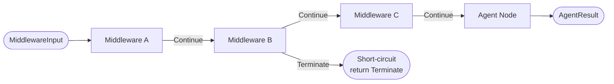

# The Middleware Execution Model

Before an agent node processes a turn, there is work to do that is not specific to the agent's purpose: injecting the right tools into the execution context, transforming the conversation history, adding context to the system prompt, and potentially short-circuiting the run if preconditions are not met. Middleware is the mechanism for this work.

The term "middleware" is borrowed from HTTP server frameworks where it describes code that runs on every request before the handler. Synwire's middleware serves the same role in the agent turn loop.

## The `MiddlewareStack` and Execution Order

Middleware components are registered on the `Agent` builder via `.middleware(mw)` calls and stored in a `MiddlewareStack`. The stack executes components in registration order — the first middleware registered runs first, the last runs last.

Each middleware component implements the `Middleware` trait:

```rust
pub trait Middleware: Send + Sync {
    fn name(&self) -> &str;
    fn process(&self, input: MiddlewareInput) -> BoxFuture<'_, Result<MiddlewareResult, AgentError>>;
    fn tools(&self) -> Vec<Box<dyn Tool>> { Vec::new() }
    fn system_prompt_additions(&self) -> Vec<String> { Vec::new() }
}
```

`process` is the primary method. It receives `MiddlewareInput` (the current messages and context) and returns `MiddlewareResult`.

## `MiddlewareResult`: Continue or Terminate

`MiddlewareResult` has two variants:

```rust
pub enum MiddlewareResult {
    Continue(MiddlewareInput),
    Terminate(String),
}
```

`Continue` passes the (potentially modified) input to the next middleware in the stack. `Terminate` causes the stack to stop immediately, returning the termination message to the runner without executing any subsequent middleware and without invoking the agent node at all.

The execution model is straightforward to follow:



If middleware B terminates, middleware C and the agent node never run. The runner receives `Terminate` and ends the turn.

The stack is frozen at build time. Components cannot be added or removed while the agent is running. This is intentional: if middleware could be modified during execution, the ordering guarantees would break. A component inserted mid-run might not have run for the first part of the conversation but would run for subsequent turns, creating inconsistent state. Immutability eliminates this class of bug.

## What Middleware Is For

Middleware is the correct home for cross-cutting concerns that affect every turn.

**Tool injection**: Middleware that provides tools adds them via `tools()`. The stack's `tools()` method collects from all components in order. A `FilesystemMiddleware` might inject read/write tools scoped to a specific directory. A `GitMiddleware` might inject commit and diff tools. Tools contributed by middleware are merged with tools registered directly on the agent.

**System prompt augmentation**: Middleware that adds context to the system prompt implements `system_prompt_additions()`. Additions are concatenated in stack order. A `PromptCachingMiddleware` that marks the system prompt for provider-side caching, or middleware that appends the current working directory, uses this mechanism.

**Context transformation**: Middleware can rewrite the messages in `MiddlewareInput` before they reach the agent node. A `SummarisationMiddleware` that watches message count and replaces the conversation history with a summary when it exceeds a threshold works this way — it modifies the `messages` field and returns `Continue` with the modified input.

**Input correction**: Some model providers occasionally return malformed tool call arguments. A `PatchToolCallsMiddleware` can inspect and correct these before the agent node sees them, without the node needing to handle the malformed case.

**Termination on precondition failure**: Rate limiting, budget enforcement, or context validation can all terminate early by returning `Terminate`. This prevents the agent node from running at all, rather than the node running and discovering the constraint violation mid-execution.

## Contrast with Hooks

The `HookRegistry` also provides callbacks at agent lifecycle points — before and after tool use, at session start and end, when subagents start or stop, around context compaction. Hooks and middleware serve different purposes:

Middleware **transforms** the execution path. It receives the messages, may modify them, and either passes them forward or stops execution. Middleware runs synchronously in the call stack of the turn loop, before the agent node.

Hooks **observe** events. They receive a context describing what happened and return `HookResult::Continue` or `HookResult::Abort`. Hooks do not modify the messages flowing through the system — they react to events that have already occurred or are about to occur. Hooks run with enforced timeouts; a hook that exceeds its timeout is skipped with a warning rather than failing the agent.

The distinction matters when choosing where to put new functionality. If the goal is to change what the agent receives or to conditionally prevent execution, middleware is the right place. If the goal is to audit, log, or react to events without affecting the execution path, hooks are the right place.

## The Middleware Stack Is Not a Pipeline of Processors

It is worth dispelling a common mental model: middleware in Synwire is not a pipeline where each stage produces a result that feeds forward to all subsequent stages in a symmetric way. There is no "post-processing" phase where middleware runs again after the agent node in reverse order (as in the onion model used by some HTTP frameworks).

`MiddlewareStack::run` iterates forward through the components once. Each component either passes the input forward or terminates. After the agent node runs, the middleware stack is not re-entered. If post-execution observation is needed, hooks (specifically `after_agent` callbacks) serve that role.

**See also:** For how to implement a custom middleware component, see the middleware how-to guide. For how hooks complement middleware for lifecycle observation, see the hooks reference. For how tools injected by middleware are merged with agent tools, see the tool system reference.
