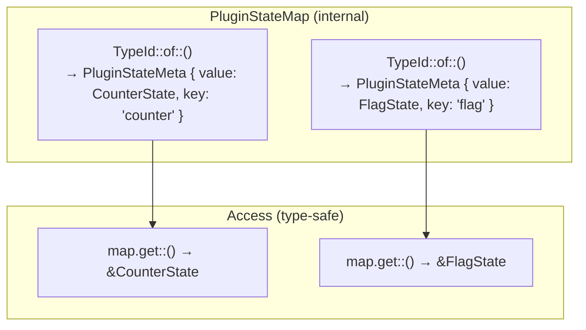

# Plugin State Isolation via the Type System

Plugins in Synwire extend the agent runtime with additional capabilities — they can react to user messages, contribute signal routes, and emit directives before and after each run loop iteration. Each plugin naturally needs to maintain its own state across these lifecycle calls. The design question is how multiple plugins share a single state container without accidentally reading or modifying each other's data.

## The Problem: Shared State Maps Lead to Collisions

The obvious implementation of a plugin state container is a `HashMap<String, Box<dyn Any>>`. Any plugin can insert and read by string key. This is simple to implement, but it creates an implicit contract: every plugin must choose a unique key, and the runtime has no way to enforce this. Two plugins that happen to share a key will silently overwrite each other's state. A plugin that reads the wrong key will get back a value that fails the downcast, producing a runtime panic or a silent `None`.

Beyond correctness, there is an ergonomics problem. Every state access requires a string key and an explicit type downcast. The type system cannot help: a plugin that mistakenly reads another plugin's state with the wrong type will only fail at runtime.

## The Solution: `PluginStateKey`

Synwire sidesteps both problems with the `PluginStateKey` trait:

```rust
pub trait PluginStateKey: Send + Sync + 'static {
    type State: Send + Sync + 'static;
    const KEY: &'static str;
}
```

Each plugin defines a zero-sized key type and implements `PluginStateKey` on it. The associated `State` type is the plugin's data. The `const KEY` string is used for serialisation purposes only — it does not govern runtime access.

The key insight is that `PluginStateMap` stores entries keyed by `TypeId`, not by the `KEY` string. `TypeId::of::<P>()` is globally unique for each distinct Rust type — the compiler guarantees this. Two plugins cannot have colliding `TypeId` values unless they literally share the same key type, which is a logic error detectable in tests via the `register` function returning `Err`.

## Type-Safe Access via `PluginHandle<P>`

When a plugin's state is registered, `PluginStateMap::register` returns a `PluginHandle<P>`:

```rust
pub struct PluginHandle<P: PluginStateKey> {
    _marker: PhantomData<P>,
}
```

This is a zero-sized proof token. Holding a `PluginHandle<P>` proves, at the type level, that the state for plugin `P` is registered. The handle itself carries no runtime data — `PhantomData<P>` is erased at compile time.

Access to plugin state is mediated through the map, not through the handle directly. `PluginStateMap::get::<P>()` returns `Option<&P::State>` — the type parameter `P` binds the return type, so reading state with the wrong type is a compile error, not a runtime panic. There is no explicit downcast at the call site; the downcast is encapsulated inside `PluginStateMap`.

## How `PluginStateMap` Works Internally

The map stores `PluginStateMeta` values keyed by `TypeId`:

```rust
struct PluginStateMeta {
    value: Box<dyn Any + Send + Sync>,
    serialize: fn(&dyn Any) -> Option<Value>,
    key: &'static str,
}
```

The `value` field holds the actual plugin state as a type-erased `Box<dyn Any>`. The `serialize` function is a monomorphised function pointer generated at registration time, capturing the concrete type `P::State`. This allows `PluginStateMap::serialize_all()` to produce a JSON object keyed by the `KEY` strings — useful for checkpointing and debugging — without the map itself knowing the concrete types at serialisation time.



The `TypeId` key means that even if `CounterKey::KEY` and `FlagKey::KEY` were the same string (a logic error worth fixing in tests), the runtime entries would still be distinct. The `KEY` string only appears in the serialised output.

## `PluginInput`: Structured Context for Lifecycle Hooks

Each plugin lifecycle hook receives a `PluginInput` alongside the `PluginStateMap`:

```rust
pub struct PluginInput {
    pub turn: u32,
    pub message: Option<String>,
}
```

The `PluginInput` carries cross-cutting context — which conversation turn this is, and the user message if one is present. The `PluginStateMap` is passed as a shared reference, so a plugin can read its own state (and, by explicit downcast, inspect other plugins' state as `&dyn Any`) but the normal path through `map.get::<P>()` is scoped to the plugin's own type.

The lifecycle hooks return `Vec<Directive>` — plugins participate in the directive/effect system rather than having their own side-effect channel.

## Why Not a Generic Parameter on `Agent`?

An alternative design would make the set of plugins a compile-time type parameter on `Agent`, using an HList or tuple-based approach to encode a heterogeneous list of plugins statically. This would give zero-cost access with no type erasure at all.

The practical problem is composability. An `Agent<(LoggingPlugin, RateLimitPlugin, AuditPlugin)>` is a different type from `Agent<(LoggingPlugin, RateLimitPlugin)>`, making it difficult to write generic code that works with any agent regardless of its plugin set. Builder patterns that add plugins would produce a new type at each step, making the builder API verbose and the resulting types unnameable.

The string-keyed map with type-parameterised accessors achieves the same safety guarantee at the access site — wrong type is a compile error — while keeping `Agent` and `PluginStateMap` as concrete, nameable types. The cost is a `TypeId` hash map lookup per access, which is negligible compared to the async operations happening around it.

**See also:** For implementing a plugin with lifecycle hooks, see the plugin how-to guide. For how plugin signal routes compose with agent and strategy routes, see the three-tier signal routing explanation.
