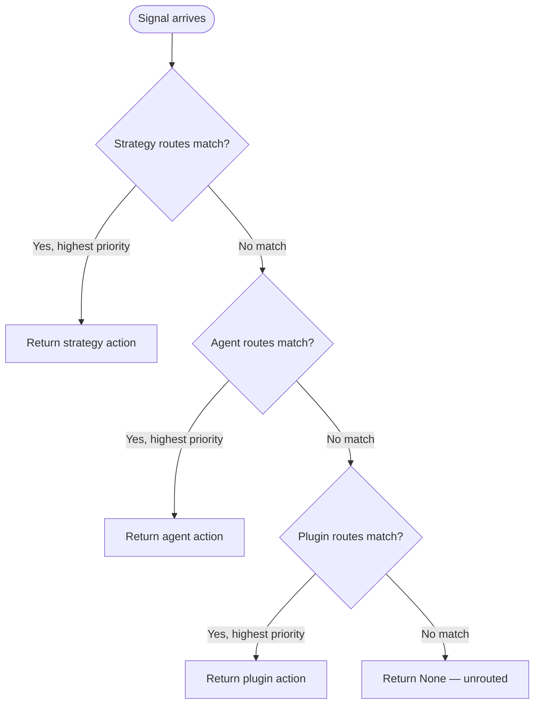

# Three-Tier Signal Routing

An agent at runtime receives inputs from multiple sources: a user sends a message, a tool returns a result, a timer fires, another agent sends an interrupt. Each of these is a `Signal`. The routing system decides what the agent should do in response. The design question is not just *what* to do with a signal, but *who gets to decide* — and in what order of authority.

## What Is a Signal?

A `Signal` carries a `SignalKind` and a JSON payload:

```rust
pub struct Signal {
    pub kind: SignalKind,
    pub payload: Value,
}
```

`SignalKind` identifies the category of signal — `UserMessage`, `ToolResult`, `Stop`, `Timer`, or a `Custom(String)` for application-defined event types. The payload carries the signal-specific data.

The routing question is: given this signal, what `Action` should the agent take? `Action` is an enum: `Continue`, `GracefulStop`, `ForceStop`, `Transition(String)`, or `Custom(String)`.

## Why Three Tiers?

A flat route table — a single `Vec<SignalRoute>` searched in priority order — seems simpler. The problem is that different parts of the system have different *authorities* over routing decisions, and a flat table conflates them.

Consider an agent with an FSM execution strategy. The FSM is currently in a state where accepting new user input would violate a business invariant — the agent is mid-transaction, and interruption would leave state inconsistent. The FSM strategy knows this. It needs to gate the `UserMessage` signal, converting it to a `Reject` or a `GracefulStop` regardless of what the agent's default routing says.

If routing were flat, the FSM strategy would need to register routes with a high priority number and hope no other component registered a conflicting route at an even higher number. This creates an implicit ordering contract between independently authored components, which breaks as soon as someone adds a new high-priority route without knowing about the FSM's requirements.

The three-tier model makes authority explicit by structure, not by number:

1. **Strategy tier**: The FSM or direct execution strategy. Has unconditional precedence. If it registers a route for a signal, that route wins regardless of priority values in lower tiers.
2. **Agent tier**: The agent's own default routing, registered at build time. Second in authority.
3. **Plugin tier**: Routes contributed by plugins via `Plugin::signal_routes()`. These represent plugin-level defaults that can be overridden by the agent.

Within each tier, routes are ordered by their `priority: i32` field. The route with the highest priority value within a tier wins. Strategy tier routes always beat agent tier routes, regardless of priority numbers.

## `ComposedRouter` and the First-Match Rule

`ComposedRouter` holds three separate `Vec<SignalRoute>`:

```rust
pub struct ComposedRouter {
    strategy_routes: Vec<SignalRoute>,
    agent_routes: Vec<SignalRoute>,
    plugin_routes: Vec<SignalRoute>,
}
```

The `route` method searches strategy routes first, then agent routes, then plugin routes. Within each tier it selects the route with the highest `priority` value among those whose `kind` matches and whose optional `predicate` passes:



A strategy-tier route with `priority: 0` beats an agent-tier route with `priority: 100`. The tier boundary is absolute.

## `SignalRoute` Fields

```rust
pub struct SignalRoute {
    pub kind: SignalKind,
    pub predicate: Option<fn(&Signal) -> bool>,
    pub action: Action,
    pub priority: i32,
}
```

`kind` provides coarse filtering — only routes whose `kind` matches the signal's `kind` are considered. `predicate` is an optional function pointer for fine-grained filtering within a kind. Using a function pointer rather than a closure keeps `SignalRoute` `Clone + Send + Sync` without requiring `Arc` wrapping.

The absence of a `predicate` field means the route matches all signals of the given kind. A route with a predicate matches only those signals that pass it. This allows "high-confidence" routes — where the payload tells you exactly which action to take — to coexist with "catch-all" routes at a lower priority.

The `predicate` approach in practice: an agent might register two `UserMessage` routes — one with a predicate that checks for a specific command in the payload and returns `Transition("command-mode")`, and a catch-all at lower priority that returns `Continue`. The predicate-bearing route wins when the condition is met; the catch-all handles everything else.

## How Strategies Contribute Routes

`ExecutionStrategy::signal_routes()` returns the strategy's routes, which the runtime uses to populate the strategy tier of `ComposedRouter`. For `FsmStrategyWithRoutes`, these are routes explicitly registered via `FsmStrategyBuilder::route()`. The builder allows strategy authors to declare, for example, that a `Stop` signal always triggers `ForceStop` in any FSM state, or that a `Timer` signal triggers `Transition("check")` from the `idle` state.

Plugins contribute routes via `Plugin::signal_routes()`, which defaults to an empty `Vec`. A plugin that manages rate limiting might register a `UserMessage` route that forwards to `GracefulStop` when the rate counter is exhausted.

## Trade-offs

The three-tier model adds conceptual overhead. A developer writing their first agent has to understand that there are three separate collections of routes, not one. The benefit emerges in systems with non-trivial strategies: the FSM strategy's veto power over routing cannot be accidentally bypassed by a plugin that registered a high-priority route.

For agents without a strategy (using the direct execution path) or without plugins, the strategy and plugin tiers are empty vectors. `ComposedRouter` degenerates to a flat list of agent routes with no overhead beyond a couple of empty-slice checks.

**See also:** For how FSM strategies register their own routes via the builder, see the FSM strategy design explanation. For how plugin routes are collected and assembled into the composed router, see the plugin system explanation.
