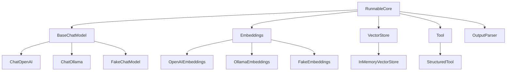
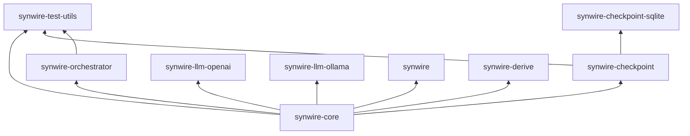

# Architecture

Synwire uses a trait-based architecture where each concern is defined by a trait and implementations are swappable at runtime via trait objects.

## Trait hierarchy



## Core traits

### BaseChatModel

Defines `invoke`, `batch`, `stream`, `model_type`, and `bind_tools`. All methods use `BoxFuture` for dyn-compatibility. The `batch` and `bind_tools` methods have default implementations.

### RunnableCore

The universal composition primitive. Uses `serde_json::Value` as the I/O type for object safety and heterogeneous chaining. This trades compile-time type safety for composability, matching LangChain Python's dynamic typing model.

### Embeddings

Simple trait with `embed_documents` (batch) and `embed_query` (single text). Some providers use different models for queries versus documents.

### VectorStore

Manages document storage and similarity search. Methods accept an `&dyn Embeddings` to decouple storage from embedding computation.

### Tool

Defines `name`, `description`, `schema`, and `invoke`. Tools are `Send + Sync` for use across async tasks.

## Design principles

### Object safety via BoxFuture

Rust traits with `async fn` methods are not dyn-compatible. Synwire uses manual `BoxFuture` desugaring:

```rust,ignore
fn invoke<'a>(
    &'a self,
    input: &'a [Message],
    config: Option<&'a RunnableConfig>,
) -> BoxFuture<'a, Result<ChatResult, SynwireError>>;
```

This enables `Box<dyn BaseChatModel>` and `&dyn BaseChatModel` usage.

### serde_json::Value as universal I/O

`RunnableCore` uses `Value` rather than generics because:

- Generic trait parameters prevent `Vec<Box<dyn RunnableCore>>` for heterogeneous chains
- Any runnable can compose with any other without explicit type conversions
- The trade-off (runtime vs compile-time checking) matches the typical use case

### Error hierarchy

`SynwireError` wraps domain-specific error types (`ModelError`, `ToolError`, `ParseError`, etc.) with `#[from]` conversions. `SynwireErrorKind` provides discriminant-based matching for retry and fallback logic without inspecting payloads.

### Send + Sync everywhere

All traits require `Send + Sync` because the primary runtime is Tokio with multi-threaded executor. This enables shared ownership via `Arc<dyn BaseChatModel>` and spawning across task boundaries.

## Layered crate architecture



`synwire-core` has zero dependencies on other Synwire crates. Provider crates depend only on `synwire-core`. The orchestrator depends on `synwire-core` for trait definitions.
