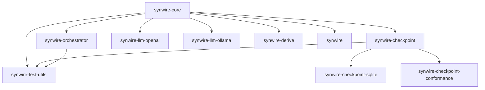

# Crate Organisation

Synwire is organised as a Cargo workspace with focused, single-responsibility crates.

## Workspace structure

```text
crates/
  synwire-core/            Core traits and types (zero Synwire deps)
  synwire-orchestrator/    Graph execution engine (depends on core)
  synwire-checkpoint/      Checkpoint traits + in-memory impl
  synwire-checkpoint-sqlite/ SQLite checkpoint backend
  synwire-llm-openai/      OpenAI provider
  synwire-llm-ollama/      Ollama provider
  synwire-derive/          Proc macros (#[tool], #[derive(State)])
  synwire-test-utils/      Fake models, proptest strategies, fixtures
  synwire/                 Re-exports, caches, text splitters, prompts
  synwire-checkpoint-conformance/ Conformance test suite
```

## Design rationale

### Why separate crates?

1. **Compile time**: users only compile what they use. An Ollama-only project does not compile OpenAI code.
2. **Dependency isolation**: `synwire-core` has minimal dependencies. Provider crates add `reqwest`, `eventsource-stream`, etc.
3. **Feature flag surface**: each crate has independent feature flags rather than one mega-crate with dozens of flags.
4. **Clear API boundaries**: traits in `synwire-core` cannot depend on implementations in provider crates.

### Dependency graph



### synwire-core

The foundation crate. Defines all core traits (`BaseChatModel`, `Embeddings`, `VectorStore`, `Tool`, `RunnableCore`, `OutputParser`, `CallbackHandler`), error types, message types, and credentials. Has zero dependencies on other Synwire crates.

### synwire-orchestrator

Graph-based orchestration. Depends on `synwire-core` for trait definitions. Contains `StateGraph`, `CompiledGraph`, channels, prebuilt agents (ReAct), and the Pregel execution engine.

### synwire-checkpoint

Checkpoint abstraction layer. Defines `BaseCheckpointSaver` and `BaseStore` traits, plus an `InMemoryCheckpointSaver` for testing.

### synwire-checkpoint-sqlite

Concrete checkpoint backend using SQLite via `rusqlite` + `r2d2` connection pooling.

### Provider crates

`synwire-llm-openai` and `synwire-llm-ollama` implement `BaseChatModel` and `Embeddings` for their respective APIs. They depend on `synwire-core` and HTTP-related crates.

### synwire-derive

Procedural macro crate. Must be a separate crate due to Rust's proc-macro rules. Depends on `syn`, `quote`, `proc-macro2`.

### synwire-test-utils

Shared test infrastructure: `FakeChatModel` (also in core for convenience), `FakeEmbeddings`, proptest strategies for all core types, and fixture builders.

### synwire (umbrella)

Convenience crate that re-exports core and optionally includes provider crates via feature flags (`openai`, `ollama`). Also provides higher-level utilities: embedding cache, chat history, few-shot prompts, text splitters.
