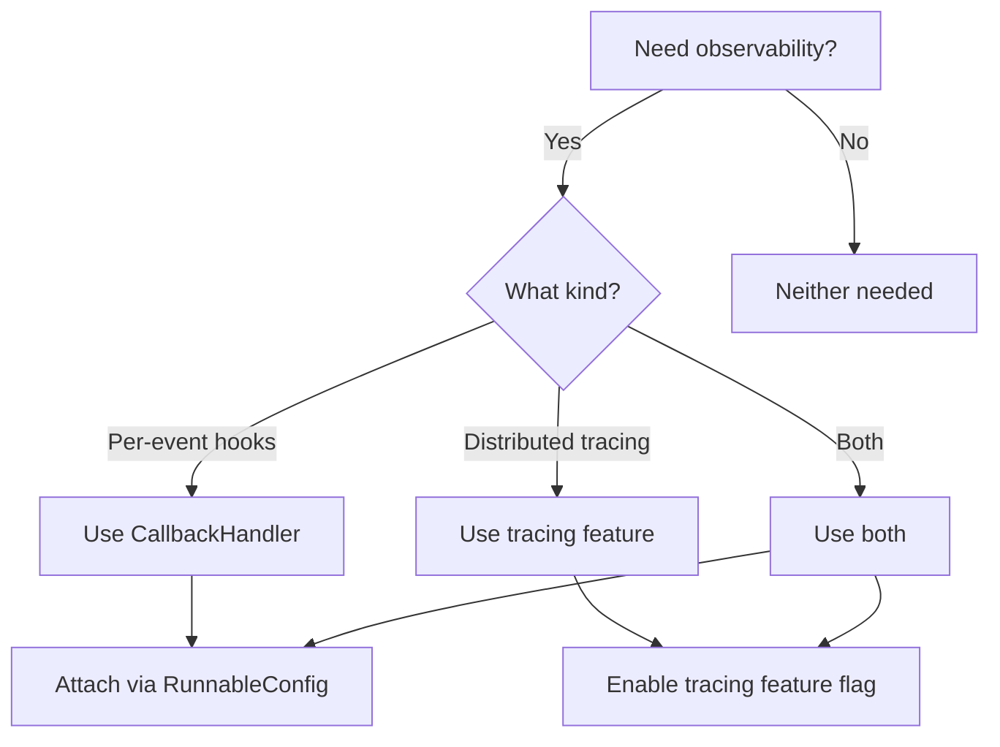

# Hooks vs Callbacks

Synwire provides two mechanisms for observability: **callbacks** (the `CallbackHandler` trait) and **tracing** (OpenTelemetry integration). This document explains when to use each.

## CallbackHandler (callbacks)

The `CallbackHandler` trait provides structured event hooks:

- `on_llm_start` / `on_llm_end`
- `on_tool_start` / `on_tool_end` / `on_tool_error`
- `on_chain_start` / `on_chain_end`
- `on_retry`

### When to use callbacks

- **Custom metrics collection** (latency, token counts, cost tracking)
- **Logging specific events** (tool calls, retries)
- **Audit trails** (recording all model interactions)
- **UI integration** (progress indicators, streaming displays)

### Characteristics

- All methods are async (`BoxFuture`)
- Default no-op implementations -- override only what you need
- Filtering via `ignore_tool()` and `ignore_llm()`
- Attached per-invocation via `RunnableConfig`

## Tracing (OpenTelemetry)

Enabled via the `tracing` feature flag on `synwire-core`. Produces structured spans and events compatible with OpenTelemetry collectors.

### When to use tracing

- **Distributed tracing** across services
- **Integration with existing observability** (Jaeger, Datadog, etc.)
- **Performance profiling** (span timing)
- **Structured logging** with context propagation

### Characteristics

- Zero-cost when disabled (feature flag)
- Automatic span hierarchy
- Context propagation across async boundaries
- Standard ecosystem (`tracing` + `tracing-opentelemetry`)

## Decision tree



## Using both together

Callbacks and tracing are complementary. Use tracing for distributed observability and callbacks for application-specific logic:

```rust,ignore
// Enable tracing feature in Cargo.toml
// synwire-core = { version = "0.1", features = ["tracing"] }

// Custom callback for business logic
struct CostTracker;

impl CallbackHandler for CostTracker {
    fn on_llm_end<'a>(
        &'a self,
        response: &'a serde_json::Value,
    ) -> BoxFuture<'a, ()> {
        Box::pin(async move {
            // Track cost from usage metadata
        })
    }
}
```
