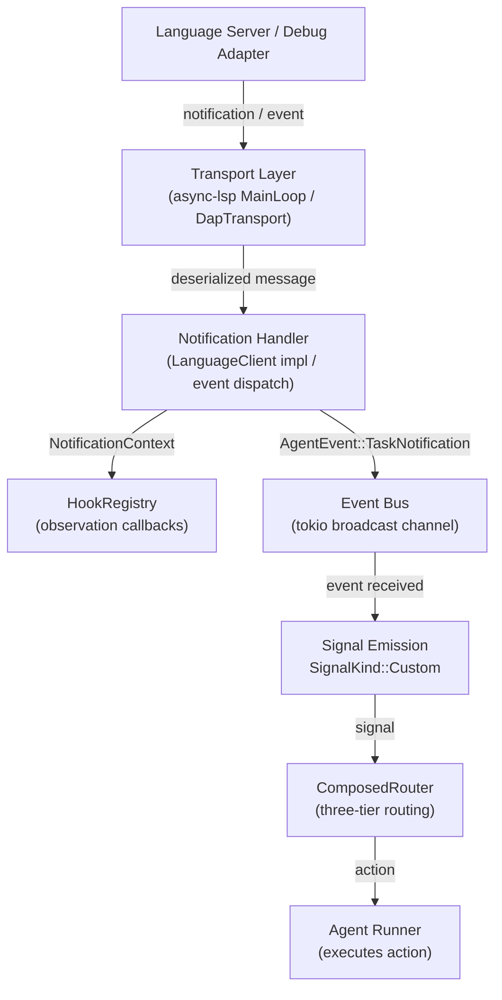
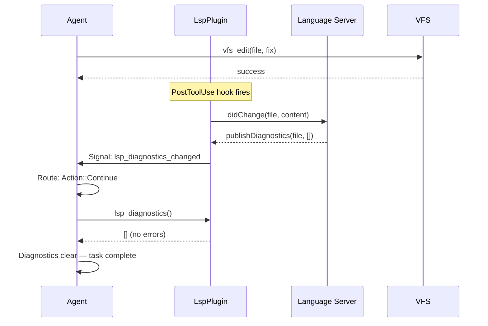
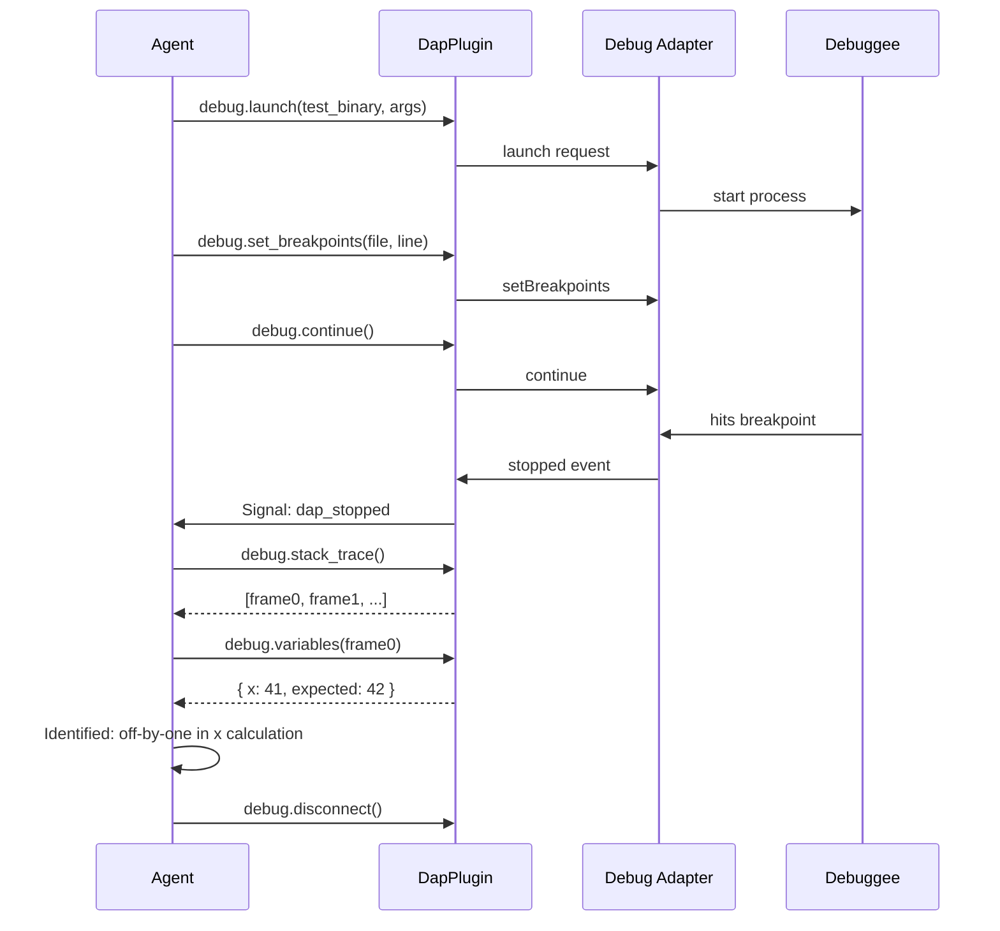

# LSP/DAP Event Bus Integration

The Language Server Protocol and the Debug Adapter Protocol are both asynchronous, event-driven protocols. A language server may emit diagnostic notifications at any time — not in response to a request, but because it finished re-analysing a file that changed minutes ago. A debug adapter emits `stopped` events when the debuggee hits a breakpoint, which may happen while the agent is in the middle of processing an unrelated tool result. These events must reach the agent and influence its behaviour without disrupting the turn loop's sequential execution model.

This document explains how LSP notifications and DAP events flow through synwire's hook, event, and signal systems — and how agents can define reactive behaviour in response.

## The Event Flow

The complete path from an external protocol event to an agent reaction traverses six boundaries:



Each boundary serves a distinct purpose:

1. **Transport layer** handles wire-protocol framing — `Content-Length` headers, JSON serialisation, multiplexing requests and notifications on a single stdio pipe. It produces typed Rust structs from raw bytes.

2. **Notification handler** is the protocol-specific dispatch logic. For LSP, the `LanguageClient` trait provides per-notification-type methods (`publish_diagnostics`, `show_message`, `log_message`). For DAP, a match on the event's `event` field routes to handler functions. The handler converts protocol-specific types into synwire's generic representations.

3. **HookRegistry** provides synchronous observation. Hooks see the event but do not alter the agent's execution path. They run with enforced timeouts — a hook that exceeds its timeout is skipped with a warning. Hooks are the right place for logging, metrics, and audit trails.

4. **Event bus** delivers `AgentEvent::TaskNotification` to any listener. The event carries a `task_id` (the plugin name), a `TaskEventKind`, and a JSON payload with the full event data.

5. **Signal emission** converts the event into a `Signal` with `SignalKind::Custom(name)`. This is the boundary where protocol events enter the agent's decision system.

6. **ComposedRouter** applies the three-tier routing logic (strategy > agent > plugin) to determine the `Action` the agent should take.

## Hook Integration

The `HookRegistry` provides several hook types. LSP and DAP plugins use a subset of them:

| Hook Type | Used By | Purpose |
|-----------|---------|---------|
| `PreToolUse` | Neither | LSP/DAP do not intercept before tool execution |
| `PostToolUse` | LSP | Detects VFS file mutations to send `didChange`/`didOpen`/`didClose` |
| `PostToolUseFailure` | Neither | LSP/DAP do not react to tool failures |
| `Notification` | Both | Routes diagnostics, messages, debug events to observation layer |
| `SessionStart` | LSP | Triggers language server startup when session begins |
| `SessionEnd` | Both | Triggers server/adapter shutdown for clean resource release |

The `PostToolUse` hook for LSP document synchronisation is worth examining in detail. It uses the `HookMatcher` with a glob pattern to match only VFS mutation tools:

```rust,ignore
hooks.on_post_tool_use(
    HookMatcher {
        tool_name_pattern: Some("vfs_*".to_string()),
        timeout: Duration::from_secs(5),
    },
    move |ctx| {
        let client = Arc::clone(&lsp_client);
        Box::pin(async move {
            if is_mutation_tool(&ctx.tool_name) {
                if let Some(path) = extract_path(&ctx.arguments) {
                    let _ = client.sync_document(&path).await;
                }
            }
            HookResult::Continue
        })
    },
);
```

The hook matches `vfs_write`, `vfs_edit`, `vfs_append`, `vfs_rm`, and similar tools. It extracts the file path from the tool arguments and synchronises the document with the language server. The `HookResult::Continue` return means the hook never aborts the operation — document synchronisation is best-effort. If the language server is restarting or the sync fails, the hook logs a warning and continues.

This stands in contrast to a `PreToolUse` hook, which could abort the tool invocation by returning `HookResult::Abort`. LSP synchronisation is strictly post-hoc — the VFS mutation has already succeeded, and the hook is informing the language server of the new state.

## Signal Routing

When a protocol event is converted to a signal, it enters the `ComposedRouter`. The signal's `SignalKind` is `Custom(name)`, where `name` identifies the event type. The following custom signal names are used:

| Signal Name | Source | Meaning |
|-------------|--------|---------|
| `lsp_diagnostics_changed` | LSP `textDocument/publishDiagnostics` | Diagnostics for a file have been updated |
| `lsp_server_crashed` | LSP server process exit | The language server exited unexpectedly |
| `lsp_server_ready` | LSP `initialize` response received | The language server is ready for requests |
| `dap_stopped` | DAP `stopped` event | The debuggee hit a breakpoint or completed a step |
| `dap_output` | DAP `output` event | The debuggee produced stdout/stderr output |
| `dap_terminated` | DAP `terminated` event | The debuggee finished execution |
| `dap_exited` | DAP `exited` event | The debuggee process exited with an exit code |

Agents define how to react to these signals by registering routes. An agent that should auto-fix diagnostics might register:

```rust,ignore
agent.route(
    SignalRoute::new(
        SignalKind::Custom("lsp_diagnostics_changed".into()),
        Action::Continue,  // Re-enter the agent loop to process diagnostics
        10,
    ),
);
```

An agent that should inspect the debuggee when it stops:

```rust,ignore
agent.route(
    SignalRoute::new(
        SignalKind::Custom("dap_stopped".into()),
        Action::Continue,  // Re-enter the loop; agent's instructions guide inspection
        10,
    ),
);
```

The `Action::Continue` in both cases means "process this signal by re-entering the agent's main loop". The agent's system prompt and instructions guide what happens next — the agent sees the signal payload (which file had diagnostics, what thread stopped, at what breakpoint) and decides which tools to invoke.

For more complex routing, predicates allow filtering on signal payload:

```rust,ignore
fn is_error_diagnostic(signal: &Signal) -> bool {
    signal.payload.get("diagnostics")
        .and_then(|d| d.as_array())
        .is_some_and(|arr| arr.iter().any(|d| d["severity"] == 1))
}

agent.route(
    SignalRoute::with_predicate(
        SignalKind::Custom("lsp_diagnostics_changed".into()),
        is_error_diagnostic,
        Action::Continue,
        20,  // Higher priority than the catch-all
    ),
);

// Lower-priority catch-all: ignore warnings-only diagnostic updates
agent.route(
    SignalRoute::with_predicate(
        SignalKind::Custom("lsp_diagnostics_changed".into()),
        |_| true,
        Action::Custom("ignore".into()),
        0,
    ),
);
```

This configuration reacts to diagnostic updates that contain errors (severity 1 in the LSP specification) but ignores updates that contain only warnings or hints. The predicate function receives the signal and inspects the payload, which contains the full `PublishDiagnosticsParams` serialised as JSON.

## Comparison with MCP

The Model Context Protocol (MCP) and the LSP/DAP integrations both contribute tools to the agent's tool set. The structural similarity ends there.

MCP is a request-response protocol. The agent calls an MCP tool; the MCP server processes the request and returns a result. There is no equivalent of an unsolicited notification from the MCP server to the agent. If an MCP server wants to inform the agent of a state change, it must wait until the agent calls a tool and piggyback the information on the response. The MCP specification (as represented by the `McpTransport` trait in synwire) defines `connect`, `list_tools`, `call_tool`, and `disconnect` — no event subscription, no notification channel.

LSP and DAP are fundamentally different. The server-to-client direction carries critical information that arrives independently of any request: diagnostics appear because the server finished analysis, not because the client asked for diagnostics; `stopped` events appear because the debuggee hit a breakpoint, not because the client polled for breakpoints.

This distinction drives the architectural difference between the MCP integration and the LSP/DAP integrations:

| Aspect | MCP | LSP/DAP |
|--------|-----|---------|
| Tool contribution | Yes | Yes |
| Signal routes | No (request-response only) | Yes (event-driven) |
| Hook usage | Minimal (connection lifecycle) | Extensive (PostToolUse for sync, Notification for events) |
| Transport | `McpTransport` trait | `async-lsp` MainLoop / `ContentLengthCodec` |
| State machine | Connection state only | Full protocol lifecycle (initialize, configured, running, etc.) |

An MCP server is stateless from the agent's perspective — each `call_tool` is independent. An LSP server is deeply stateful — the server maintains a model of the workspace, and the agent must keep that model synchronised with the VFS. A DAP session is even more stateful — the debug session has a lifecycle that constrains which operations are valid at any point.

## Reactive Agent Patterns

The combination of event bridging and signal routing enables reactive agent patterns that go beyond simple tool invocation.

**Diagnostic auto-fix loop.** The agent receives an `lsp_diagnostics_changed` signal after editing a file. The signal payload contains the file URI and diagnostic array. The agent invokes `lsp_diagnostics` to read the current diagnostics (the tool may aggregate diagnostics across multiple files), identifies the errors, reads the relevant source code via VFS, generates a fix, applies it with `vfs_edit`, and the cycle repeats. The loop terminates when the diagnostics are empty or when the agent exhausts its retry budget.



**Breakpoint investigation.** The agent launches a failing test under the debugger, sets a breakpoint at the suspected fault location, and continues. When the debuggee stops, the agent receives a `dap_stopped` signal. It invokes `debug.stack_trace` to read the call stack, `debug.variables` to inspect local variables in the stopped frame, and `debug.evaluate` to test a hypothesis about the bug. Based on the findings, it either sets additional breakpoints and continues, or disconnects the debugger and applies a fix.



**Combined LSP + DAP workflow.** The most powerful pattern uses both protocols together. The agent edits a file, receives diagnostics showing a type error, uses `lsp_goto_definition` to understand the type contract, fixes the type error, receives clean diagnostics, runs the test under the debugger to verify the runtime behaviour, and confirms the fix. This is the agent equivalent of a developer's edit-compile-debug cycle.

## Unrouted Signals

Not all signals need to be routed. An agent that does not register a route for `dap_output` will simply never react to debuggee stdout — the signal arrives at the `ComposedRouter`, finds no matching route, and is discarded. The event is still delivered to any registered `Notification` hooks, so logging and auditing still work. The signal is simply not actionable for the agent.

This is intentional. An agent focused on code editing might use LSP for diagnostics but have no use for the debugger. It registers routes for `lsp_diagnostics_changed` but not for any `dap_*` signals. The DAP plugin, if installed, still receives events and logs them, but they do not influence the agent's behaviour.

The three-tier routing makes this composable. A plugin can register default routes for its own signals at the plugin tier. The agent can override them at the agent tier. The execution strategy can override both at the strategy tier. A plugin that provides a "reasonable default" reaction to its own events — for instance, auto-restarting the language server on crash — can do so without forcing the agent to handle the signal explicitly.

## Ordering and Concurrency

Protocol events arrive on a background task (the `MainLoop` for LSP, the `DapTransport` reader for DAP). They are delivered to the hook registry and event bus asynchronously. The agent's main turn loop processes signals between turns — not mid-turn.

This means that if the agent is in the middle of a tool invocation when a diagnostic notification arrives, the notification is queued. The agent sees it after the current tool invocation completes and the turn loop checks for pending signals. This serialisation avoids the complexity of concurrent signal handling within a single turn — the agent's state is never modified by a signal while a tool is executing.

The ordering guarantee within a single protocol is preserved: if the language server sends two `publishDiagnostics` notifications in sequence, the agent sees them in that order. Ordering between protocols is not guaranteed: an LSP diagnostic notification and a DAP `stopped` event that arrive at the same wall-clock time may be processed in either order. In practice, the agent should not depend on cross-protocol ordering — the two protocols operate on independent timelines.

**See also:** For the three-tier signal routing system that processes these signals, see the [Three-Tier Signal Routing](./agent-core-three-tier-signal-routing.md) explanation. For how hooks work — registration, matching, timeouts — see the [Middleware Execution Model](./agent-core-middleware-execution-model.md) explanation (the "Contrast with Hooks" section). For the `Plugin` trait that LSP and DAP plugins implement, see the [Plugin State Isolation](./agent-core-plugin-state-isolation.md) explanation. For the `AgentEvent::TaskNotification` variant that carries these events, see the [Public Types reference](../reference/types.md).
