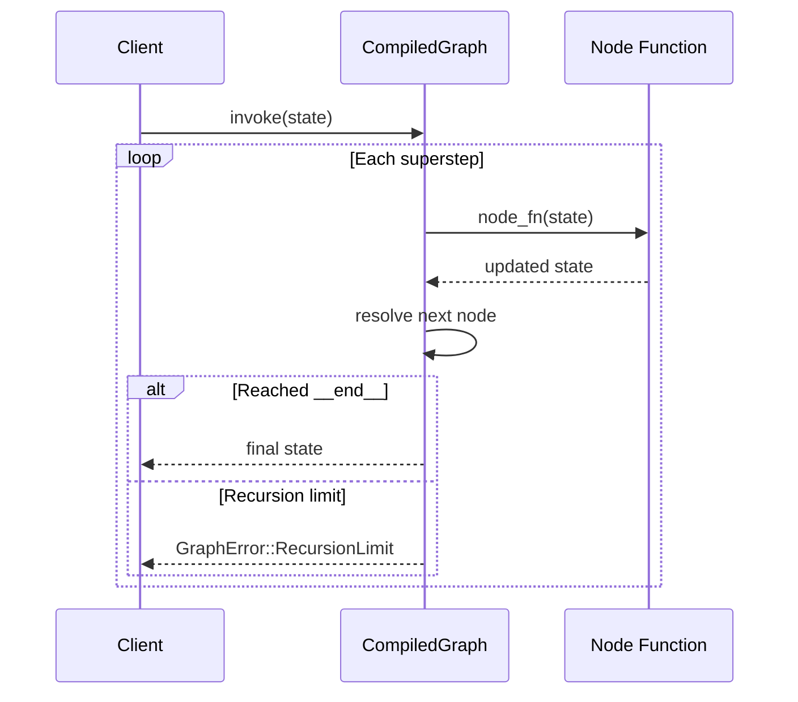

# Pregel Execution Model

The `synwire-orchestrator` crate executes graphs using a Pregel-inspired superstep model.

## What is Pregel?

Pregel is Google's model for large-scale graph processing. In Synwire, it is adapted for sequential state machine execution:

1. **Superstep**: execute the current node's function with the current state
2. **Edge resolution**: determine the next node (static or conditional)
3. **Repeat** until `__end__` is reached or the recursion limit is exceeded

## Execution flow



## State as serde_json::Value

Graph state is a `serde_json::Value`, typically a JSON object. Each node receives the full state, transforms it, and returns the updated state.

## Edge resolution order

1. **Conditional edges** are checked first. The condition function inspects the state and returns a key, which is looked up in a mapping to find the target node.
2. **Static edges** are checked next if no conditional edge exists for the current node.
3. If neither exists, `GraphError::CompileError` is returned.

## Recursion limit

The default limit is defined in `constants::DEFAULT_RECURSION_LIMIT`. Override it per graph:

```rust,ignore
let compiled = graph.compile()?.with_recursion_limit(50);
```

This prevents infinite loops from conditional edges that never reach `__end__`.

## Channels and supersteps

In the full Pregel model, channels accumulate values during a superstep and expose a reduced value for the next superstep. Synwire's `BaseChannel` trait supports this:

- `update`: receive values during a superstep
- `get`: read the current value
- `consume`: take the value and reset

Different channel types implement different reduction strategies (last value, append, max, etc.).

## Determinism

Given the same input state and the same graph topology, execution is deterministic. The Pregel loop is sequential (one node per superstep), so there are no concurrency-related non-determinism concerns within a single invocation.

## See also

- [Checkpointing Tutorial](../tutorials/06-checkpointing.md) — how to snapshot and resume Pregel runs
- [Checkpointing Explanation](../explanation/synwire-checkpoint.md) — `BaseCheckpointSaver` and the serde protocol
- [Channel System](./channels.md) — how channels accumulate state between supersteps
