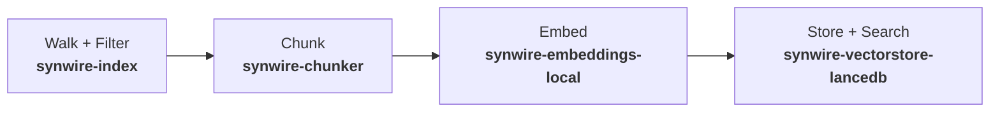

# Semantic Search Architecture

Synwire's semantic search system lets LLM agents find code and documents by
meaning rather than by exact text match. An agent can ask "where is the error
handling logic?" and receive ranked results — even when the source never contains
that literal phrase.

> **Background**: [Retrieval-Augmented Generation](https://www.promptingguide.ai/techniques/rag)
> — the Prompt Engineering Guide explains how retrieval enhances LLM reasoning.
> Semantic search is the retrieval component of this pattern.

## The problem

Text search (`grep`) matches character patterns. It works when you already know
what to look for — a function name, an error string, a config key. It fails when
you know what something *does* but not what it is *called*:

| Query                          | grep finds it? | Semantic search finds it? |
|--------------------------------|-----------------|---------------------------|
| `fn authenticate`              | Yes             | Yes                       |
| "authentication flow"          | No              | Yes                       |
| "how are errors propagated?"   | No              | Yes                       |
| `ECONNREFUSED`                 | Yes             | Yes                       |
| "network connection failures"  | No              | Yes                       |

Semantic search complements grep — it does not replace it. Use grep for known
patterns; use semantic search for conceptual queries.

## Pipeline overview

The pipeline has four stages, each handled by a dedicated crate:



1. **Walk**: `synwire-index` traverses a directory, filtering by include/exclude
   globs and maximum file size.
2. **Chunk**: `synwire-chunker` splits each file into semantic units — AST
   definitions for code, overlapping text segments for prose.
3. **Embed**: `synwire-embeddings-local` converts each chunk into a 384-dimension
   float vector using BAAI/bge-small-en-v1.5 (ONNX, runs locally).
4. **Store**: `synwire-vectorstore-lancedb` writes vectors to a LanceDB table.
   At search time, it performs approximate nearest-neighbour lookup, and an
   optional reranker (BAAI/bge-reranker-base) re-scores the top results.

## Chunking strategy

Code and prose require different splitting approaches:

**AST chunking** (code files): `synwire-chunker` uses tree-sitter to parse the
source into an abstract syntax tree. It extracts top-level definitions — functions,
structs, classes, traits, enums, interfaces — as individual chunks. Each chunk
carries metadata: the symbol name, language, and line range.

```text
src/auth.rs
├── fn authenticate(...)       → chunk 1, symbol="authenticate", lines 12-45
├── struct AuthConfig { ... }  → chunk 2, symbol="AuthConfig",   lines 47-62
└── impl AuthConfig { ... }    → chunk 3, lines 64-120
```

**Text chunking** (non-code files): A recursive character splitter tries
progressively finer split points — paragraph boundaries (`\n\n`), newlines,
spaces, then individual characters — to keep chunks near a target size (default
1 500 bytes) with configurable overlap (default 200 bytes).

The `Chunker` facade dispatches automatically: if the file extension maps to a
supported language *and* tree-sitter produces definition nodes, AST chunking is
used. Otherwise, the text splitter handles it.

### Supported languages

| Language     | AST chunking | Language     | AST chunking |
|-------------|--------------|-------------|--------------|
| Rust        | Yes          | Ruby        | Yes          |
| Python      | Yes          | Bash        | Yes          |
| JavaScript  | Yes          | JSON        | Yes          |
| TypeScript  | Yes          | YAML        | Yes          |
| Go          | Yes          | HTML        | Yes          |
| Java        | Yes          | CSS         | Yes          |
| C           | Yes          | TOML        | Text only    |
| C++         | Yes          | Markdown    | Text only    |
| C#          | Yes          |             |              |

TOML and Markdown lack compatible tree-sitter grammars for version 0.24, so they
always fall back to text chunking. JSON, YAML, HTML, and CSS have parsers but no
meaningful "definition" nodes — these also fall back to the text splitter.

## Embedding model

`synwire-embeddings-local` wraps [fastembed-rs](https://github.com/Anush008/fastembed-rs),
which bundles an ONNX Runtime for inference. The default model is
**BAAI/bge-small-en-v1.5** — a 33M-parameter encoder producing 384-dimensional
vectors.

Key properties:

- **Local**: No API calls. Inference runs on the CPU via ONNX Runtime.
- **Lazy download**: The model is downloaded from Hugging Face Hub on first use
  and cached in fastembed's default cache directory.
- **Thread-safe**: The model is wrapped in `Arc<TextEmbedding>` and all inference
  runs on Tokio's blocking thread pool via `spawn_blocking`, keeping the async
  runtime unblocked.

## Vector storage

`synwire-vectorstore-lancedb` implements the `VectorStore` trait on top of
[LanceDB](https://lancedb.github.io/lancedb/), a serverless vector database
backed by Apache Arrow columnar storage.

**Schema:**

| Column     | Arrow type                         | Purpose                     |
|-----------|------------------------------------|-----------------------------|
| `id`      | `Utf8`                             | UUID per chunk              |
| `text`    | `Utf8`                             | Chunk content               |
| `vector`  | `FixedSizeList(Float32, 384)`      | Embedding vector            |
| `metadata`| `Utf8`                             | JSON-encoded metadata       |

LanceDB stores data as Lance files on disk. It supports approximate
nearest-neighbour (ANN) search using IVF-PQ indices, but for small-to-medium
codebases the brute-force flat scan is fast enough. No separate server process
is required.

## Reranking

After the initial vector search returns candidate chunks, an optional
**cross-encoder reranker** (BAAI/bge-reranker-base, also via fastembed) re-scores
each candidate against the original query. Cross-encoders are more accurate than
bi-encoders for relevance scoring because they attend to the query–document pair
jointly, but they are slower — hence the two-stage pipeline:

1. **Retrieval** (fast, bi-encoder): embed the query, find top-*k* nearest vectors
2. **Reranking** (accurate, cross-encoder): re-score the top-*k* candidates

Reranking is enabled by default and can be disabled via `SemanticSearchOptions { rerank: Some(false), .. }`.

## Caching and incremental updates

`synwire-index` caches each indexed directory under the OS cache directory:

```text
$XDG_CACHE_HOME/synwire/indices/<sha256(canonical_path)>/
├── lance/          ← LanceDB data files
├── meta.json       ← { path, indexed_at, files_indexed, chunks_produced, version }
└── hashes.json     ← { file_path → xxh128 hex hash }
```

On subsequent `index()` calls with `force: false`, the cache is checked. If
`meta.json` exists and is recent, the index is reused without re-walking.

### Content-based deduplication

Both the initial pipeline and the file watcher use **xxHash128** content hashing
to skip files that have not changed. Before chunking and embedding a file, the
pipeline computes the xxh128 hash of its content and compares it against the
stored hash in `hashes.json`. If the hashes match, the file is skipped entirely
— no chunking, no embedding, no vector store writes. This avoids duplicate
effort when re-indexing after minor changes or when the watcher fires for a file
that was saved without modification (e.g. by an editor auto-save).

xxHash128 was chosen over SHA-256 or other cryptographic hashes because:

- **Speed**: xxh128 hashes at ~30 GB/s on modern CPUs, orders of magnitude
  faster than SHA-256 (~500 MB/s). For indexing thousands of source files,
  hashing overhead is negligible.
- **Collision resistance**: 128 bits provides sufficient collision resistance for
  content deduplication (not a security context).
- **No `unsafe`**: The `xxhash-rust` crate is pure Rust with no unsafe code,
  matching Synwire's `#![forbid(unsafe_code)]` policy.

### File watcher

After the initial index completes, a background file watcher (via the `notify`
crate) monitors the directory for changes:

- **Created/modified files**: content hash is checked first; only files with
  changed content are re-chunked, re-embedded, and inserted into the vector
  store.
- **Debouncing**: events within a 300 ms window are coalesced to avoid redundant
  re-indexing during active editing.

The watcher uses the platform-native mechanism: `inotify` on Linux, `FSEvents`
on macOS, `ReadDirectoryChangesW` on Windows.

## VFS integration

The semantic search pipeline is exposed to LLM agents through the
[VFS (Virtual Filesystem)](./synwire-agent.md) trait:

| VFS method         | Purpose                                          |
|--------------------|--------------------------------------------------|
| `index(path, opts)` | Start indexing a directory; returns immediately with an `IndexHandle` |
| `index_status(id)` | Poll progress: `Pending` → `Indexing` → `Ready`/`Failed` |
| `semantic_search(query, opts)` | Search indexed content by meaning |

These methods are gated behind the `semantic-search` feature flag on
`synwire-agent`. When the feature is disabled, the VFS reports that `INDEX` and
`SEMANTIC_SEARCH` capabilities are unavailable, and the corresponding tools are
not offered to the LLM.

`LocalProvider` lazily initialises the full pipeline — `LocalEmbeddings`,
`LocalReranker`, `LanceDbVectorStore` factory, and `SemanticIndex` — on the
first `index()` call.

## Agentic ignore files

`LocalProvider` discovers and respects **agentic ignore files** by searching
upward from the provider's root directory to the filesystem root. These files
use gitignore syntax and control which paths the agent can see:

| File name          | Tool / ecosystem                |
|--------------------|---------------------------------|
| `.gitignore`       | Git (universal baseline)        |
| `.cursorignore`    | Cursor                          |
| `.aiignore`        | Emerging cross-tool standard    |
| `.claudeignore`    | Claude Code                     |
| `.aiderignore`     | Aider                           |
| `.copilotignore`   | GitHub Copilot                  |
| `.codeiumignore`   | Codeium                         |
| `.tabbyignore`     | Tabby                           |

The upward traversal is important because a monorepo may have ignore files in a
parent directory that should still apply to nested workspaces. For example, a
`.cursorignore` at `~/projects/` containing `**/secrets/` applies to every
project under that directory — even if `LocalProvider` is rooted at
`~/projects/myapp/`.

Ignore rules are applied to:

- **`ls`** — hidden entries are omitted from directory listings
- **`grep`** — hidden files are skipped during content search
- **`glob`** — hidden files are excluded from pattern matches
- **Semantic indexing** — hidden files are not walked, chunked, or embedded

Patterns from files closer to the root directory take precedence over patterns
from ancestor directories, matching standard gitignore semantics. Negation
(`!` prefix) and directory-only patterns (trailing `/`) are fully supported.

## Safety constraints

- **Root denial**: `index("/", ..)` is rejected with `VfsError::IndexDenied` to
  prevent accidentally indexing the entire filesystem.
- **Path traversal protection**: `LocalProvider` canonicalises paths and rejects
  any that escape the configured root directory.
- **Agentic ignore**: Files matching patterns in `.cursorignore`, `.aiignore`,
  and similar files are excluded from all VFS operations.
- **Graceful degradation**: Individual file failures during indexing are logged
  and skipped; the pipeline continues with remaining files.

## See also

- [synwire-chunker](./synwire-chunker.md) — AST and text chunking in depth
- [synwire-embeddings-local](./synwire-embeddings-local.md) — local embedding models
- [synwire-vectorstore-lancedb](./synwire-vectorstore-lancedb.md) — vector storage details
- [synwire-index](./synwire-index.md) — indexing pipeline lifecycle
- [Semantic Search Tutorial](../tutorials/09-semantic-search.md) — hands-on walkthrough
- [Semantic Search How-To](../how-to/semantic-search.md) — task-focused recipes
