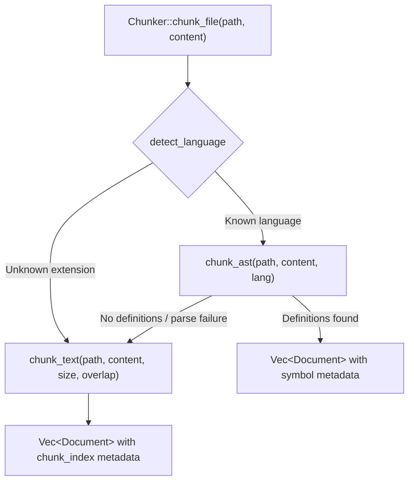

# synwire-chunker: AST-Aware Code Chunking

`synwire-chunker` splits source files into semantically meaningful chunks for
embedding and retrieval. It combines tree-sitter AST parsing for code with a
recursive character splitter for prose, producing [`Document`] values annotated
with file path, line range, language, and symbol name metadata.

## Why AST chunking matters

Naive text splitting (every *n* characters) breaks code at arbitrary points —
splitting a function in half, separating a struct from its impl block, or cutting
a docstring from the function it documents. These broken chunks embed poorly
because the vector captures a fragment rather than a concept.

AST chunking extracts whole definitions:

```text
Naive (500-char chunks)              AST chunking
┌──────────────────┐                 ┌──────────────────┐
│ /// Authenticates │                 │ /// Authenticates │
│ /// a user with   │                 │ /// a user with   │
│ /// the given     │                 │ /// credentials.  │
│ /// credentials.  │                 │ fn authenticate(  │
│ fn authenticate(  │                 │   user: &str,     │
│   user: &str,     │                 │   pass: &str,     │
├──────────────────┤ ← split here    │ ) -> Result<Token> │
│   pass: &str,     │                 │ {                 │
│ ) -> Result<Token> │                │   // full body    │
│ {                 │                 │ }                 │
│   // body...      │                 └──────────────────┘
│ }                 │                 one complete unit
│                   │
│ struct AuthConfig │
│ {                 │
├──────────────────┤ ← split here
│   timeout: u64,   │
│ }                 │
└──────────────────┘
```

Each AST chunk represents one concept — a function, a struct, a trait — which
produces a focused embedding vector that matches conceptual queries.

## Architecture



The `Chunker` facade:

1. Detects the language from the file extension via `detect_language(path)`.
2. Attempts AST chunking with tree-sitter.
3. Falls back to the text splitter if: the language is unrecognised, no
   tree-sitter grammar is available, parsing fails, or no definition-level
   nodes are found.

## Tree-sitter integration

`synwire-chunker` bundles 15 tree-sitter grammar crates. For each language, it
defines which AST node kinds represent top-level definitions:

| Language   | Definition node kinds                                           |
|-----------|------------------------------------------------------------------|
| Rust      | `function_item`, `impl_item`, `struct_item`, `enum_item`, `trait_item`, `type_alias` |
| Python    | `function_definition`, `class_definition`                        |
| JavaScript| `function_declaration`, `class_declaration`, `method_definition`, `arrow_function` |
| TypeScript| `function_declaration`, `class_declaration`, `method_definition`, `interface_declaration`, `type_alias_declaration` |
| Go        | `function_declaration`, `method_declaration`, `type_declaration` |
| Java      | `method_declaration`, `class_declaration`, `interface_declaration`, `constructor_declaration` |
| C         | `function_definition`, `struct_specifier`                        |
| C++       | `function_definition`, `struct_specifier`, `class_specifier`, `namespace_definition` |
| C#        | `method_declaration`, `class_declaration`, `interface_declaration`, `property_declaration` |
| Ruby      | `method`, `singleton_method`, `class`, `module`                  |
| Bash      | `function_definition`                                            |

The walker is intentionally **shallow** — it collects only immediate children of
the root node. Nested definitions (helper functions inside a class, closures
inside a function) are captured within their parent definition, not split out
separately. This keeps each chunk self-contained.

### Symbol extraction

For each definition node, the chunker attempts to extract a symbol name by
scanning direct children for `identifier`, `name`, `field_identifier`, or
`type_identifier` nodes. The symbol name is stored in the chunk's metadata under
the `"symbol"` key.

## Text splitter

The recursive character splitter handles non-code files and fallback cases. It
tries split points in order of decreasing granularity:

1. **Paragraph boundary** (`\n\n`) — preserves paragraph structure
2. **Newline** (`\n`) — preserves line structure
3. **Space** (` `) — preserves word boundaries
4. **Character boundary** — last resort, splits at any character

At each level, it finds the *last* occurrence of the separator that keeps the
chunk within the target size. If no separator fits, it falls through to the next
level.

**Overlap**: Consecutive chunks share `overlap` bytes of context (default 200),
so a concept split between chunks appears in both. This helps retrieval when the
relevant content straddles a split point.

## Metadata

Every chunk carries a `HashMap<String, serde_json::Value>` metadata map:

| Key            | AST chunks | Text chunks | Type     | Description                    |
|----------------|:----------:|:-----------:|----------|--------------------------------|
| `file`         | Yes        | Yes         | `String` | Source file path               |
| `language`     | Yes        | No          | `String` | Lowercase language name        |
| `symbol`       | When found | No          | `String` | Definition name (e.g. `add`)   |
| `line_start`   | Yes        | Yes         | `Number` | 1-indexed first line           |
| `line_end`     | Yes        | Yes         | `Number` | 1-indexed last line            |
| `chunk_index`  | No         | Yes         | `Number` | 0-based sequential position    |

## Configuration

The `ChunkOptions` struct controls the text splitter parameters:

```rust,ignore
use synwire_chunker::ChunkOptions;

let opts = ChunkOptions {
    chunk_size: 2000,   // target bytes per chunk (default: 1500)
    overlap: 300,       // overlap bytes between consecutive chunks (default: 200)
};
let chunker = synwire_chunker::Chunker::with_options(opts);
```

AST chunking ignores these options — each definition is one chunk regardless of
size. If a function is 5 000 bytes, it becomes a single 5 000-byte chunk.

## See also

- [Semantic Search Architecture](./semantic-search-architecture.md) — how chunking fits into the pipeline
- [synwire-embeddings-local](./synwire-embeddings-local.md) — what happens after chunking
- [Semantic Search Tutorial](../tutorials/09-semantic-search.md) — hands-on walkthrough
