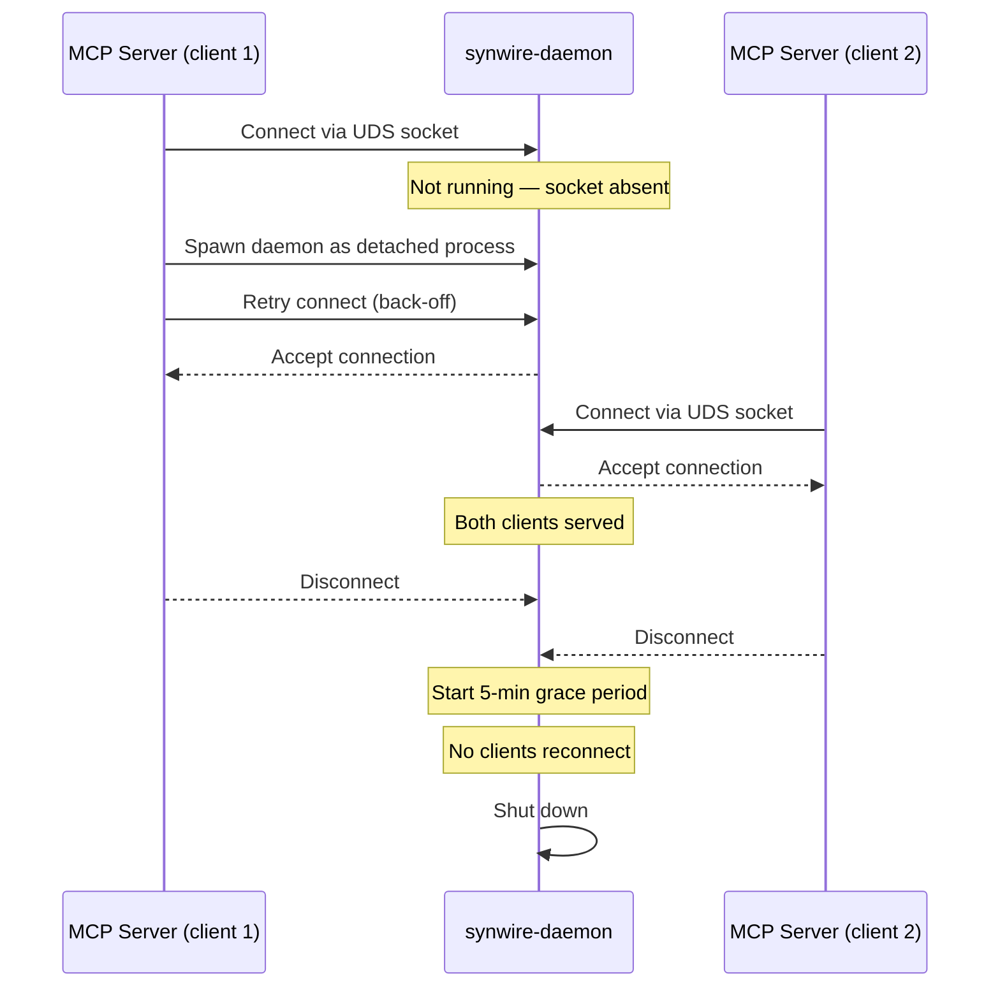
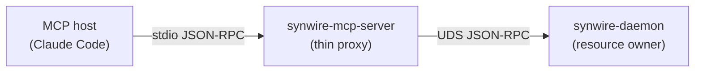

# synwire-daemon: Singleton Background Process

> **Status**: Planned — the daemon crate does not exist yet. This document describes the intended design. Current deployments run `synwire-mcp-server` directly without a daemon.

`synwire-daemon` will be a singleton background process, one per product name, that owns shared expensive resources across all MCP server instances connecting to it.

## Motivation

Each `synwire-mcp-server` process currently holds its own embedding model, file watchers, and indexing pipeline. For a developer running multiple MCP clients (Claude Code, Copilot, Cursor) against the same project, these resources are duplicated:

- Embedding model loaded 3× into RAM (~30–110 MB each)
- Three separate file watchers on the same directory tree
- Three independent index caches that may diverge

The daemon solves this by centralising these resources so all clients share them.

## Daemon responsibilities

| Resource | Owned by daemon | Per-MCP-server without daemon |
|----------|:--------------:|:-----------------------------:|
| Embedding model | Single instance | One per server process |
| File watchers | Single watcher per project | One per server process |
| Indexing pipeline | Shared, serialised | Independent, may race |
| Global experience pool | Centralised | Shared via SQLite WAL |
| Dependency index | Centralised | Shared via SQLite WAL |
| Cross-project registry | Centralised | Shared via JSON |

## Auto-launch lifecycle

The daemon is not managed by systemd, launchctl, or any service manager. It is spawned on demand:



1. MCP server checks for the daemon socket at `StorageLayout::daemon_socket()`.
2. If absent, it spawns the daemon as a detached child process and polls for the socket.
3. The daemon writes its PID to `StorageLayout::daemon_pid_file()`.
4. All subsequent MCP servers connect to the existing daemon.
5. When the last client disconnects, a 5-minute grace period begins. If no new clients connect, the daemon shuts down cleanly. If a client connects during the grace period, the timer resets.

## Identity: per-product-name singleton

The daemon is scoped to a `--product-name`. Two products (`myapp` and `yourtool`) run independent daemon instances with isolated sockets and PID files:

```text
~/.local/share/myapp/daemon.sock
~/.local/share/myapp/daemon.pid

~/.local/share/yourtool/daemon.sock
~/.local/share/yourtool/daemon.pid
```

## Transport: Unix domain socket

MCP servers communicate with the daemon over a Unix domain socket (UDS). The MCP server acts as a thin `stdio ↔ UDS` proxy:



The proxy adds no protocol logic — it forwards messages verbatim. This keeps `synwire-mcp-server` trivially simple and allows the daemon to be updated independently.

## Global tier

The daemon maintains a global tier of shared knowledge across all projects:

- **Registry** (`global_registry()`): Known projects, their `RepoId`s, and worktree paths
- **Experience pool** (`global_experience_db()`): Cross-project edit-to-file associations
- **Dependency index** (`global_dependency_db()`): Cross-project symbol dependency graph

## Planned implementation

When implemented, `synwire-daemon` will be a separate binary crate that:

1. Parses `--product-name` and `--data-dir` arguments
2. Initialises `StorageLayout`, acquires the PID file, binds the UDS socket
3. Loads the embedding model once
4. Accepts UDS connections from MCP server proxies
5. Dispatches tool requests to the appropriate project handler
6. Manages the 5-minute idle shutdown timer

## See also

- [synwire-mcp-server](./synwire-mcp-server.md) — current deployment without daemon
- [synwire-storage](./synwire-storage.md) — `daemon_pid_file()`, `daemon_socket()` path methods
