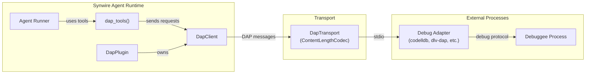
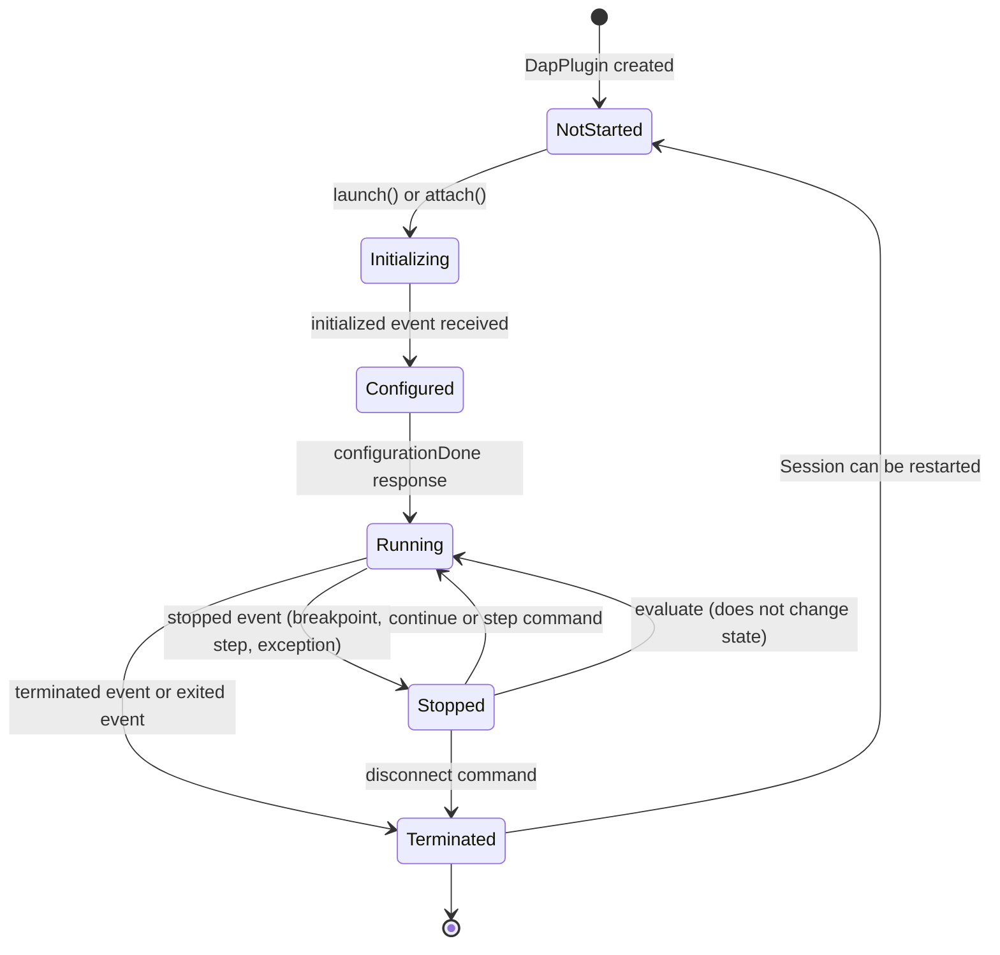

# synwire-dap: Debug Adapter Integration

When an agent writes code and the tests fail, the typical recovery strategy is to re-read the code, re-read the error message, and guess at a fix. This works for straightforward compilation errors. It works poorly for logic errors — the kind where the code compiles, the types check, and the output is simply wrong. A human developer in this situation reaches for a debugger. The `synwire-dap` crate gives agents the same capability, integrating the Debug Adapter Protocol into the synwire runtime so that agents can set breakpoints, step through execution, and inspect runtime values.

## The Problem: Guessing at Runtime Behaviour

Consider a test that asserts a function returns `42` but the function returns `41`. The agent can read the function's source code and attempt to trace the logic mentally. For simple functions this works. For functions that involve mutable state, loop counters, conditional branches based on runtime data, or interactions between multiple modules, mental simulation is unreliable — even for experienced human developers.

A debugger eliminates the guesswork. The agent sets a breakpoint at the start of the function, runs the test under the debugger, and observes the actual values of variables at each step. It can inspect the call stack to understand how the function was reached. It can evaluate expressions in the debuggee's context to test hypotheses. The information it obtains is ground truth, not inference.

The Debug Adapter Protocol (DAP) standardises this interaction. Originally developed by Microsoft for VS Code, it defines a JSON-based protocol between a client (the IDE, or in this case, the agent) and a debug adapter (a process that mediates between the client and the actual debugger). Debug adapters exist for most major languages: `codelldb` and `cppvsdbg` for C/C++/Rust, `dlv-dap` for Go, `debugpy` for Python, the Node.js built-in inspector for JavaScript.

## Architecture

The crate is structured as a plugin with a transport layer that manages the DAP wire protocol:



The event path flows back:

```mermaid
graph RL
    Debuggee["Debuggee"] -->|"debug event"| DA["Debug Adapter"]
    DA -->|"DAP event"| DT["DapTransport"]
    DT -->|"dispatch"| Client["DapClient"]
    Client -->|"NotificationContext"| HR["HookRegistry"]
    HR -->|"AgentEvent::TaskNotification"| Agent["Agent Runner"]
    Agent -->|"SignalKind::Custom"| CR["ComposedRouter"]
```



`DapPlugin` implements the `Plugin` trait, contributing tools and signal routes. `DapClient` manages the request-response correlation — DAP uses sequential integer `seq` numbers rather than opaque IDs, and the client maintains a map from `seq` to response channel. `DapTransport` handles the wire protocol framing.

## DAP Session State Machine

A DAP session progresses through a well-defined sequence of states. The agent cannot set breakpoints before the adapter is configured, cannot inspect variables before the debuggee is stopped, and cannot continue execution after the debuggee has terminated. The state machine enforces these constraints:



Each state determines which tools are available to the agent:

- **NotStarted**: Only `debug.launch` and `debug.attach` are functional. Other tools return an error explaining the session has not started.
- **Initializing**: No tools are functional. The plugin is waiting for the adapter to signal readiness.
- **Configured**: The plugin sends `configurationDone`. This state is transient — it transitions to `Running` immediately.
- **Running**: `debug.set_breakpoints` and `debug.pause` are functional. Inspection tools (`debug.stack_trace`, `debug.variables`, `debug.evaluate`) return errors because no thread is stopped.
- **Stopped**: All tools are functional. This is the state where the agent can inspect the debuggee: read the call stack, examine variables, evaluate expressions, then continue or step.
- **Terminated**: Only `debug.launch` (to start a new session) is functional.

The state machine is encoded as an enum in `DapClient`, and each tool checks the current state before sending a request to the adapter. This prevents the agent from issuing protocol-invalid requests and receiving confusing error messages from the adapter.

## `ContentLengthCodec`

DAP uses the same wire format as LSP: `Content-Length: N\r\n\r\n{json}`. Each message is a JSON object preceded by an HTTP-style header declaring its byte length. The `ContentLengthCodec` implements `tokio_util::codec::Decoder` and `tokio_util::codec::Encoder` for this format.

The implementation is straightforward: the decoder reads bytes until it finds the `\r\n\r\n` separator, parses the `Content-Length` value, then reads exactly that many bytes and deserialises the JSON. The encoder serialises the JSON, prepends the `Content-Length` header, and writes both to the output buffer.

A natural question is why this codec is not shared with the LSP integration. The `async-lsp` crate, which `synwire-lsp` depends on, includes its own transport implementation with the same framing. However, `async-lsp` is built around the LSP message schema — JSON-RPC 2.0 with `method`, `id`, `params`, `result`, `error` fields. DAP uses a different schema: messages have `seq`, `type` (`"request"`, `"response"`, `"event"`), `command`, `body`, and `success` fields. The framing is identical, but the message structure is not.

Rather than abstracting the framing away from both protocols (which would require a generic transport parameterised over message type, adding complexity for minimal benefit), each crate owns its transport. The `ContentLengthCodec` in `synwire-dap` is approximately 80 lines of code. Duplication at this scale is a reasonable trade-off against the coupling that a shared transport abstraction would introduce.

The correlation model also differs. LSP uses JSON-RPC `id` fields — the client assigns an ID to each request, and the server echoes it in the response. DAP uses `seq` and `request_seq` — each message has a monotonically increasing sequence number, and responses reference the `seq` of the request they answer. `DapClient` maintains a `HashMap<i64, oneshot::Sender<DapResponse>>` to route responses to the correct waiting future.

## Event Bridging

Debug adapters emit events asynchronously: `stopped` when the debuggee hits a breakpoint, `output` when the debuggee writes to stdout or stderr, `terminated` when the debuggee exits. These events must reach the agent so it can react.

The bridging follows the same two-path pattern as `synwire-lsp`:

**Notification hooks**: Each DAP event fires a `NotificationContext` through the `HookRegistry`. The `stopped` event, for instance, produces:

```rust,ignore
NotificationContext {
    message: format!(
        "Debuggee stopped: reason={}, thread_id={}",
        event.reason, event.thread_id
    ),
    level: "dap_stopped".to_string(),
}
```

**Task notifications and signals**: The event is also emitted as an `AgentEvent::TaskNotification` with a `Custom` kind:

| DAP Event | Signal Kind | Payload |
|-----------|-------------|---------|
| `stopped` | `dap_stopped` | `{ "reason": "breakpoint", "thread_id": 1, "all_threads_stopped": true }` |
| `output` | `dap_output` | `{ "category": "stdout", "output": "test output line\n" }` |
| `terminated` | `dap_terminated` | `{ "restart": false }` |
| `exited` | `dap_exited` | `{ "exit_code": 0 }` |

The `dap_stopped` signal is the most important for reactive agent behaviour. When the agent receives it, the debuggee is paused and all inspection tools are available. The agent can read the stack trace, examine variables in each frame, evaluate expressions, and decide whether to continue, step, or disconnect.

The `dap_output` signal delivers debuggee stdout/stderr to the agent. This is valuable for understanding program behaviour without setting breakpoints — the agent can observe log output in real time.

## Security Considerations

The `debug.evaluate` tool deserves special attention. It sends an `evaluate` request to the debug adapter, which executes an arbitrary expression in the debuggee's runtime context. In Python, this means arbitrary Python code execution. In Go, it means expression evaluation with access to all in-scope variables and functions. In Rust (via `codelldb`), it can call functions with side effects.

This makes `debug.evaluate` the most powerful — and most dangerous — tool in the DAP tool set. It is marked with metadata that the permission system uses to gate access:

```rust,ignore
ToolSchema {
    name: "debug.evaluate".into(),
    description: "Evaluate an expression in the debuggee's context. \
                  WARNING: can execute arbitrary code.".into(),
    parameters: json!({
        "type": "object",
        "properties": {
            "expression": { "type": "string" },
            "frame_id": { "type": "integer" },
            "context": {
                "type": "string",
                "enum": ["watch", "repl", "hover"]
            }
        },
        "required": ["expression"]
    }),
}
```

The tool's `ToolSchema` metadata marks it as `destructive: true` and `open_world: true`. The `destructive` flag indicates that the tool can modify external state (the debuggee's memory, files, network connections). The `open_world` flag indicates that the set of possible effects is unbounded — the expression is arbitrary, so the tool cannot enumerate what it might do.

These flags interact with the `PermissionMode` system. In `PermissionMode::Default`, the approval gate will prompt the user before executing `debug.evaluate`. In `PermissionMode::PlanOnly`, it is blocked entirely. In `PermissionMode::BypassAll`, it executes without confirmation. The `DenyUnauthorized` mode blocks it unless an explicit `PermissionRule` with `behavior: Allow` matches the `debug.evaluate` tool pattern.

Other DAP tools — `debug.set_breakpoints`, `debug.stack_trace`, `debug.variables`, `debug.continue`, `debug.step_over` — are observation and control tools. They do not execute arbitrary code in the debuggee and are not marked as destructive.

## Trade-offs

**Debug sessions are resource-intensive.** Running a debuggee under a debug adapter is slower than running it natively. The adapter adds overhead for breakpoint management, memory inspection, and protocol marshalling. For large test suites, running under the debugger may be impractical. The agent should use debugging selectively — for specific failing tests, not as a general test runner.

**Adapter availability varies by language.** Rust debugging via `codelldb` is mature. Go debugging via `dlv-dap` is solid. Python debugging via `debugpy` is well-established. But some languages lack a DAP-compatible adapter entirely, and some adapters have incomplete or buggy implementations of certain DAP features. The capability-conditional approach used for tool generation mitigates this somewhat, but there is no equivalent of `ServerCapabilities` in DAP — the adapter does not declare which optional features it supports. Discovery is empirical.

**The agent must understand debugging concepts.** Setting a breakpoint requires knowing a file path and line number. Navigating a stack trace requires understanding call frames. Evaluating expressions requires knowledge of the debuggee's language syntax. The system prompt for an agent using DAP tools must include guidance on debugging strategies — this is not a tool that works well when the agent has no prior knowledge of debugging workflows.

**Session state complicates checkpointing.** A debug session includes the state of the debuggee process, which cannot be serialised into a synwire checkpoint. If the agent is checkpointed and resumed, the debug session is lost. The resumed agent would need to re-launch the debugger and re-set breakpoints. This is an inherent limitation of integrating with external stateful processes.

**See also:** For how to configure and use DAP tools in an agent, see the [DAP Integration how-to guide](../how-to/dap-integration.md). For how DAP events integrate with hooks and signals alongside LSP notifications, see the [LSP/DAP Event Integration](./lsp-dap-event-integration.md) explanation. For how the approval gate system handles `debug.evaluate`, see the [Approval Gates how-to guide](../how-to/approval-gates.md). For permission modes that affect destructive tools, see the [Permission Modes how-to guide](../how-to/permission-modes.md).
