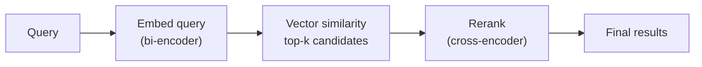

# synwire-embeddings-local: Local Embedding and Reranking Models

`synwire-embeddings-local` provides CPU-based text embedding and cross-encoder
reranking, backed by [fastembed-rs](https://github.com/Anush008/fastembed-rs)
and ONNX Runtime. No API keys, no network calls at inference time, no data
leaves the machine.

## Models

| Component        | Model                      | Parameters | Output     | Purpose                          |
|-----------------|----------------------------|-----------|-----------|----------------------------------|
| `LocalEmbeddings`| BAAI/bge-small-en-v1.5    | 33M       | 384-dim `f32` vector | Bi-encoder: fast similarity search |
| `LocalReranker`  | BAAI/bge-reranker-base    | 110M      | Relevance score    | Cross-encoder: accurate re-scoring |

Both models are downloaded from Hugging Face Hub on first use and cached locally
by fastembed. Subsequent constructions load from cache with no network access.

## Bi-encoder vs cross-encoder

The two models serve complementary roles in a two-stage retrieval pipeline:



**Bi-encoder** (`LocalEmbeddings`): Encodes query and documents independently
into fixed-size vectors. Similarity is computed via cosine distance. This is fast
(embeddings are precomputed for documents) but less accurate because the model
never sees query and document together.

**Cross-encoder** (`LocalReranker`): Takes a (query, document) pair as input and
produces a single relevance score. This is more accurate because the model
attends to both texts jointly, but slower because it must run inference for every
candidate. Hence it is used only on the top-*k* results from the bi-encoder.

## Thread safety and async integration

fastembed's inference is synchronous and CPU-bound. To avoid blocking the Tokio
async runtime, both `LocalEmbeddings` and `LocalReranker`:

1. Wrap the underlying model in `Arc<T>`, making it safely shareable across tasks.
2. Run all inference on Tokio's blocking thread pool via
   `tokio::task::spawn_blocking`.

```rust,ignore
// Simplified view of the embed_query implementation:
let model = Arc::clone(&self.model);
let owned = text.to_owned();
tokio::task::spawn_blocking(move || model.embed(vec![owned], None)).await
```

This pattern keeps the async event loop responsive even during heavy inference
workloads.

## Implementing the core traits

`LocalEmbeddings` implements `synwire_core::embeddings::Embeddings`:

| Method              | Input                | Output                       |
|--------------------|----------------------|------------------------------|
| `embed_documents`  | `&[String]`          | `Vec<Vec<f32>>` (batch)      |
| `embed_query`      | `&str`               | `Vec<f32>` (single vector)   |

`LocalReranker` implements `synwire_core::rerankers::Reranker`:

| Method    | Input                                | Output                        |
|----------|--------------------------------------|-------------------------------|
| `rerank` | query, `&[Document]`, top_n          | `Vec<Document>` (re-ordered)  |

Both return `Result<T, SynwireError>` — embedding failures are mapped to
`SynwireError::Embedding(EmbeddingError::Failed { message })`.

## Error handling

| Error type               | Cause                                      |
|--------------------------|---------------------------------------------|
| `LocalEmbeddingsError::Init` | Model download failure or ONNX load error |
| `LocalRerankerError::Init`   | Same, for the reranker model              |
| `EmbeddingError::Failed`     | Inference panicked or returned no results |

Construction errors (`::new()`) are separate from runtime errors. Construction
may fail due to network issues (first download) or corrupted cache files.
Runtime errors indicate ONNX inference failures or task panics.

## Performance characteristics

| Operation          | Typical latency (CPU)       | Notes                          |
|--------------------|-----------------------------|--------------------------------|
| Model construction | 50–200 ms (cached)          | First-ever: download ~30 MB    |
| `embed_query`      | 1–5 ms per query            | Single text, 384-dim output    |
| `embed_documents`  | ~2 ms per document (batch)  | Batching amortises overhead    |
| `rerank`           | 5–20 ms per candidate       | Cross-encoder is heavier       |

These are order-of-magnitude figures on a modern x86 CPU. Actual performance
depends on text length, CPU architecture, and available cores.

## See also

- [Semantic Search Architecture](./semantic-search-architecture.md) — where embedding fits in the pipeline
- [synwire-chunker](./synwire-chunker.md) — what produces the text that gets embedded
- [synwire-vectorstore-lancedb](./synwire-vectorstore-lancedb.md) — where vectors are stored
- [synwire-core: Trait Contract Layer](./synwire-core.md) — the `Embeddings` and `Reranker` traits
