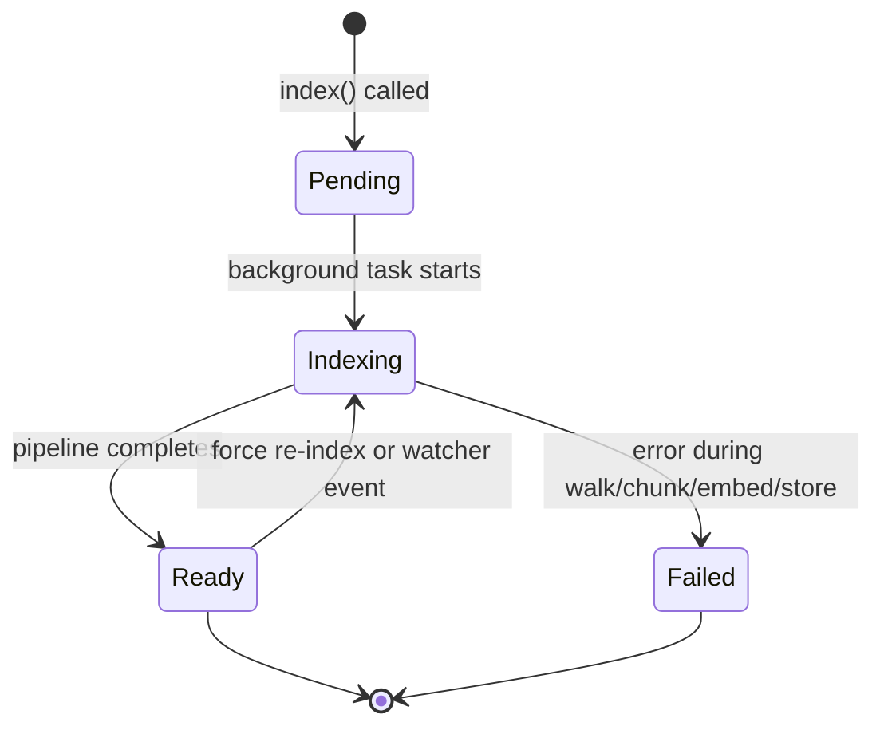
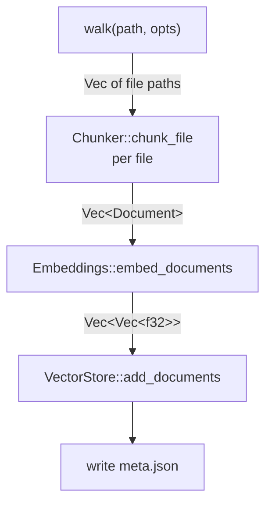

# synwire-index: Semantic Indexing Pipeline

`synwire-index` orchestrates the full indexing lifecycle: directory walking,
chunking dispatch, embedding, vector storage, cache management, and background
file watching. It is the single entry point consumed by VFS providers — they
delegate to `SemanticIndex` rather than assembling the pipeline themselves.

## Responsibilities

| Concern                   | Handled by                         |
|---------------------------|------------------------------------|
| Directory traversal       | `walker` module (walkdir + globset) |
| File → chunks             | `synwire-chunker` (AST + text)     |
| Chunks → vectors          | `synwire-embeddings-local`         |
| Vectors → storage         | `synwire-vectorstore-lancedb`      |
| Cache location + metadata | `cache` module                     |
| Background file watching  | `watcher` module (notify crate)    |
| Status tracking + events  | `SemanticIndex` state machine      |

## Lifecycle



### 1. Index request

`SemanticIndex::index(path, opts)` is called by the VFS provider. It:

- Canonicalises the path and rejects `/` with `VfsError::IndexDenied`.
- Checks the cache (unless `opts.force` is true). If `meta.json` exists and
  indicates a recent index, the status transitions directly to `Ready` with
  `was_cached: true`.
- Generates a UUID `index_id` and returns an `IndexHandle` immediately.
- Spawns a background `tokio::task` for the actual pipeline work.

### 2. Pipeline execution

The background task runs the pipeline module:



- **Walk**: Collects files matching include/exclude globs, under the max file
  size limit (default 1 MiB). Uses `walkdir` for recursive traversal and
  `globset` for pattern matching.
- **Hash check**: Each file's content is hashed with xxHash128 and compared
  against the stored hash in `hashes.json`. Files with unchanged content are
  skipped entirely — no chunking, no embedding, no vector store writes.
- **Chunk**: Changed files are passed to `Chunker::chunk_file`, which dispatches
  to AST or text chunking based on the detected language.
- **Embed + Store**: Document texts are batch-embedded and inserted into the
  vector store. Individual file failures are logged and skipped.
- **Cache**: On completion, `meta.json` is written with file/chunk counts and
  a timestamp, and `hashes.json` is updated with current content hashes.

Progress is reported via the `IndexStatus::Indexing { progress }` state, where
`progress` is a `f32` between 0.0 and 1.0 based on files processed.

### 3. File watcher

After a successful index, `synwire-index` starts a background file watcher
using the `notify` crate:

- **Platform-native**: `inotify` (Linux), `FSEvents` (macOS), `ReadDirectoryChangesW` (Windows).
- **Debouncing**: Events within a 300 ms window are coalesced. A rename-then-write
  sequence (common in editors) produces a single re-index.
- **Content hash check**: The watcher computes the xxh128 hash of the changed
  file and compares against its in-memory hash table. Files saved without
  actual content changes (e.g. editor auto-save) are skipped.
- **Incremental update**: Changed files are re-chunked and re-embedded. New
  chunks replace old ones in the vector store.

The watcher runs until `SemanticIndex::unwatch(path)` is called or the
`SemanticIndex` is dropped.

### 4. Search

`SemanticIndex::search(path, query, opts)` performs:

1. **Validation**: Checks that the path has a ready index (either from a
   completed `index()` call or from cache).
2. **Vector search**: Embeds the query and calls `similarity_search_with_score`
   on the vector store.
3. **Reranking** (optional, default on): Passes the top candidates through the
   cross-encoder reranker for more accurate scoring.
4. **Filtering**: Applies `min_score` threshold and `file_filter` glob patterns.
5. **Result mapping**: Converts `(Document, f32)` pairs into
   `SemanticSearchResult` structs with file, line range, content, score, symbol,
   and language.

## Dependency injection

`SemanticIndex` accepts its components via constructor injection:

```rust,ignore
use synwire_index::{SemanticIndex, IndexConfig};
use synwire_embeddings_local::{LocalEmbeddings, LocalReranker};
use synwire_vectorstore_lancedb::LanceDbVectorStore;

let embeddings = Arc::new(LocalEmbeddings::new()?);
let reranker = Some(Arc::new(LocalReranker::new()?));

let store_factory = Box::new(|path: &Path| {
    let rt = tokio::runtime::Handle::current();
    rt.block_on(LanceDbVectorStore::open(
        path.join("lance").to_string_lossy(),
        "chunks",
        384,
    ))
});

let index = SemanticIndex::new(
    Chunker::new(),
    embeddings,
    reranker,
    store_factory,
    IndexConfig::default(),
    None, // optional event sender
);
```

This design allows testing with mock embeddings and in-memory stores, and
supports swapping to different embedding models or vector backends without
changing `synwire-index`.

## Configuration

`IndexConfig` controls pipeline behaviour:

| Field           | Type              | Default       | Purpose                           |
|----------------|-------------------|---------------|-----------------------------------|
| `cache_base`   | `Option<PathBuf>` | OS cache dir  | Override cache location            |
| `chunk_size`   | `usize`           | 1500          | Target bytes for text chunks       |
| `chunk_overlap` | `usize`          | 200           | Overlap bytes between text chunks  |

## Event notifications

An optional `tokio::sync::mpsc::Sender<IndexEvent>` can be provided at
construction. The pipeline emits events that the VFS provider or agent runner
can forward to the LLM:

| Event                   | When                                      |
|-------------------------|-------------------------------------------|
| `IndexEvent::Progress`  | During pipeline execution (periodic)       |
| `IndexEvent::Complete`  | Pipeline finished successfully              |
| `IndexEvent::Failed`    | Pipeline encountered a fatal error          |
| `IndexEvent::FileChanged` | Watcher detected a file change            |

## See also

- [Semantic Search Architecture](./semantic-search-architecture.md) — pipeline overview
- [synwire-chunker](./synwire-chunker.md) — chunking strategies
- [synwire-embeddings-local](./synwire-embeddings-local.md) — embedding models
- [synwire-vectorstore-lancedb](./synwire-vectorstore-lancedb.md) — vector storage
- [Semantic Search Tutorial](../tutorials/09-semantic-search.md) — hands-on walkthrough
- [Semantic Search How-To](../how-to/semantic-search.md) — task-focused recipes
