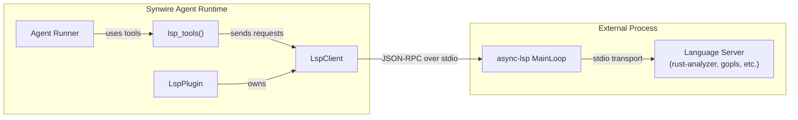
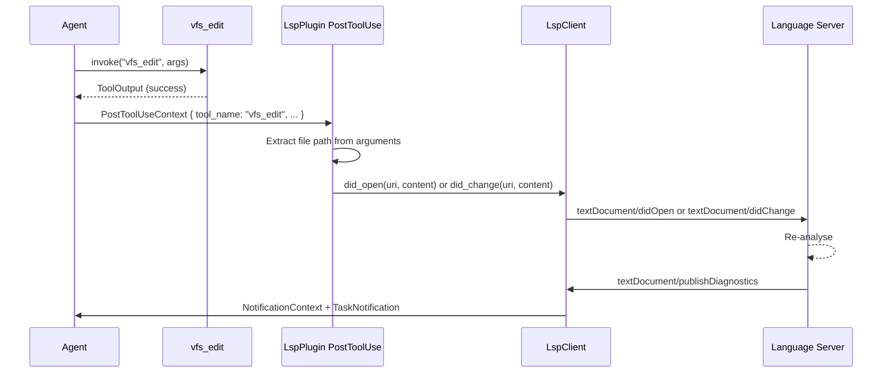
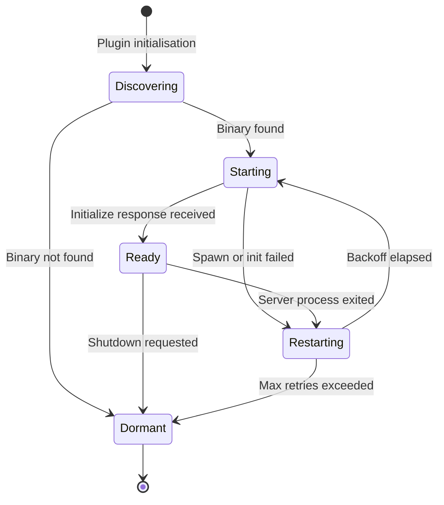

# synwire-lsp: Language Server Integration

An AI agent that can read files and run grep has access to the textual content of a codebase. It does not, however, have access to the *meaning* of that content. It cannot answer "what type does this variable have?" without parsing the source code, resolving imports, and evaluating type inference. Language servers exist precisely to provide this semantic intelligence. The `synwire-lsp` crate bridges the Language Server Protocol into the synwire agent runtime, giving agents structured access to type information, diagnostics, symbol navigation, and refactoring operations.

## The Problem: Text Search Is Not Code Understanding

Consider an agent asked to rename a function across a codebase. With text search alone (`grep` or VFS `grep`), the agent can find occurrences of the function name. But the function name might also appear in comments, string literals, or as a substring of a longer identifier. The agent has no way to distinguish a call site from a coincidental match. It cannot know whether two identically-named functions in different modules refer to the same symbol or to distinct definitions.

A language server resolves these ambiguities. It maintains a semantic model of the codebase: the parse tree, the type environment, the symbol table, the import graph. When asked for "references to function `foo` in module `bar`", it returns exactly the call sites, method references, and re-exports that resolve to that definition. When asked for diagnostics, it returns the compiler's own assessment of errors and warnings — not a heuristic, but the same analysis the compiler would perform.

The challenge is that the Language Server Protocol is a stateful, bidirectional, asynchronous protocol. It was designed for IDEs, not for AI agents. Integrating it into synwire requires solving several problems: lifecycle management, capability negotiation, document synchronisation, notification bridging, and crash recovery.

## Architecture

The crate is structured as a plugin that owns an LSP client, which in turn communicates with an external language server process:



The notification path flows in the opposite direction:


`LspPlugin` implements the `Plugin` trait. It registers signal routes, contributes tools via `Plugin::tools()`, and bridges notifications through the `HookRegistry`. `LspClient` is the typed wrapper around the `async-lsp` concurrency machinery — it sends JSON-RPC requests and receives responses, while the `MainLoop` handles the transport-level framing and multiplexing.

## `LanguageClient` Notification Bridging

The LSP protocol is not purely request-response. The server sends unsolicited notifications to the client: `textDocument/publishDiagnostics` when errors change, `window/showMessage` for user-facing messages, `window/logMessage` for debug output. In an IDE, these drive UI updates. In synwire, they must be routed into the agent's event and signal systems.

`LspPlugin` implements the `LanguageClient` trait from `async-lsp`, which provides callback methods for each notification type. The implementation of each callback does two things:

1. **Fires a `NotificationContext` hook** via the `HookRegistry`. This allows any registered notification hook to observe the event. A diagnostic notification, for example, produces a `NotificationContext` with `level: "diagnostics"` and a message containing the file URI and diagnostic summary.

2. **Emits an `AgentEvent::TaskNotification`** with a `Custom` kind string. For diagnostics, this is `"lsp_diagnostics_changed"`; for server crashes, `"lsp_server_crashed"`. The event carries a JSON payload with the full notification data.

The `TaskNotification` event is then available to the signal routing system. An agent that has registered a route for `SignalKind::Custom("lsp_diagnostics_changed".into())` will receive the signal and can react — for example, by invoking the `lsp_diagnostics` tool to read the current diagnostic set and attempting fixes.

This two-path delivery — hooks for observation, signals for reactive behaviour — follows the same pattern used throughout synwire. Hooks are for logging, auditing, and side-effect-free reactions. Signals are for directing the agent's next action.

## Capability-Conditional Tool Generation

Not every language server supports every LSP feature. A minimal server might support `textDocument/completion` and `textDocument/diagnostics` but not `textDocument/rename` or `textDocument/formatting`. Exposing a `lsp_rename` tool to the agent when the server does not support renaming would produce confusing errors at runtime.

The `lsp_tools()` function follows the same pattern as `vfs_tools()` in `synwire-core`. It takes the `ServerCapabilities` returned by the server's `initialize` response and generates only those tools that the server has declared support for:

```rust,ignore
pub fn lsp_tools(
    client: Arc<LspClient>,
    capabilities: &ServerCapabilities,
) -> Vec<Arc<dyn Tool>> {
    let mut tools: Vec<Arc<dyn Tool>> = Vec::new();

    // Always available — diagnostics come from notifications, not a capability
    tools.push(Arc::new(LspDiagnosticsTool::new(Arc::clone(&client))));

    if capabilities.hover_provider.is_some() {
        tools.push(Arc::new(LspHoverTool::new(Arc::clone(&client))));
    }

    if capabilities.definition_provider.is_some() {
        tools.push(Arc::new(LspGotoDefinitionTool::new(Arc::clone(&client))));
    }

    if capabilities.references_provider.is_some() {
        tools.push(Arc::new(LspReferencesTool::new(Arc::clone(&client))));
    }

    if capabilities.rename_provider.is_some() {
        tools.push(Arc::new(LspRenameTool::new(Arc::clone(&client))));
    }

    // ... further capability checks for formatting, code actions, etc.

    tools
}
```

This approach ensures the agent's tool set accurately reflects what the language server can do. The agent never sees a tool it cannot use. If the server is upgraded to support additional capabilities, the tools appear automatically on the next connection without any configuration change.

The `VfsCapabilities` bitflag pattern from the VFS module serves as the conceptual precedent. There, each VFS operation has a corresponding capability flag, and `vfs_tools()` only generates tools for capabilities the provider declares. The LSP case is structurally identical, but the capabilities come from the `ServerCapabilities` struct defined by the LSP specification rather than from a custom bitflag.

## Document Synchronisation

The LSP protocol requires the client to notify the server when documents are opened, modified, or closed. In an IDE, keystrokes trigger `textDocument/didChange`. In synwire, file mutations happen through VFS tools — `vfs_write`, `vfs_edit`, `vfs_append`. The language server must be informed of these changes so that its semantic model stays current.

The synchronisation is driven by a `PostToolUse` hook registered by `LspPlugin`:



The hook inspects the `PostToolUseContext` to determine which file was affected. If the file has not been opened with the language server yet, it sends `textDocument/didOpen` with the full file content. If it was already open, it sends `textDocument/didChange`.

The initial implementation uses **full-document synchronisation** (`TextDocumentSyncKind::Full`). Each change notification includes the entire file content. This is simpler and more robust than incremental synchronisation, which requires the client to compute precise text edits (line/character offsets, insertion ranges) that exactly match the server's expected document state. A mismatch in incremental sync causes the server's model to diverge from the actual file content — a class of bug that is difficult to detect and produces misleading diagnostics.

Full-document sync is measurably less efficient for large files. A single-character edit in a 10,000-line file transmits 10,000 lines over the stdio pipe. For the typical agent workflow — where file edits are infrequent relative to LLM inference time — this overhead is negligible. If profiling reveals it to be a bottleneck, incremental sync can be added later without changing the plugin's external interface.

When a VFS tool deletes a file (`vfs_rm`), the hook sends `textDocument/didClose`. The server can then release memory associated with the file's analysis state.

## Auto-Start and Crash Recovery

Language servers are external processes. They can fail to start (binary not found), crash during operation (segfault, OOM), or hang (deadlock). The agent should not fail permanently when the language server is unavailable — it should degrade gracefully to text-based tools and attempt recovery.

Server startup follows this sequence:

1. **Registry lookup**: The `LspPlugin` configuration specifies a language identifier (e.g., `"rust"`, `"go"`, `"python"`). The language server registry maps this to a server binary name and default arguments.

2. **Binary discovery**: `which::which()` locates the binary on `$PATH`. If the binary is not found, the plugin logs a warning and enters a dormant state. No LSP tools are registered. The agent operates without language intelligence.

3. **Process spawn**: The binary is launched as a child process with stdio transport. The `async-lsp` `MainLoop` manages the stdin/stdout pipes.

4. **Initialisation handshake**: The plugin sends `initialize` with the workspace root and client capabilities. The server responds with its `ServerCapabilities`. Tool generation happens at this point.

Crash recovery uses exponential backoff:



When the server process exits unexpectedly, the plugin emits a `SignalKind::Custom("lsp_server_crashed".into())` signal and enters the `Restarting` state. The backoff sequence is 1s, 2s, 4s, 8s, 16s, capped at 30s. After five consecutive failures without a successful `initialize`, the plugin enters `Dormant` and logs a permanent warning. LSP tools are removed from the agent's tool set.

During the restart window, LSP tool invocations return a structured error message explaining that the language server is restarting. This allows the agent to fall back to VFS-based text search rather than treating the failure as a hard error.

## Language Server Registry

The registry provides a mapping from language identifiers to server binaries and default arguments. It ships with built-in entries derived from [langserver.org](https://langserver.org/):

| Language | Binary | Default Arguments |
|----------|--------|-------------------|
| `rust` | `rust-analyzer` | (none) |
| `go` | `gopls` | `serve` |
| `python` | `pylsp` | (none) |
| `typescript` | `typescript-language-server` | `--stdio` |
| `c` | `clangd` | (none) |

The registry is extensible via configuration. An agent builder can add custom entries or override built-in ones:

```rust,ignore
let plugin = LspPlugin::builder()
    .language("rust")
    .server_binary("rust-analyzer")
    .server_args(vec!["--log-file=/tmp/ra.log".into()])
    .registry_override("haskell", "haskell-language-server-wrapper", vec!["--lsp".into()])
    .build()?;
```

The registry stores entries as plain data — binary name, argument list, optional environment variables. It does not attempt to install missing servers. Installation is the responsibility of the environment (container image, Nix shell, system package manager). The agent's role is to use what is available, not to provision infrastructure.

## Trade-offs

**Stateful servers consume memory and startup time.** A language server for a large Rust project may take 10-30 seconds to fully index the workspace and consume several hundred megabytes of RAM. For short-lived agent tasks — answering a single question about a codebase — this startup cost may exceed the cost of the task itself. The dormant/ready state machine mitigates this by deferring startup until the first LSP tool invocation, but the fundamental cost remains.

**Synchronisation lag between VFS edits and LSP state.** After a `vfs_edit` triggers `didChange`, the language server must re-analyse the affected files. For rust-analyzer, this can take seconds for a change that affects type inference across many modules. During this window, diagnostics and hover information reflect the pre-edit state. The agent has no reliable way to know when re-analysis is complete — LSP provides no "analysis finished" notification in the standard protocol.

**Single-workspace limitation.** The current design opens one language server per workspace root. An agent working across multiple repositories would need multiple `LspPlugin` instances, each with its own server process. Multi-root workspace support (available in some servers) is a possible future extension but adds configuration complexity.

**Protocol version coupling.** The `async-lsp` crate tracks a specific LSP protocol version. Servers that implement newer protocol features may not be fully utilised; servers that implement older versions may produce unexpected behaviour if the client sends requests they do not recognise. The capability-conditional tool generation partially mitigates this — the agent only sees tools for capabilities the server actually declared — but edge cases remain around optional fields and protocol extensions.

**See also:** For how to configure and use LSP tools in an agent, see the [LSP Integration how-to guide](../how-to/lsp-integration.md). For how LSP notifications integrate with the hook and signal systems, see the [LSP/DAP Event Integration](./lsp-dap-event-integration.md) explanation. For the VFS tool generation pattern that `lsp_tools()` follows, see the [VFS Providers how-to guide](../how-to/vfs.md). For the three-tier signal routing that handles `lsp_diagnostics_changed` signals, see the [Three-Tier Signal Routing](./agent-core-three-tier-signal-routing.md) explanation.
