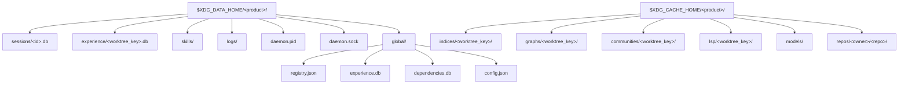
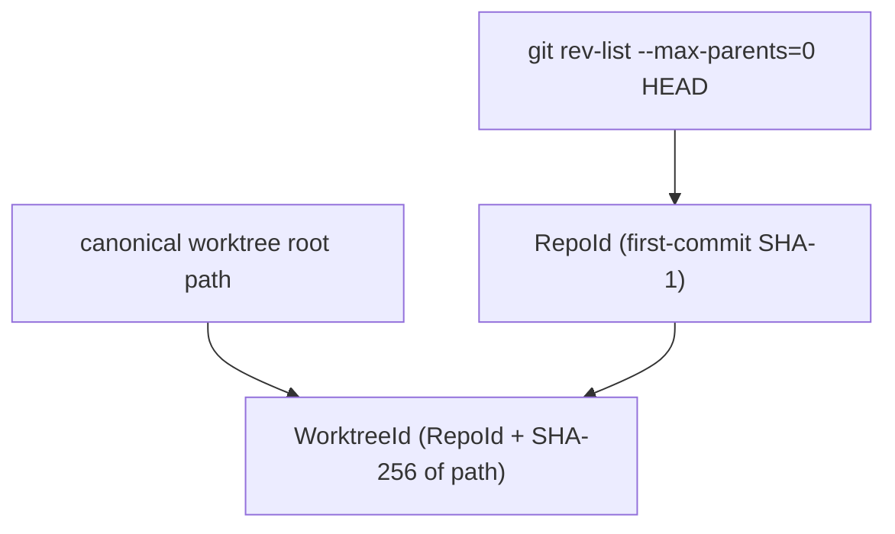

# synwire-storage: Storage Layout and Project Identity

`synwire-storage` provides two things: a deterministic mapping from a product name to all storage paths a Synwire deployment needs (`StorageLayout`), and a two-level project identity (`RepoId` / `WorktreeId`) that is stable across clones and branches.

## Why a centralised path library?

Without a shared layout library, paths scatter across crates and configuration files, making them difficult to migrate and easy to get wrong. `StorageLayout` is the single source of truth: every crate that needs a path calls `layout.index_cache(worktree)` rather than constructing paths ad-hoc.

## Path hierarchy



### Durable vs cache

Data is separated by durability:

| Tier | Location | Property | Examples |
|------|----------|----------|---------|
| Durable | `$DATA/<product>/` | Must survive reboots | Sessions, experience, skills, logs |
| Cache | `$CACHE/<product>/` | Safe to delete and regenerate | Indices, graphs, communities, cloned repos |

This separation aligns with XDG semantics. Cache directories can be cleaned by `systemd-tmpfiles`, `bleachbit`, or manual deletion without losing durable state.

## Configuration hierarchy

`StorageLayout::new(product_name)` resolves paths in this priority order:

1. `SYNWIRE_DATA_DIR` / `SYNWIRE_CACHE_DIR` environment variables
2. Programmatic override via `StorageLayout::with_root(root, name)`
3. `.<product>/config.json` in the project root
4. Platform default (`directories::BaseDirs`)

This allows per-project, per-machine, and per-container overrides without changing code.

## Two-level identity

### The problem

A developer may have multiple working copies of the same repository:

- `~/projects/myapp` — main branch
- `~/projects/myapp-feature` — feature branch (git worktree)
- `~/builds/myapp` — CI checkout

These should share certain data (experience pool, global dependency graph) but have independent indices (because the code differs per branch).

### Solution: RepoId + WorktreeId



**`RepoId`** is the same for all clones and worktrees of one repository. It is derived from the SHA-1 of the root (first) commit. When Git is unavailable, SHA-256 of the canonical path is used as a fallback.

**`WorktreeId`** uniquely identifies a single working copy. It combines `RepoId` with a SHA-256 of the canonicalised worktree root path. The `key()` method returns a compact filesystem-safe string: `<repo_id>-<worktree_hash[:12]>`.

### What each tier uses

| Data | Keyed by | Why |
|------|----------|-----|
| Vector + BM25 indices | `WorktreeId` | Code differs per branch |
| Code dependency graph | `WorktreeId` | Call graph is branch-specific |
| Experience pool | `WorktreeId` | Edit history is branch-specific |
| Global dependency index | — | Spans all repos |
| Global experience | — | Spans all repos |

## Path conventions

All path strings produced by `StorageLayout` use the `WorktreeId.key()` format as directory names under the cache root. This means:

- Directory names are stable across renames of the project directory (key is based on git content, not path)
- Two machines cloning the same repo get the same `RepoId` and therefore compatible cache structures
- Branch switches produce different `WorktreeId`s, so index data from `main` is not mixed with `feature-branch`

## Product isolation

Each product name produces fully isolated paths. Two products running on the same machine cannot see each other's data:

```rust,no_run
let a = StorageLayout::new("product-a")?;
let b = StorageLayout::new("product-b")?;
assert_ne!(a.data_home(), b.data_home());
assert_ne!(a.cache_home(), b.cache_home());
```

This enables multiple Synwire-based tools (e.g. a coding assistant and a documentation assistant) to coexist without conflicting storage.

## Directory permissions

`StorageLayout::ensure_dir(path)` creates directories with `0o700` permissions on Unix. This prevents other users on the same machine from reading session data, experience pools, or API-adjacent artefacts.

## See also

- [synwire-storage](./synwire-storage.md) — API reference
- [Migration Guide](../how-to/migration.md) — path changes from pre-StorageLayout deployments
- [synwire-daemon](./synwire-daemon.md) — how the daemon uses `daemon_pid_file()` and `daemon_socket()`
