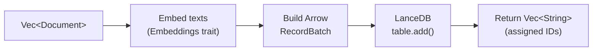
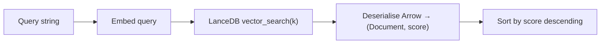

# synwire-vectorstore-lancedb: Vector Storage with LanceDB

`synwire-vectorstore-lancedb` implements the `VectorStore` trait on top of
[LanceDB](https://lancedb.github.io/lancedb/), a serverless columnar vector
database built on Apache Arrow. It stores document embeddings on disk and
supports similarity search with no external server process.

## Why LanceDB

Synwire's semantic search targets single-machine, offline-capable use cases — a
developer's laptop indexing a codebase. This rules out hosted vector databases
and favours embedded solutions:

| Requirement                | LanceDB                        | Alternatives (Qdrant, Milvus, etc.) |
|----------------------------|--------------------------------|--------------------------------------|
| No server process          | Yes (embedded library)         | Requires separate server             |
| Disk-backed persistence    | Yes (Lance format files)       | Yes                                  |
| No network dependency      | Yes                            | Typically client-server              |
| Apache Arrow native        | Yes (zero-copy data access)    | Varies                               |
| Rust-first                 | Yes                            | Often Python-first                   |
| Approximate nearest-neighbour | IVF-PQ (optional)          | Yes                                  |

LanceDB writes data as Lance files — a columnar format derived from Arrow IPC
with built-in versioning and fast random access. For small-to-medium codebases
(thousands to tens of thousands of chunks), the default flat scan is fast enough.
IVF-PQ indexing is available for larger collections.

## Schema

Each vector store table uses a fixed Arrow schema:

| Column     | Arrow type                         | Description                     |
|-----------|------------------------------------|---------------------------------|
| `id`      | `Utf8`                             | UUID v4 per chunk               |
| `text`    | `Utf8`                             | Chunk content (source code or prose) |
| `vector`  | `FixedSizeList(Float32, dims)`     | Embedding vector (384 dims default) |
| `metadata`| `Utf8`                             | JSON-serialised metadata map    |

The `dims` parameter is set at construction and must match the embedding model's
output dimensionality. `LanceDbVectorStore::open()` validates this on every
`add_documents` call — a dimension mismatch returns `LanceDbError::DimensionMismatch`.

## Operations

`LanceDbVectorStore` implements `synwire_core::vectorstore::VectorStore`:

| Method                           | Description                                                |
|----------------------------------|------------------------------------------------------------|
| `add_documents(docs, embeddings)` | Embed documents, assign UUIDs, insert as Arrow record batch |
| `similarity_search(query, k, embeddings)` | Embed query, find *k* nearest vectors                    |
| `similarity_search_with_score(query, k, embeddings)` | Same, but returns `(Document, f32)` pairs     |
| `delete(ids)`                    | Remove documents by ID using SQL `IN` predicate            |

### Add flow



Documents with an existing `id` in their metadata retain it; documents without
one receive a new UUID v4. This allows idempotent re-indexing of the same file.

### Search flow



Scores are L2 distances — lower is more similar. The results are sorted so the
most relevant document comes first.

## Error types

| Error                              | Cause                                        |
|------------------------------------|----------------------------------------------|
| `LanceDbError::Lance(String)`      | LanceDB operation failed (I/O, corruption)   |
| `LanceDbError::Embedding(String)`  | Embedding call failed during add/search       |
| `LanceDbError::DimensionMismatch`  | Vector dims do not match table schema         |
| `LanceDbError::NoTable`            | Table not found (internal state error)        |

All errors are mapped to `SynwireError::VectorStore(VectorStoreError::Failed { message })`
when accessed through the `VectorStore` trait.

## Disk layout

LanceDB stores data at the path provided to `LanceDbVectorStore::open()`:

```text
<store_path>/
├── <table_name>.lance/
│   ├── data/           ← Lance data files (columnar Arrow)
│   ├── _versions/      ← version metadata
│   └── _indices/       ← optional ANN index files
```

In the context of `synwire-index`, the store path is
`$XDG_CACHE_HOME/synwire/indices/<sha256(path)>/lance/`.

## See also

- [Semantic Search Architecture](./semantic-search-architecture.md) — how vector storage fits in the pipeline
- [synwire-embeddings-local](./synwire-embeddings-local.md) — the embedding model producing vectors
- [synwire-index](./synwire-index.md) — the indexing pipeline that manages the store
- [synwire-core: Trait Contract Layer](./synwire-core.md) — the `VectorStore` trait
