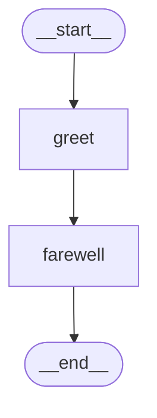

# Graph Agents

This tutorial builds a custom graph-based agent using `StateGraph` from `synwire-orchestrator`.

## Overview

A `StateGraph` is a directed graph where:

- **Nodes** are async functions that transform state
- **Edges** are transitions between nodes (static or conditional)
- **State** is a `serde_json::Value` passed through the graph

## Basic graph

```rust,ignore
use synwire_orchestrator::graph::StateGraph;
use synwire_orchestrator::constants::END;
use synwire_orchestrator::error::GraphError;

#[tokio::main]
async fn main() -> Result<(), GraphError> {
    let mut graph = StateGraph::new();

    // Add a node that appends a greeting
    graph.add_node("greet", Box::new(|mut state| {
        Box::pin(async move {
            state["greeting"] = serde_json::json!("Hello!");
            Ok(state)
        })
    }))?;

    // Add a node that appends a farewell
    graph.add_node("farewell", Box::new(|mut state| {
        Box::pin(async move {
            state["farewell"] = serde_json::json!("Goodbye!");
            Ok(state)
        })
    }))?;

    // Wire the graph: start -> greet -> farewell -> end
    graph.set_entry_point("greet");
    graph.add_edge("greet", "farewell");
    graph.set_finish_point("farewell");

    // Compile and run
    let compiled = graph.compile()?;
    let result = compiled.invoke(serde_json::json!({})).await?;

    assert_eq!(result["greeting"], "Hello!");
    assert_eq!(result["farewell"], "Goodbye!");

    Ok(())
}
```

## Conditional edges

Route execution based on state:

```rust,ignore
use std::collections::HashMap;
use synwire_orchestrator::constants::END;

// Condition function inspects state and returns a branch key
fn route(state: &serde_json::Value) -> String {
    if state["score"].as_i64().unwrap_or(0) > 80 {
        "pass".into()
    } else {
        "retry".into()
    }
}

let mut mapping = HashMap::new();
mapping.insert("pass".into(), END.into());
mapping.insert("retry".into(), "evaluate".into());

graph.add_conditional_edges("evaluate", Box::new(route), mapping);
```

## Recursion limit

Guard against infinite loops:

```rust,ignore
let compiled = graph.compile()?
    .with_recursion_limit(10);
```

If execution exceeds the limit, `GraphError::RecursionLimit` is returned.

## Visualisation

Generate a Mermaid diagram of your graph:

```rust,ignore
let mermaid = compiled.to_mermaid();
println!("{mermaid}");
```

Output:



## Using with a chat model

Combine graph orchestration with model invocations:

```rust,ignore
use std::sync::Arc;
use synwire_core::language_models::{FakeChatModel, BaseChatModel};
use synwire_core::messages::Message;

let model = Arc::new(FakeChatModel::new(vec!["Processed.".into()]));

let model_ref = Arc::clone(&model);
graph.add_node("llm_node", Box::new(move |state| {
    let model = Arc::clone(&model_ref);
    Box::pin(async move {
        let query = state["query"].as_str().unwrap_or("");
        let result = model
            .invoke(&[Message::human(query)], None)
            .await
            .map_err(|e| GraphError::Core(e))?;
        let mut new_state = state;
        new_state["response"] = serde_json::json!(
            result.message.content().as_text()
        );
        Ok(new_state)
    })
}))?;
```

## Next steps

- [Derive Macros](./derive-macros.md) -- `#[derive(State)]` for typed graph state
- [Add Checkpointing](../how-to/add-checkpointing.md) -- persist graph state
- [Graph Interrupts](../how-to/graph-interrupts.md) -- pause and resume graphs

## See also

- [StateGraph vs FsmStrategy](../explanation/graph-vs-agent.md) — when to use a graph pipeline vs a single-agent FSM
- [Pregel Execution Model](../explanation/pregel.md) — how supersteps work under the hood
- [synwire-orchestrator Explanation](../explanation/synwire-orchestrator.md) — channels and conditional routing

> **Background**: [AI Workflows vs AI Agents](https://www.promptingguide.ai/agents/ai-workflows-vs-ai-agents) — the spectrum from deterministic pipelines to autonomous agents.
> **Background**: [Introduction to Agents](https://www.promptingguide.ai/agents/introduction) — agent architecture fundamentals.
