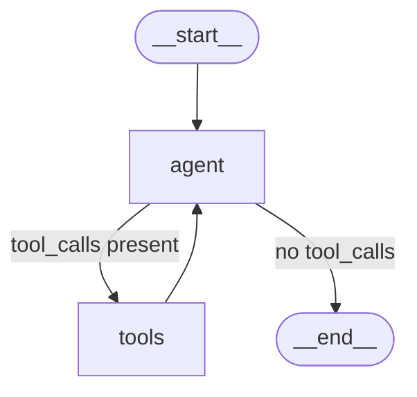

# Tools and Agents

This tutorial shows how to define tools and create a ReAct agent that uses them.

## Defining a tool

Implement the `Tool` trait:

```rust,ignore
use synwire_core::tools::{Tool, ToolOutput, ToolSchema};
use synwire_core::error::SynwireError;
use synwire_core::BoxFuture;

struct Calculator;

impl Tool for Calculator {
    fn name(&self) -> &str { "calculator" }
    fn description(&self) -> &str { "Evaluates simple maths expressions" }
    fn schema(&self) -> &ToolSchema {
        // In practice, store this in a field
        Box::leak(Box::new(ToolSchema {
            name: "calculator".into(),
            description: "Evaluates simple maths expressions".into(),
            parameters: serde_json::json!({
                "type": "object",
                "properties": {
                    "expression": {"type": "string"}
                },
                "required": ["expression"]
            }),
        }))
    }
    fn invoke(
        &self,
        input: serde_json::Value,
    ) -> BoxFuture<'_, Result<ToolOutput, SynwireError>> {
        Box::pin(async move {
            let expr = input["expression"].as_str().unwrap_or("0");
            Ok(ToolOutput {
                content: format!("Result: {expr}"),
                artifact: None,
            })
        })
    }
}
```

## Using StructuredTool

For simpler tool definitions without implementing the trait manually:

```rust,ignore
use synwire_core::tools::StructuredTool;

let tool = StructuredTool::builder()
    .name("search")
    .description("Searches the web")
    .parameters(serde_json::json!({
        "type": "object",
        "properties": {
            "query": {"type": "string"}
        },
        "required": ["query"]
    }))
    .func(|input| Box::pin(async move {
        let query = input["query"].as_str().unwrap_or("");
        Ok(synwire_core::tools::ToolOutput {
            content: format!("Results for: {query}"),
            artifact: None,
        })
    }))
    .build()?;
```

## Creating a ReAct agent

The `create_react_agent` function builds a graph that loops between the model and tools:

```rust,ignore
use synwire_core::language_models::{FakeChatModel, BaseChatModel};
use synwire_core::tools::Tool;
use synwire_orchestrator::prebuilt::create_react_agent;

let model: Box<dyn BaseChatModel> = Box::new(
    FakeChatModel::new(vec!["The answer is 42.".into()])
);
let tools: Vec<Box<dyn Tool>> = vec![/* your tools here */];

let graph = create_react_agent(model, tools)?;

let state = serde_json::json!({
    "messages": [
        {"type": "human", "content": "What is 6 * 7?"}
    ]
});

let result = graph.invoke(state).await?;
```

## How ReAct works

The agent graph follows this pattern:



1. **agent** node: invokes the model with current messages
2. **tools_condition**: checks if the AI response contains tool calls
3. **tools** node: executes tool calls and appends results
4. Loop continues until the model responds without tool calls

## Tool name validation

Tool names must match `[a-zA-Z0-9_-]{1,64}`:

```rust,ignore
use synwire_core::tools::validate_tool_name;

assert!(validate_tool_name("my-tool").is_ok());
assert!(validate_tool_name("my tool").is_err()); // spaces not allowed
```

## Next steps

- [Graph Agents](./graph-agent.md) -- build custom graph-based agents
- [Derive Macros](./derive-macros.md) -- use `#[tool]` for ergonomic tool definitions

> **Background**: [Function Calling](https://www.promptingguide.ai/agents/function-calling) — how LLMs invoke structured tools.
> **Background**: [ReAct](https://www.promptingguide.ai/techniques/react) — the Reason + Act pattern that most tool-using agents follow.
