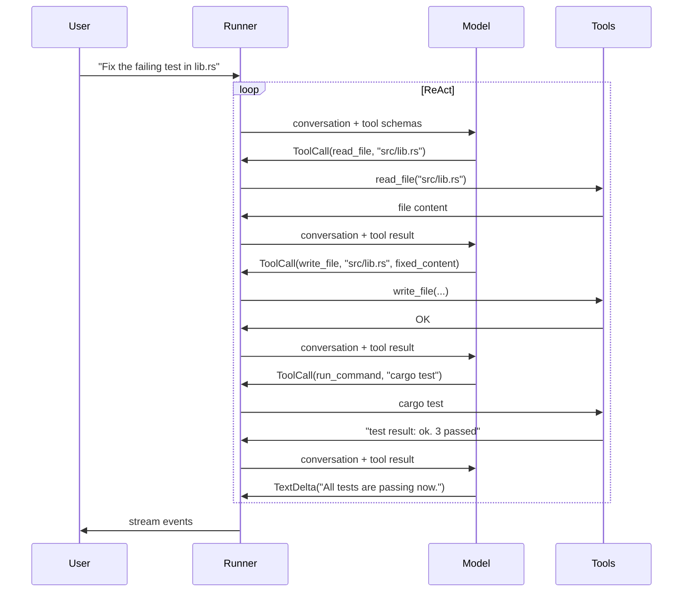

# Tutorial 7: Building a Coding Agent

**Time**: ~90 minutes
**Prerequisites**: Rust 1.85+, completion of [Tutorial 5: File and Shell Operations](./05-backend-operations.md), basic familiarity with async Rust

> **Background**: [Function Calling](https://www.promptingguide.ai/agents/function-calling) — how LLMs invoke tools; [ReAct](https://www.promptingguide.ai/techniques/react) — the reason-then-act loop that coding agents use.

In this tutorial you will build a terminal-based coding assistant — similar in spirit to tools like OpenCode or Aider — using the Synwire agent runtime. By the end you will have a working binary that:

- Reads and writes files inside a project directory
- Searches source code for patterns
- Runs shell commands (`cargo build`, `cargo test`, linters)
- Streams output to the terminal as the model generates it
- Resumes conversations across sessions
- Asks for approval before running shell commands

> 📖 **Rust note:** A [trait](https://doc.rust-lang.org/book/ch10-02-traits.html) is Rust's equivalent of an interface. Synwire's `Vfs` and `Tool` are traits — they define a contract that multiple implementations satisfy, letting you swap backends without changing the agent.

---

## What makes a coding agent different

A plain chatbot responds with text. A coding agent calls tools on every turn:

1. **Model receives** the user's request plus the conversation history.
2. **Model emits** a tool call (e.g., `read_file("src/main.rs")`).
3. **Runtime executes** the tool and appends the result to the conversation.
4. **Model receives** the tool result and decides whether to call another tool or respond.
5. Repeat until the model emits a text response with no tool calls.

This loop — called **ReAct** (Reason + Act) — continues until the model decides the task is done. Synwire's `Runner` drives this loop automatically. Your job is to define the tools and the system prompt.



---

## Step 1: Project setup

Create a new binary crate:

```bash
cargo new synwire-coder
cd synwire-coder
```

Add dependencies to `Cargo.toml`:

```toml
[package]
name = "synwire-coder"
version = "0.1.0"
edition = "2024"

[dependencies]
# Agent builder and Runner
synwire-core  = "0.1"
synwire-agent = "0.1"

# OpenAI provider (swap for synwire-llm-ollama for local inference)
synwire-llm-openai = "0.1"

# Async runtime
tokio = { version = "1", features = ["full"] }

# JSON tool schemas and input parsing
serde        = { version = "1", features = ["derive"] }
serde_json   = "1"
schemars     = { version = "0.8", features = ["derive"] }

# Error handling
anyhow = "1"

# Command-line argument parsing
clap = { version = "4", features = ["derive"] }

[dev-dependencies]
synwire-test-utils = "0.1"
```

> 📖 **Rust note:** `schemars` derives [JSON Schema](https://json-schema.org/) from your Rust types. The `#[tool]` attribute macro in `synwire-derive` calls it automatically to generate the schema that the model uses to format tool call arguments.

---

## Step 2: The five core tools

A coding agent needs exactly five tools to handle most tasks. Create `src/tools.rs`:

> 📖 **Rust note:** [`serde::Deserialize`](https://serde.rs/) and `schemars::JsonSchema` on the same struct serve different purposes: `Deserialize` parses JSON arguments at runtime; `JsonSchema` generates the schema at startup that tells the model what arguments to supply.

```rust
// src/tools.rs
use std::sync::Arc;

use anyhow::Context;
use schemars::JsonSchema;
use serde::Deserialize;
use serde_json::Value;
use synwire_core::error::SynwireError;
use synwire_core::tools::{StructuredTool, ToolOutput, ToolSchema};

use crate::backend::ProjectBackend;

// ─────────────────────────────────────────────────────────────────────────────
// 1. read_file
// ─────────────────────────────────────────────────────────────────────────────

#[derive(Debug, Deserialize, JsonSchema)]
pub struct ReadFileInput {
    /// Path to the file, relative to the project root.
    pub path: String,
    /// Optional: only return lines `start_line` through `end_line` (1-indexed).
    pub start_line: Option<usize>,
    pub end_line: Option<usize>,
}

pub fn read_file_tool(backend: Arc<ProjectBackend>) -> Result<StructuredTool, SynwireError> {
    StructuredTool::builder()
        .name("read_file")
        .description(
            "Read the contents of a file in the project. \
             Use start_line and end_line to retrieve a window when the file is large.",
        )
        .schema(ToolSchema {
            name: "read_file".into(),
            description: "Read a project file".into(),
            parameters: schemars::schema_for!(ReadFileInput)
                .schema
                .into_object()
                .into(),
        })
        .func(move |args: Value| {
            let backend = Arc::clone(&backend);
            Box::pin(async move {
                let input: ReadFileInput = serde_json::from_value(args)
                    .context("invalid read_file arguments")
                    .map_err(|e| SynwireError::Tool(e.to_string()))?;

                let content = backend
                    .read(&input.path)
                    .await
                    .map_err(|e| SynwireError::Tool(e.to_string()))?;

                let text = String::from_utf8_lossy(&content.content).into_owned();

                // Apply optional line window.
                let output = match (input.start_line, input.end_line) {
                    (Some(start), Some(end)) => text
                        .lines()
                        .enumerate()
                        .filter(|(i, _)| *i + 1 >= start && *i + 1 <= end)
                        .map(|(_, line)| line)
                        .collect::<Vec<_>>()
                        .join("\n"),
                    _ => text,
                };

                Ok(ToolOutput {
                    content: output,
                    ..Default::default()
                })
            })
        })
        .build()
}

// ─────────────────────────────────────────────────────────────────────────────
// 2. write_file
// ─────────────────────────────────────────────────────────────────────────────

#[derive(Debug, Deserialize, JsonSchema)]
pub struct WriteFileInput {
    /// Path to create or overwrite, relative to the project root.
    pub path: String,
    /// Complete new content for the file.
    pub content: String,
}

pub fn write_file_tool(backend: Arc<ProjectBackend>) -> Result<StructuredTool, SynwireError> {
    StructuredTool::builder()
        .name("write_file")
        .description(
            "Write content to a file, creating it if it does not exist. \
             Overwrites the entire file. Always write the complete file content — \
             do not write partial content.",
        )
        .schema(ToolSchema {
            name: "write_file".into(),
            description: "Write a project file".into(),
            parameters: schemars::schema_for!(WriteFileInput)
                .schema
                .into_object()
                .into(),
        })
        .func(move |args: Value| {
            let backend = Arc::clone(&backend);
            Box::pin(async move {
                let input: WriteFileInput = serde_json::from_value(args)
                    .context("invalid write_file arguments")
                    .map_err(|e| SynwireError::Tool(e.to_string()))?;

                backend
                    .write(&input.path, input.content.as_bytes())
                    .await
                    .map_err(|e| SynwireError::Tool(e.to_string()))?;

                Ok(ToolOutput {
                    content: format!("Wrote {} bytes to {}", input.content.len(), input.path),
                    ..Default::default()
                })
            })
        })
        .build()
}

// ─────────────────────────────────────────────────────────────────────────────
// 3. list_dir
// ─────────────────────────────────────────────────────────────────────────────

#[derive(Debug, Deserialize, JsonSchema)]
pub struct ListDirInput {
    /// Directory to list, relative to the project root. Defaults to "." (root).
    pub path: Option<String>,
}

pub fn list_dir_tool(backend: Arc<ProjectBackend>) -> Result<StructuredTool, SynwireError> {
    StructuredTool::builder()
        .name("list_dir")
        .description(
            "List the contents of a directory. \
             Returns file names and whether each entry is a file or directory.",
        )
        .schema(ToolSchema {
            name: "list_dir".into(),
            description: "List a directory".into(),
            parameters: schemars::schema_for!(ListDirInput)
                .schema
                .into_object()
                .into(),
        })
        .func(move |args: Value| {
            let backend = Arc::clone(&backend);
            Box::pin(async move {
                let input: ListDirInput = serde_json::from_value(args)
                    .context("invalid list_dir arguments")
                    .map_err(|e| SynwireError::Tool(e.to_string()))?;

                let path = input.path.as_deref().unwrap_or(".");
                let entries = backend
                    .ls(path)
                    .await
                    .map_err(|e| SynwireError::Tool(e.to_string()))?;

                let lines: Vec<String> = entries
                    .iter()
                    .map(|e| {
                        if e.is_dir {
                            format!("{}/", e.name)
                        } else {
                            e.name.clone()
                        }
                    })
                    .collect();

                Ok(ToolOutput {
                    content: lines.join("\n"),
                    ..Default::default()
                })
            })
        })
        .build()
}

// ─────────────────────────────────────────────────────────────────────────────
// 4. search_code
// ─────────────────────────────────────────────────────────────────────────────

#[derive(Debug, Deserialize, JsonSchema)]
pub struct SearchCodeInput {
    /// Regular expression pattern to search for.
    pub pattern: String,
    /// Restrict search to this subdirectory (optional).
    pub path: Option<String>,
    /// File glob filter, e.g. "*.rs" (optional).
    pub glob: Option<String>,
    /// Number of context lines before and after each match.
    pub context_lines: Option<u32>,
    /// Case-insensitive search.
    pub case_insensitive: Option<bool>,
}

pub fn search_code_tool(backend: Arc<ProjectBackend>) -> Result<StructuredTool, SynwireError> {
    StructuredTool::builder()
        .name("search_code")
        .description(
            "Search for a regex pattern across the project files. \
             Returns matching lines with optional context. \
             Use glob to restrict to a file type (e.g. '*.rs', '*.toml').",
        )
        .schema(ToolSchema {
            name: "search_code".into(),
            description: "Grep the project files".into(),
            parameters: schemars::schema_for!(SearchCodeInput)
                .schema
                .into_object()
                .into(),
        })
        .func(move |args: Value| {
            use synwire_core::vfs::grep_options::GrepOptions;

            let backend = Arc::clone(&backend);
            Box::pin(async move {
                let input: SearchCodeInput = serde_json::from_value(args)
                    .context("invalid search_code arguments")
                    .map_err(|e| SynwireError::Tool(e.to_string()))?;

                let ctx = input.context_lines.unwrap_or(2);
                let opts = GrepOptions {
                    path: input.path,
                    glob: input.glob,
                    before_context: ctx,
                    after_context: ctx,
                    case_insensitive: input.case_insensitive.unwrap_or(false),
                    line_numbers: true,
                    ..GrepOptions::default()
                };

                let matches = backend
                    .grep(&input.pattern, opts)
                    .await
                    .map_err(|e| SynwireError::Tool(e.to_string()))?;

                if matches.is_empty() {
                    return Ok(ToolOutput {
                        content: "No matches found.".into(),
                        ..Default::default()
                    });
                }

                // Format like ripgrep terminal output.
                let mut out = String::new();
                let mut last_file = String::new();
                for m in &matches {
                    if m.file != last_file {
                        if !last_file.is_empty() {
                            out.push('\n');
                        }
                        out.push_str(&format!("{}:\n", m.file));
                        last_file = m.file.clone();
                    }
                    for line in &m.before {
                        out.push_str(&format!("  {}\n", line));
                    }
                    out.push_str(&format!(
                        "  {:>4}: {}\n",
                        m.line_number, m.line_content
                    ));
                    for line in &m.after {
                        out.push_str(&format!("  {}\n", line));
                    }
                }

                Ok(ToolOutput {
                    content: out,
                    ..Default::default()
                })
            })
        })
        .build()
}

// ─────────────────────────────────────────────────────────────────────────────
// 5. run_command
// ─────────────────────────────────────────────────────────────────────────────

#[derive(Debug, Deserialize, JsonSchema)]
pub struct RunCommandInput {
    /// Command to run, e.g. "cargo".
    pub command: String,
    /// Arguments, e.g. ["test", "--", "--nocapture"].
    pub args: Vec<String>,
    /// Optional timeout in seconds. Defaults to 120.
    pub timeout_secs: Option<u64>,
}

pub fn run_command_tool(backend: Arc<ProjectBackend>) -> Result<StructuredTool, SynwireError> {
    StructuredTool::builder()
        .name("run_command")
        .description(
            "Run a shell command in the project root directory. \
             Use for 'cargo build', 'cargo test', 'cargo clippy', 'cargo fmt', \
             and similar development commands. \
             Returns stdout, stderr, and the exit code.",
        )
        .schema(ToolSchema {
            name: "run_command".into(),
            description: "Execute a shell command".into(),
            parameters: schemars::schema_for!(RunCommandInput)
                .schema
                .into_object()
                .into(),
        })
        .func(move |args: Value| {
            use std::time::Duration;
            let backend = Arc::clone(&backend);
            Box::pin(async move {
                let input: RunCommandInput = serde_json::from_value(args)
                    .context("invalid run_command arguments")
                    .map_err(|e| SynwireError::Tool(e.to_string()))?;

                let timeout = input.timeout_secs.map(Duration::from_secs);

                let resp = backend
                    .execute_cmd(&input.command, &input.args, timeout)
                    .await
                    .map_err(|e| SynwireError::Tool(e.to_string()))?;

                // Format output for model consumption.
                let mut out = String::new();
                if !resp.stdout.is_empty() {
                    out.push_str("stdout:\n");
                    out.push_str(&resp.stdout);
                }
                if !resp.stderr.is_empty() {
                    if !out.is_empty() {
                        out.push('\n');
                    }
                    out.push_str("stderr:\n");
                    out.push_str(&resp.stderr);
                }
                out.push_str(&format!("\nexit code: {}", resp.exit_code));

                Ok(ToolOutput {
                    content: out,
                    ..Default::default()
                })
            })
        })
        .build()
}
```

> 📖 **Rust note:** `Box::pin(async move { ... })` is required because async closures can't be used directly in trait objects. The `move` keyword transfers ownership of captured variables (`backend`, `input`) into the async block. See the [Rust async book](https://rust-lang.github.io/async-book/) for a full explanation.

---

## Step 3: The backend

The agent needs access to the project's filesystem and the ability to run commands. `Shell` wraps `LocalProvider` and adds command execution. Create `src/backend.rs`:

> 📖 **Rust note:** [`Arc<T>`](https://doc.rust-lang.org/std/sync/struct.Arc.html) (Atomically Reference Counted) lets multiple tools share ownership of the same backend without copying it. Calling `.clone()` on an `Arc` creates another pointer to the same data — no allocation.

```rust
// src/backend.rs
use std::collections::HashMap;
use std::path::PathBuf;
use std::sync::Arc;

use synwire_agent::vfs::local_shell::Shell;
use synwire_core::vfs::error::VfsError;
use synwire_core::vfs::protocol::Vfs;

/// Wraps Shell as a shared, Arc-compatible project backend.
///
/// The Arc lets multiple tools borrow the same backend concurrently
/// without copying it.
pub type ProjectBackend = dyn Vfs;

/// Create the shared backend for a project directory.
pub fn create_backend(
    project_root: PathBuf,
) -> Result<Arc<Shell>, VfsError> {
    // Inherit PATH and common Rust toolchain variables from the environment.
    let env: HashMap<String, String> = std::env::vars()
        .filter(|(k, _)| {
            matches!(
                k.as_str(),
                "PATH" | "HOME" | "CARGO_HOME" | "RUSTUP_HOME" | "RUST_LOG"
            )
        })
        .collect();

    let backend = Shell::new(
        project_root,
        env,
        120, // default command timeout: 2 minutes
    )?;

    Ok(Arc::new(backend))
}
```

---

## Step 4: The system prompt

The system prompt is the most important part of any coding agent. It defines the agent's constraints, tells it which tools to reach for first, and prevents common failure modes. Create `src/prompt.rs`:

```rust
// src/prompt.rs

/// System prompt for the coding agent.
///
/// Design principles:
/// - Tell the model to read before writing (prevents hallucinated edits).
/// - Tell the model to run tests after editing (validates the change).
/// - Constrain the working directory explicitly.
/// - Describe each tool's purpose so the model reaches for the right one.
pub fn system_prompt(project_root: &str) -> String {
    format!(
        r#"You are a coding assistant with direct access to the files and shell in a \
Rust project located at `{project_root}`.

## Core workflow

When asked to make a change:
1. Use `list_dir` to orient yourself if you haven't seen the project yet.
2. Use `read_file` to read the relevant files before editing them.
3. Use `search_code` to find definitions, usages, or error messages when you \
   don't know where something is.
4. Use `write_file` to make the edit. Always write the complete file — never \
   write partial content.
5. After editing, run `cargo check` with `run_command` to verify the code \
   compiles.
6. Run `cargo test` to check for regressions.
7. If tests fail, read the error output carefully, fix the code, and re-test.

## Tool guidance

- **read_file**: Use `start_line`/`end_line` to read large files in sections. \
  Check `list_dir` first if you're not sure the file exists.
- **write_file**: Always write the complete file content. The tool overwrites \
  the entire file.
- **search_code**: Use for finding function definitions, error messages, or \
  usages of a type. Prefer `*.rs` glob for Rust files.
- **run_command**: Prefer `cargo check` over `cargo build` for speed. Run \
  `cargo clippy` when asked to improve code quality. Run `cargo fmt` when \
  asked to format.
- **list_dir**: Start here when exploring an unfamiliar project.

## Constraints

- Only modify files inside the project root.
- Do not install system packages or modify global configuration.
- If a change is destructive or irreversible, explain what you are about to \
  do before calling write_file or run_command.

When the task is complete, summarise what you changed and why.
"#
    )
}
```

---

## Step 5: Building the agent

Now assemble the tools and agent. Create `src/agent.rs`:

> 📖 **Rust note:** [`Result<T, E>`](https://doc.rust-lang.org/book/ch09-02-recoverable-errors-with-result.html) is Rust's error type. The `?` operator unwraps `Ok(value)` or immediately returns the `Err` to the caller — it replaces the boilerplate `match result { Ok(v) => v, Err(e) => return Err(e.into()) }`.

```rust
// src/agent.rs
use std::sync::Arc;

use synwire_core::agents::agent_node::Agent;
use synwire_core::agents::permission::{PermissionBehavior, PermissionMode, PermissionRule};
use synwire_core::error::SynwireError;

use crate::backend::ProjectBackend;
use crate::prompt::system_prompt;
use crate::tools::{
    list_dir_tool, read_file_tool, run_command_tool, search_code_tool, write_file_tool,
};

/// Configuration for the coding agent.
pub struct CoderAgentConfig {
    /// LLM model to use (e.g. "claude-opus-4-6").
    pub model: String,
    /// Absolute path to the project root shown in the system prompt.
    pub project_root: String,
    /// Whether to require approval before running shell commands.
    pub require_command_approval: bool,
}

/// Build the coding agent with all five tools registered.
pub fn build_coding_agent(
    backend: Arc<dyn ProjectBackend>,
    config: CoderAgentConfig,
) -> Result<Agent, SynwireError> {
    let system = system_prompt(&config.project_root);

    // Register tools — each tool captures an Arc<backend> clone.
    let read   = read_file_tool(Arc::clone(&backend))?;
    let write  = write_file_tool(Arc::clone(&backend))?;
    let ls     = list_dir_tool(Arc::clone(&backend))?;
    let search = search_code_tool(Arc::clone(&backend))?;
    let run    = run_command_tool(Arc::clone(&backend))?;

    // Permission rules: file tools auto-approve; shell commands require
    // confirmation unless require_command_approval is false.
    let permission_rules = if config.require_command_approval {
        vec![
            PermissionRule {
                tool_pattern: "read_file".into(),
                behavior: PermissionBehavior::Allow,
            },
            PermissionRule {
                tool_pattern: "list_dir".into(),
                behavior: PermissionBehavior::Allow,
            },
            PermissionRule {
                tool_pattern: "search_code".into(),
                behavior: PermissionBehavior::Allow,
            },
            PermissionRule {
                tool_pattern: "write_file".into(),
                behavior: PermissionBehavior::Ask,
            },
            PermissionRule {
                tool_pattern: "run_command".into(),
                behavior: PermissionBehavior::Ask,
            },
        ]
    } else {
        vec![PermissionRule {
            tool_pattern: "*".into(),
            behavior: PermissionBehavior::Allow,
        }]
    };

    let agent = Agent::new("coder", &config.model)
        .description("A coding assistant with filesystem and shell access")
        .system_prompt(system)
        .tool(read)
        .tool(write)
        .tool(ls)
        .tool(search)
        .tool(run)
        .permission_mode(PermissionMode::DenyUnauthorized)
        .permission_rules(permission_rules)
        .max_turns(50);

    Ok(agent)
}
```

---

## Step 6: The terminal REPL

The REPL reads user input, runs the agent, and streams events to the terminal. Create `src/repl.rs`:

> 📖 **Rust note:** Rust's [`match`](https://doc.rust-lang.org/book/ch18-00-patterns.html) is exhaustive — the compiler forces you to handle every variant. `#[non_exhaustive]` on `AgentEvent` means new variants may appear in future releases, which is why the `_` catch-all arm is required.

```rust
// src/repl.rs
use std::io::{self, BufRead, Write};

use synwire_core::agents::runner::{Runner, RunnerConfig};
use synwire_core::agents::streaming::AgentEvent;

use crate::approval::handle_approval;

/// Run the interactive REPL until the user types "exit" or EOF.
///
/// `session_id` is used to resume conversations across process restarts.
pub async fn run_repl(
    runner: &Runner,
    session_id: &str,
) -> anyhow::Result<()> {
    let stdin = io::stdin();
    let mut stdout = io::stdout();

    println!("Coding agent ready. Type your request, or 'exit' to quit.");
    println!("Session: {session_id}");
    println!();

    loop {
        // Print the prompt and flush so it appears before blocking.
        print!("you> ");
        stdout.flush()?;

        // Read one line of input.
        let mut line = String::new();
        let n = stdin.lock().read_line(&mut line)?;
        if n == 0 || line.trim() == "exit" {
            println!("Goodbye.");
            break;
        }
        let input = line.trim().to_string();
        if input.is_empty() {
            continue;
        }

        // Run the agent with the current session_id so conversation
        // history is preserved across turns.
        let config = RunnerConfig {
            session_id: Some(session_id.to_string()),
            ..RunnerConfig::default()
        };

        let mut stream = runner.run(serde_json::json!(input), config).await?;

        println!();
        print!("agent> ");
        stdout.flush()?;

        // Drain the event stream.
        while let Some(event) = stream.recv().await {
            match event {
                AgentEvent::TextDelta { content } => {
                    print!("{content}");
                    stdout.flush()?;
                }

                AgentEvent::ToolCallStart { name, .. } => {
                    println!();
                    println!("\x1b[2m[calling {name}]\x1b[0m");
                }

                AgentEvent::ToolResult { output, .. } => {
                    // Show a preview of tool results so the user can
                    // see what the agent is reading.
                    let preview: String = output.content.chars().take(120).collect();
                    let ellipsis = if output.content.len() > 120 { "…" } else { "" };
                    println!("\x1b[2m  → {preview}{ellipsis}\x1b[0m");
                }

                AgentEvent::StatusUpdate { status, .. } => {
                    println!("\x1b[2m[{status}]\x1b[0m");
                }

                AgentEvent::UsageUpdate { usage } => {
                    // Print token usage at end of turn.
                    println!(
                        "\n\x1b[2m[tokens: {}↑ {}↓]\x1b[0m",
                        usage.input_tokens, usage.output_tokens
                    );
                }

                AgentEvent::TurnComplete { reason } => {
                    println!("\n\x1b[2m[done: {reason:?}]\x1b[0m");
                }

                AgentEvent::Error { message } => {
                    eprintln!("\n\x1b[31merror: {message}\x1b[0m");
                }

                _ => {
                    // Ignore other events (ToolCallDelta, DirectiveEmitted, etc.)
                }
            }
        }

        println!();
    }

    Ok(())
}
```

---

## Step 7: Approval gates

When `PermissionBehavior::Ask` is set for a tool, Synwire calls an approval callback before executing that tool call. The callback receives the proposed `Directive` and must return `ApprovalDecision`. Create `src/approval.rs`:

```rust
// src/approval.rs
use std::io::{self, Write};

use synwire_core::agents::directive::Directive;
use synwire_agent::vfs::threshold_gate::{ApprovalDecision, ApprovalRequest};

/// Interactive approval callback for write_file and run_command.
///
/// Returns Allow, AllowAlways (never ask again), or Deny.
pub async fn handle_approval(request: &ApprovalRequest) -> ApprovalDecision {
    let tool_name = match &request.directive {
        Directive::Emit { event } => {
            // Extract tool name from ToolCall events if present.
            format!("{event:?}")
        }
        _ => format!("{:?}", request.directive),
    };

    // In practice, the approval request arrives with the tool name and
    // arguments already formatted. Display them to the user.
    eprintln!();
    eprintln!("\x1b[33m⚠ Approval required\x1b[0m");
    eprintln!("  Tool: {}", request.tool_name.as_deref().unwrap_or("unknown"));
    eprintln!("  Risk: {:?}", request.risk_level);
    if let Some(args) = &request.tool_args {
        eprintln!("  Args: {}", serde_json::to_string_pretty(args).unwrap_or_default());
    }
    eprint!("  Allow? [y]es / [a]lways / [n]o: ");
    io::stderr().flush().ok();

    let mut line = String::new();
    io::stdin().read_line(&mut line).ok();
    match line.trim() {
        "y" | "yes" => ApprovalDecision::Allow,
        "a" | "always" => ApprovalDecision::AllowAlways,
        _ => ApprovalDecision::Deny,
    }
}
```

---

## Step 8: The main binary

Wire everything together in `src/main.rs`:

> 📖 **Rust note:** [`#[tokio::main]`](https://docs.rs/tokio/latest/tokio/attr.main.html) transforms `async fn main` into a standard synchronous entry point by starting the Tokio runtime. Without it, you cannot `.await` at the top level.

```rust
// src/main.rs
mod agent;
mod approval;
mod backend;
mod prompt;
mod repl;
mod tools;

use std::path::PathBuf;

use clap::Parser;
use synwire_agent::runner::Runner;

use crate::agent::{CoderAgentConfig, build_coding_agent};
use crate::backend::create_backend;
use crate::repl::run_repl;

/// A Synwire-powered coding assistant.
#[derive(Parser)]
#[command(version, about)]
struct Cli {
    /// Project root directory to operate on.
    #[arg(short, long, default_value = ".")]
    project: PathBuf,

    /// LLM model identifier.
    #[arg(short, long, default_value = "claude-opus-4-6")]
    model: String,

    /// Session ID for conversation continuity (auto-generated if omitted).
    #[arg(short, long)]
    session: Option<String>,

    /// Automatically approve write and shell operations without prompting.
    #[arg(long)]
    auto_approve: bool,
}

#[tokio::main]
async fn main() -> anyhow::Result<()> {
    let cli = Cli::parse();

    // Resolve the project root to an absolute path.
    let project_root = cli.project.canonicalize()
        .unwrap_or_else(|_| cli.project.clone());
    let project_root_str = project_root.to_string_lossy().into_owned();

    // Create the shared backend scoped to the project root.
    let backend = create_backend(project_root)?;

    // Build the agent with the five tools.
    let agent_config = CoderAgentConfig {
        model: cli.model,
        project_root: project_root_str,
        require_command_approval: !cli.auto_approve,
    };
    let agent = build_coding_agent(backend, agent_config)?;

    // Wrap in a Runner.
    let runner = Runner::new(agent);

    // Use the provided session ID or generate a new one.
    let session_id = cli.session.unwrap_or_else(|| {
        uuid::Uuid::new_v4().to_string()
    });

    // Run the interactive REPL.
    run_repl(&runner, &session_id).await?;

    Ok(())
}
```

Add `uuid` to your dependencies for session ID generation:

```toml
uuid = { version = "1", features = ["v4"] }
```

---

## Step 9: Testing without side effects

Use `FakeChatModel` to test agent behaviour without an API key or real files. Create `tests/agent_tools.rs`:

> 📖 **Rust note:** `#[tokio::test]` is the async equivalent of `#[test]`. It starts the Tokio runtime for the duration of the test function, which is required because all Synwire operations are async.

```rust
// tests/agent_tools.rs
use std::sync::Arc;

use synwire_core::vfs::state_backend::MemoryProvider;
use synwire_test_utils::fake_chat_model::FakeChatModel;
use synwire_test_utils::recording_executor::RecordingExecutor;

use synwire_coder::agent::{CoderAgentConfig, build_coding_agent};
use synwire_coder::tools::read_file_tool;

#[tokio::test]
async fn read_file_tool_returns_content() {
    // Use MemoryProvider — ephemeral, no real filesystem.
    let backend = Arc::new(MemoryProvider::new());
    backend
        .write("/src/main.rs", b"fn main() { println!(\"hello\"); }")
        .await
        .unwrap();

    let tool = read_file_tool(Arc::clone(&backend) as Arc<_>).unwrap();

    let output = tool
        .invoke(serde_json::json!({ "path": "/src/main.rs" }))
        .await
        .unwrap();

    assert!(output.content.contains("println!"));
}

#[tokio::test]
async fn read_file_with_line_window() {
    let backend = Arc::new(MemoryProvider::new());
    let content = "line1\nline2\nline3\nline4\nline5";
    backend.write("/file.txt", content.as_bytes()).await.unwrap();

    let tool = read_file_tool(Arc::clone(&backend) as Arc<_>).unwrap();

    let output = tool
        .invoke(serde_json::json!({
            "path": "/file.txt",
            "start_line": 2,
            "end_line": 3
        }))
        .await
        .unwrap();

    assert_eq!(output.content.trim(), "line2\nline3");
    assert!(!output.content.contains("line1"), "line1 should be excluded");
    assert!(!output.content.contains("line5"), "line5 should be excluded");
}

/// Test the full agent turn loop with a fake model.
/// The fake model emits a tool call then a text response.
#[tokio::test]
async fn agent_calls_read_file_then_responds() {
    use synwire_core::agents::runner::{Runner, RunnerConfig};
    use synwire_core::agents::streaming::AgentEvent;

    let backend = Arc::new(MemoryProvider::new());
    backend
        .write("/lib.rs", b"pub fn add(a: i32, b: i32) -> i32 { a + b }")
        .await
        .unwrap();

    // FakeChatModel returns pre-programmed responses in order.
    // Response 1: a tool call to read_file.
    // Response 2: text after seeing the file content.
    let model = FakeChatModel::new(vec![
        // The model calls read_file on the first turn.
        r#"{"tool_calls": [{"id": "tc1", "name": "read_file", "arguments": {"path": "/lib.rs"}}]}"#.into(),
        // After seeing the file, it responds with text.
        "The `add` function takes two i32 arguments and returns their sum.".into(),
    ]);

    let agent_config = CoderAgentConfig {
        model: model.model_name().to_string(),
        project_root: "/".to_string(),
        require_command_approval: false,
    };
    let agent = build_coding_agent(
        Arc::clone(&backend) as Arc<_>,
        agent_config,
    )
    .unwrap();

    let runner = Runner::new(agent).with_model(model);
    let config = RunnerConfig::default();
    let mut stream = runner
        .run(serde_json::json!("Explain the add function."), config)
        .await
        .unwrap();

    let mut text = String::new();
    let mut tool_called = false;

    while let Some(event) = stream.recv().await {
        match event {
            AgentEvent::ToolCallStart { name, .. } if name == "read_file" => {
                tool_called = true;
            }
            AgentEvent::TextDelta { content } => {
                text.push_str(&content);
            }
            _ => {}
        }
    }

    assert!(tool_called, "agent should have called read_file");
    assert!(
        text.contains("add"),
        "agent should mention the function"
    );
}
```

Run the tests:

```bash
cargo test
```

---

## Step 10: Running the agent

Build and run against your current Rust project:

```bash
# Set your API key (if using OpenAI/Anthropic)
export ANTHROPIC_API_KEY="..."

# Run against the current directory
cargo run -- --project . --model claude-opus-4-6

# Run with a fixed session to resume later
cargo run -- --project . --session my-session-001

# Disable approval prompts (auto-approve all tool calls)
cargo run -- --project . --auto-approve
```

Example session:

```text
Coding agent ready. Type your request, or 'exit' to quit.
Session: my-session-001

you> Why is cargo test failing?

agent>
[calling list_dir]
  → src/ Cargo.toml Cargo.lock README.md tests/…
[calling run_command]
  → stdout:
    running 3 tests
    test tests::it_works ... FAILED

    failures:
      tests::it_works
    …
[calling read_file]
  → use crate::processor::process;

  #[test]
  fn it_works() {
      assert_eq!(process("hello"), "HELLO");
  }…
[calling search_code]
  → src/processor.rs:
    3:  pub fn process(input: &str) -> String {
    4:      input.to_lowercase()  ← match here
[calling write_file]

⚠ Approval required
  Tool: write_file
  Risk: Medium
  Args: { "path": "src/processor.rs", "content": "pub fn process ..." }
  Allow? [y]es / [a]lways / [n]o: y

[calling run_command]
  → stdout: test result: ok. 3 passed

[tokens: 2847↑ 412↓]
[done: Complete]

I found the issue: `process()` returns lowercase but the test expects uppercase.
I changed `to_lowercase()` to `to_uppercase()` in `src/processor.rs`.
All 3 tests now pass.
```

---

## Step 11: Session continuity

The `session_id` in `RunnerConfig` tells the runner to load and save conversation history via `InMemorySessionManager`. To persist sessions across process restarts, swap the session manager:

```rust,no_run
// In agent.rs, when building the Runner:
use synwire_agent::session::InMemorySessionManager;
use std::sync::Arc;

// In-memory session (lost on exit — good for development):
let session_manager = Arc::new(InMemorySessionManager::new());

// For production, implement SessionManager backed by a database.
// The runner accepts any Arc<dyn SessionManager>:
let runner = Runner::new(agent)
    .with_session_manager(session_manager);
```

With a fixed `--session` argument, the agent picks up the conversation exactly where it left off, including the full tool call history. This is how multi-session coding workflows — "continue the refactor you started yesterday" — become possible.

---

## Step 12: Extension ideas

Now that you have the foundation, here are natural next steps:

### Git-aware operations

Replace `LocalProvider` with `GitBackend` to give the agent version control awareness. The agent can then check `git diff`, create commits, and revert changes:

```rust,no_run
use synwire_agent::vfs::git::GitBackend;

let backend = Arc::new(GitBackend::new(&project_root)?);
// The agent can now call run_command("git", ["diff", "--stat"])
// and GitBackend enforces the repository boundary.
```

### Multi-file context via search first

Constrain the agent to always search before reading. Add this to the system prompt:

> Before reading any file, always call `search_code` with the symbol name to find where it is defined. Only then call `read_file` on the relevant file.

### Streaming diffs in the terminal

Intercept `write_file` tool calls in the approval gate to show a diff before applying:

```rust,no_run
// In approval.rs, compute and show a diff before accepting.
use similar::{ChangeTag, TextDiff};

let diff = TextDiff::from_lines(&old_content, &new_content);
for change in diff.iter_all_changes() {
    match change.tag() {
        ChangeTag::Delete => eprint!("\x1b[31m- {change}\x1b[0m"),
        ChangeTag::Insert => eprint!("\x1b[32m+ {change}\x1b[0m"),
        ChangeTag::Equal  => eprint!("  {change}"),
    }
}
```

### Parallel sub-agents

For large refactors, spawn a sub-agent per file using `Directive::SpawnAgent`. The orchestrator collects results via the directive system without blocking the main conversation.

### Local inference with Ollama

Swap the provider without changing any other code:

```toml
[dependencies]
synwire-llm-ollama = "0.1"
```

```rust,no_run
// src/main.rs
use synwire_llm_ollama::ChatOllama;

// Replace ChatOpenAI with ChatOllama — same BaseChatModel trait.
let runner = Runner::new(agent)
    .with_model(ChatOllama::builder().model("codestral").build()?);
```

See [Local Inference with Ollama](../getting-started/ollama.md) for setup instructions.

### Language server intelligence (LSP)

Add the `synwire-lsp` crate to give the agent semantic code understanding — hover documentation, go-to-definition, find-references, and real-time diagnostics — without reading every file:

```toml
[dependencies]
synwire-lsp = "0.1"
```

```rust,ignore
use synwire_lsp::plugin::LspPlugin;
use synwire_lsp::registry::LanguageServerRegistry;
use synwire_lsp::config::LspPluginConfig;

let registry = LanguageServerRegistry::default_registry();
let lsp = LspPlugin::new(registry, LspPluginConfig::default());

let agent = Agent::new("coder", "coding assistant")
    .plugin(Box::new(lsp))
    // ... other configuration
    .build()?;
```

The plugin auto-detects language servers on PATH based on file extension. For a Rust project, if `rust-analyzer` is installed, tools like `lsp_goto_definition`, `lsp_hover`, and `lsp_diagnostics` become available immediately. Add a line to the system prompt to take advantage:

> Before reading an entire file, use `lsp_hover` or `lsp_goto_definition` to navigate directly to the relevant symbol. Use `lsp_diagnostics` after edits to check for errors without running a full build.

See [How-To: LSP Integration](../how-to/lsp-integration.md) for full details.

### Interactive debugging (DAP)

Add the `synwire-dap` crate so the agent can debug failing tests by setting breakpoints and inspecting runtime values:

```toml
[dependencies]
synwire-dap = "0.1"
```

```rust,ignore
use synwire_dap::plugin::DapPlugin;
use synwire_dap::registry::DebugAdapterRegistry;
use synwire_dap::config::DapPluginConfig;

let registry = DebugAdapterRegistry::default_registry();
let dap = DapPlugin::new(registry, DapPluginConfig::default());

let agent = Agent::new("coder", "coding assistant")
    .plugin(Box::new(dap))
    // ... other configuration
    .build()?;
```

The agent gains tools like `debug.launch`, `debug.set_breakpoints`, `debug.continue`, `debug.variables`, and `debug.evaluate`. Add a system prompt hint:

> When a test fails and the cause is not obvious from the source code, use `debug.launch` to run it under the debugger. Set a breakpoint at the failing assertion, then use `debug.variables` to inspect local state.

Note that `debug.evaluate` is marked as destructive since it can execute arbitrary code in the debuggee — the approval gate will prompt the user before execution.

See [How-To: DAP Integration](../how-to/dap-integration.md) for full details.

---

## What you have built

You now have a working coding agent with:

| Capability | Implementation |
|---|---|
| File read (with line windows) | `read_file_tool` + `LocalProvider` |
| File write (full overwrite) | `write_file_tool` + path traversal protection |
| Directory listing | `list_dir_tool` |
| Code search (ripgrep-style) | `search_code_tool` + `GrepOptions` |
| Shell command execution | `run_command_tool` + `Shell` |
| Streaming terminal output | `AgentEvent` matching in REPL |
| Conversation continuity | `RunnerConfig::session_id` |
| Approval gates | `PermissionBehavior::Ask` + `handle_approval` |
| Safe sandboxing | `LocalProvider` path traversal protection |
| Unit-testable tools | `MemoryProvider` + `FakeChatModel` |
| Code intelligence (hover, goto-def, diagnostics) | `LspPlugin` + auto-started language server |
| Interactive debugging (breakpoints, variables) | `DapPlugin` + debug adapter |

---

## See also

- [Tutorial 5: File and Shell Operations](./05-backend-operations.md) — deep dive into `Vfs`, path traversal protection, and `GrepOptions`
- [Tutorial 2: Testing Without Side Effects](./02-pure-directive-testing.md) — `RecordingExecutor` for testing directives without executing them
- [How-To: Approval Gates](../how-to/approval-gates.md) — `ThresholdGate` and `RiskLevel`-based approval
- [How-To: MCP Integration](../how-to/mcp-integration.md) — give the agent access to external tools via the Model Context Protocol
- [How-To: Backend Implementations](../how-to/vfs.md) — `CompositeProvider`, `GitBackend`, and custom backends
- [Explanation: synwire-agent](../explanation/synwire-agent.md) — full reference for the `Runner`, middleware, and all backends
- [Local Inference with Ollama](../getting-started/ollama.md) — run the agent locally without an API key
- [Explanation: StateGraph vs FsmStrategy](../explanation/graph-vs-agent.md) — when to use an agent runtime vs. a graph workflow
- [How-To: LSP Integration](../how-to/lsp-integration.md) — add code intelligence tools (hover, goto-definition, diagnostics) to your agent
- [How-To: DAP Integration](../how-to/dap-integration.md) — add interactive debugging (breakpoints, stepping, variable inspection)
- [Explanation: synwire-lsp](../explanation/synwire-lsp.md) — architecture and design of the LSP integration
- [Explanation: synwire-dap](../explanation/synwire-dap.md) — architecture and design of the DAP integration

> **Background**: [AI Workflows vs AI Agents](https://www.promptingguide.ai/agents/ai-workflows-vs-ai-agents) — the distinction between an orchestrated pipeline and a ReAct agent loop; this tutorial builds the latter. [Context Engineering for AI Agents](https://www.promptingguide.ai/agents/context-engineering) — how the system prompt and tool descriptions shape agent behaviour.
