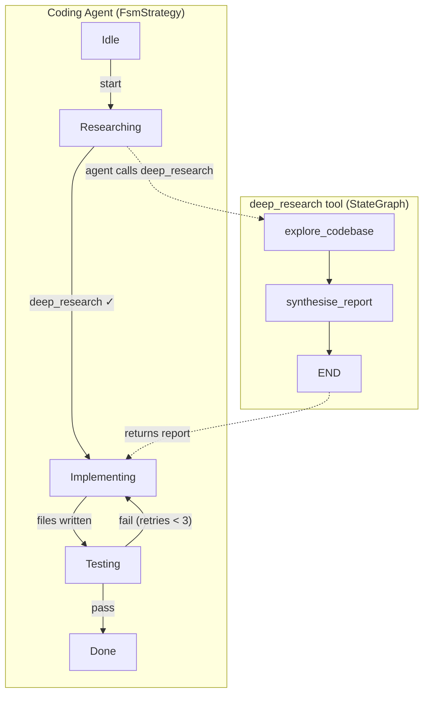

# Tutorial 8: Deep Research + Coding Agent

**Time**: ~2 hours
**Prerequisites**: Rust 1.85+, completion of [Tutorial 7: Building a Coding Agent](./07-coding-agent.md), completion of [Tutorial 3: Execution Strategies](./03-execution-strategies.md)

> **Background**: [AI Workflows vs AI Agents](https://www.promptingguide.ai/agents/ai-workflows-vs-ai-agents) — the distinction between a static multi-step workflow and an open-ended agent loop. This tutorial uses *both*: the coding agent is an open-ended agent that decides what to do; the deep research tool it can call is a fixed workflow.

This tutorial builds a coding agent that can invoke deep research as a tool. Two Synwire primitives compose to make this work:

| Primitive | Role |
|---|---|
| `FsmStrategy` (synwire-agent) | Outer coding agent: FSM-constrained turn loop |
| `StateGraph` (synwire-orchestrator) | Inner research pipeline: runs inside a tool the agent can call |

The key idea: the `StateGraph` pipeline is **not** the top-level entrypoint — it is wrapped as a `StructuredTool` and handed to an FSM-governed coding agent. The agent decides *when* to call `deep_research`, and the FSM ensures it does so *before* writing any code.



- The **outer agent** uses `FsmStrategy` to enforce: research first, then implement, then test.
- The **inner tool** uses `StateGraph` to chain two nodes: codebase exploration → report synthesis.
- The agent sees `deep_research` as just another tool — it doesn't know there's a graph inside.

> 📖 **Rust note:** A [`StructuredTool`](../explanation/synwire-core.md) wraps a closure `Fn(Value) -> BoxFuture<Result<ToolOutput, SynwireError>>`. Because `StateGraph::invoke` is an async function that returns `Result<S, GraphError>`, wrapping a graph as a tool is a one-liner: call `invoke` inside the closure, serialise the result.

---

## Architecture: why the agent holds the graph, not the other way round

In [Tutorial 7](./07-coding-agent.md) the coding agent was a standalone tool-calling loop. In this tutorial, the agent gains a *research capability* — but the research itself is a multi-step pipeline that's too complex for a single tool call.

You could build this two ways:

| Approach | Topology | Agent autonomy |
|---|---|---|
| **Graph-first** (Tutorial 8 v1) | `StateGraph` is the top level; the agent is a node | Low — stages are fixed at compile time |
| **Agent-first** (this tutorial) | Agent is the top level; the graph is a tool | High — agent decides *when* and *whether* to research |

The agent-first approach is more powerful: the agent can skip research for trivial tasks, call it multiple times for complex ones, or interleave research with implementation. The FSM still prevents it from writing code without researching first — you get autonomy *within* structural bounds.

> **Background**: [Agent Components](https://www.promptingguide.ai/agents/components) — the deep research tool is the agent's *memory retrieval* component. The FSM is its *planning* component. Tools are its *action* component.

---

## Step 1: Project setup

```toml
[package]
name = "synwire-research-coder"
version = "0.1.0"
edition = "2024"

[dependencies]
# Agent runtime + FSM strategy
synwire-core  = "0.1"
synwire-agent = "0.1"

# Graph orchestration (for the research tool's internal pipeline)
synwire-orchestrator = "0.1"
synwire-derive       = "0.1"

# LLM provider
synwire-llm-openai = "0.1"

# Async + serde
tokio        = { version = "1", features = ["full"] }
serde        = { version = "1", features = ["derive"] }
serde_json   = "1"
schemars     = { version = "0.8", features = ["derive"] }

# Error handling + CLI
anyhow = "1"
clap   = { version = "4", features = ["derive"] }

[dev-dependencies]
synwire-test-utils = "0.1"
tempfile           = "3"
```

---

## Step 2: The research pipeline state

The research graph has its own typed state, separate from the outer agent's working memory. This state flows through the two graph nodes and is discarded after the tool call completes — only the final report string is returned to the agent.

> 📖 **Rust note:** `#[derive(State)]` generates the `State` trait implementation. `#[reducer(last_value)]` overwrites on each superstep; `#[reducer(topic)]` appends. See [synwire-derive](../explanation/synwire-derive.md).

```rust
// src/research/state.rs
use serde::{Deserialize, Serialize};
use synwire_derive::State;

/// Internal state for the deep research pipeline.
///
/// This state is NOT exposed to the outer coding agent.
/// Only `report` is extracted and returned as the tool result.
#[derive(State, Debug, Clone, Default, Serialize, Deserialize)]
pub struct ResearchState {
    /// The question or task to research.
    #[reducer(last_value)]
    pub query: String,

    /// Absolute path to the project root.
    #[reducer(last_value)]
    pub project_root: String,

    /// Files discovered and read during exploration.
    #[reducer(topic)]
    pub files_explored: Vec<String>,

    /// Raw findings from the exploration node (file contents, search hits).
    #[reducer(topic)]
    pub raw_findings: Vec<String>,

    /// Final synthesised report returned to the caller.
    #[reducer(last_value)]
    pub report: String,
}
```

---

## Step 3: The exploration node

The first graph node uses a `DirectStrategy` agent to explore the codebase. It reads files, searches for patterns, and records raw findings.

```rust
// src/research/explore.rs
use std::sync::Arc;

use synwire_core::agents::agent_node::Agent;
use synwire_core::agents::runner::{Runner, RunnerConfig};
use synwire_core::agents::streaming::AgentEvent;
use synwire_orchestrator::error::GraphError;

use crate::backend::create_backend;
use crate::research::state::ResearchState;
use crate::tools::{list_dir_tool, read_file_tool, search_code_tool};

/// Exploration node: agent reads the codebase and populates `raw_findings`.
pub async fn explore_node(mut state: ResearchState) -> Result<ResearchState, GraphError> {
    let backend = create_backend(state.project_root.clone().into())
        .map_err(|e| GraphError::NodeError { message: e.to_string() })?;
    let backend = Arc::new(backend);

    let system = format!(
        r#"You are a code researcher exploring a Rust codebase.

Your goal: gather all information relevant to this question:
  {query}

Use list_dir to understand project structure, search_code to find relevant
symbols and patterns, and read_file to read the actual source.

Focus on:
- Relevant types, traits, and functions
- Test patterns and conventions
- Module boundaries and public APIs
- Any existing code that relates to the question

Output your findings as structured notes — one paragraph per file or concept.
Be thorough but focused: only include information that helps answer the question."#,
        query = state.query,
    );

    let read   = read_file_tool(Arc::clone(&backend) as Arc<_>)
        .map_err(|e| GraphError::NodeError { message: e.to_string() })?;
    let ls     = list_dir_tool(Arc::clone(&backend) as Arc<_>)
        .map_err(|e| GraphError::NodeError { message: e.to_string() })?;
    let search = search_code_tool(Arc::clone(&backend) as Arc<_>)
        .map_err(|e| GraphError::NodeError { message: e.to_string() })?;

    let agent = Agent::new("explorer", "claude-opus-4-6")
        .system_prompt(system)
        .tool(read)
        .tool(ls)
        .tool(search)
        .max_turns(20);

    let runner = Runner::new(agent);
    let mut stream = runner
        .run(serde_json::json!(state.query.clone()), RunnerConfig::default())
        .await
        .map_err(|e| GraphError::NodeError { message: e.to_string() })?;

    let mut findings = String::new();
    while let Some(event) = stream.recv().await {
        match event {
            AgentEvent::TextDelta { content } => findings.push_str(&content),
            AgentEvent::Error { message } => {
                return Err(GraphError::NodeError { message });
            }
            _ => {}
        }
    }

    state.raw_findings.push(findings);
    Ok(state)
}
```

---

## Step 4: The synthesis node

The second graph node is a one-shot agent that reads the raw findings and produces a structured report. No tools needed — just reasoning.

```rust
// src/research/synthesise.rs
use synwire_core::agents::agent_node::Agent;
use synwire_core::agents::runner::{Runner, RunnerConfig};
use synwire_core::agents::streaming::AgentEvent;
use synwire_orchestrator::error::GraphError;

use crate::research::state::ResearchState;

/// Synthesis node: distils raw findings into a structured report.
pub async fn synthesise_node(mut state: ResearchState) -> Result<ResearchState, GraphError> {
    let system = r#"You receive raw findings from a codebase exploration and produce
a structured research report. Format the report as markdown with these sections:

1. **Relevant Code** — files, types, and functions that relate to the task
2. **Data Types** — key structs, enums, and traits the implementation must use
3. **Test Patterns** — how existing tests are structured in this project
4. **Integration Points** — where new code should fit in
5. **Constraints** — things the implementation must not break

Be concise. The implementation agent will use this report to guide its work."#;

    let prompt = format!(
        "Question: {}\n\nRaw findings:\n{}",
        state.query,
        state.raw_findings.join("\n\n---\n\n"),
    );

    let agent = Agent::new("synthesiser", "claude-opus-4-6")
        .system_prompt(system)
        .max_turns(1);

    let runner = Runner::new(agent);
    let mut stream = runner
        .run(serde_json::json!(prompt), RunnerConfig::default())
        .await
        .map_err(|e| GraphError::NodeError { message: e.to_string() })?;

    let mut report = String::new();
    while let Some(event) = stream.recv().await {
        match event {
            AgentEvent::TextDelta { content } => report.push_str(&content),
            AgentEvent::Error { message } => {
                return Err(GraphError::NodeError { message });
            }
            _ => {}
        }
    }

    state.report = report;
    Ok(state)
}
```

---

## Step 5: Assembling the research graph

Two nodes, one edge, no conditionals:

```rust
// src/research/graph.rs
use synwire_orchestrator::constants::END;
use synwire_orchestrator::error::GraphError;
use synwire_orchestrator::graph::{CompiledGraph, StateGraph};

use crate::research::explore::explore_node;
use crate::research::state::ResearchState;
use crate::research::synthesise::synthesise_node;

/// Build and compile the two-stage research pipeline.
///
/// ```text
/// START → explore → synthesise → END
/// ```
pub fn build_research_graph() -> Result<CompiledGraph<ResearchState>, GraphError> {
    let mut graph = StateGraph::<ResearchState>::new();

    graph.add_node("explore",    Box::new(|s| Box::pin(explore_node(s))))?;
    graph.add_node("synthesise", Box::new(|s| Box::pin(synthesise_node(s))))?;

    graph
        .set_entry_point("explore")
        .add_edge("explore", "synthesise")
        .add_edge("synthesise", END);

    graph.compile()
}
```

---

## Step 6: Wrapping the graph as a tool

This is the composition point. The `StateGraph` pipeline becomes a `StructuredTool` — the agent sees it as a single function call that takes a query and returns a research report.

> 📖 **Rust note:** [`Arc`](https://doc.rust-lang.org/std/sync/struct.Arc.html) (Atomic Reference Count) allows multiple owners of a value across threads. The compiled graph is `Send + Sync`, so wrapping it in `Arc` lets the tool closure capture it safely. The closure itself must be `Fn` (not `FnOnce`) because it may be called multiple times.

```rust
// src/research/tool.rs
use std::sync::Arc;

use synwire_core::BoxFuture;
use synwire_core::error::SynwireError;
use synwire_core::tools::{StructuredTool, ToolOutput, ToolSchema};

use crate::research::graph::build_research_graph;
use crate::research::state::ResearchState;

/// Creates the `deep_research` tool.
///
/// When invoked, this tool:
/// 1. Builds a `ResearchState` from the JSON input
/// 2. Runs the two-stage `StateGraph` (explore → synthesise)
/// 3. Returns the synthesised report as the tool output
///
/// The calling agent never sees the internal graph topology —
/// it receives a plain-text research report.
pub fn deep_research_tool(
    project_root: String,
) -> Result<StructuredTool, SynwireError> {
    // Compile the graph once; share it across invocations via Arc.
    let graph = Arc::new(
        build_research_graph()
            .map_err(|e| SynwireError::Tool(
                synwire_core::error::ToolError::InvocationFailed {
                    message: format!("failed to compile research graph: {e}"),
                },
            ))?,
    );

    let root = project_root.clone();

    StructuredTool::builder()
        .name("deep_research")
        .description(
            "Performs deep codebase research. Takes a question about the codebase \
             and returns a structured report covering relevant code, data types, \
             test patterns, integration points, and constraints. Use this BEFORE \
             writing any code to understand the existing codebase."
        )
        .schema(ToolSchema {
            name: "deep_research".into(),
            description: "Deep codebase research tool".into(),
            parameters: serde_json::json!({
                "type": "object",
                "properties": {
                    "query": {
                        "type": "string",
                        "description": "The research question about the codebase"
                    }
                },
                "required": ["query"]
            }),
        })
        .func(move |input: serde_json::Value| -> BoxFuture<'static, Result<ToolOutput, SynwireError>> {
            let graph = Arc::clone(&graph);
            let project_root = root.clone();

            Box::pin(async move {
                let query = input["query"]
                    .as_str()
                    .unwrap_or("general codebase overview")
                    .to_owned();

                let initial = ResearchState {
                    query,
                    project_root,
                    ..ResearchState::default()
                };

                // Run the two-stage pipeline to completion.
                let result = graph.invoke(initial).await.map_err(|e| {
                    SynwireError::Tool(synwire_core::error::ToolError::InvocationFailed {
                        message: format!("research pipeline failed: {e}"),
                    })
                })?;

                Ok(ToolOutput {
                    content: result.report,
                    ..Default::default()
                })
            })
        })
        .build()
}
```

### What just happened

The entire `StateGraph` — two agents, file I/O tools, a synthesis step — is now hidden behind a single `deep_research(query: String) -> String` interface. From the outer coding agent's perspective, it's no different from `read_file` or `search_code`. But internally, it spawns two sub-agents, explores the codebase, and synthesises findings.

This is the composability the [crate architecture](../explanation/agent-core-crate-structure.md) enables: `synwire-orchestrator` and `synwire-agent` are independent crates that compose through `synwire-core`'s `Tool` trait.

---

## Step 7: The coding agent's FSM

The FSM constrains the coding agent's turn loop. The critical constraint: the agent **must** call `deep_research` before it can write any files.

```rust
// src/fsm.rs
use serde_json::Value;
use synwire_agent::strategies::fsm::{FsmStrategy, FsmStrategyWithRoutes};
use synwire_core::agents::execution_strategy::{ClosureGuard, StrategyError};

/// FSM states for the coding agent.
pub mod states {
    pub const IDLE:          &str = "idle";
    pub const RESEARCHING:   &str = "researching";
    pub const IMPLEMENTING:  &str = "implementing";
    pub const TESTING:       &str = "testing";
    pub const DONE:          &str = "done";
}

/// Actions that drive FSM transitions.
pub mod actions {
    /// Idle → Researching: agent starts working.
    pub const START:              &str = "start";
    /// Researching → Implementing: deep_research has been called.
    pub const RESEARCH_COMPLETE:  &str = "research_complete";
    /// Implementing → Testing: at least one file written.
    pub const RUN_TESTS:          &str = "run_tests";
    /// Testing → Done: tests passed.
    pub const TESTS_PASS:         &str = "tests_pass";
    /// Testing → Implementing: tests failed, retry.
    pub const TESTS_FAIL:         &str = "tests_fail";
}

/// Payload keys inspected by guards.
pub mod payload {
    pub const RESEARCH_CALLS:  &str = "research_calls";
    pub const FILES_WRITTEN:   &str = "files_written";
    pub const RETRIES:         &str = "retries";
}

/// Build the FSM for the coding agent.
///
/// ```text
/// idle → [start] → researching
/// researching → [research_complete | research_calls > 0] → implementing
/// implementing → [run_tests | files_written > 0] → testing
/// testing → [tests_pass] → done
/// testing → [tests_fail | retries < 3] → implementing
/// ```
///
/// Guards enforce three invariants:
/// 1. Agent must call `deep_research` at least once before implementing.
/// 2. Agent must write at least one file before running tests.
/// 3. Test retries are capped at 3.
pub fn build_coder_fsm() -> Result<FsmStrategyWithRoutes, StrategyError> {
    let guard_has_researched = ClosureGuard::new(
        "has_researched",
        |p: &Value| p[payload::RESEARCH_CALLS].as_u64().unwrap_or(0) > 0,
    );

    let guard_has_written = ClosureGuard::new(
        "has_written",
        |p: &Value| p[payload::FILES_WRITTEN].as_u64().unwrap_or(0) > 0,
    );

    let guard_retry_allowed = ClosureGuard::new(
        "retry_allowed",
        |p: &Value| p[payload::RETRIES].as_u64().unwrap_or(0) < 3,
    );

    FsmStrategy::builder()
        .state(states::IDLE)
        .state(states::RESEARCHING)
        .state(states::IMPLEMENTING)
        .state(states::TESTING)
        .state(states::DONE)
        // idle → researching (unconditional)
        .transition(states::IDLE, actions::START, states::RESEARCHING)
        // researching → implementing (must have called deep_research)
        .transition_with_guard(
            states::RESEARCHING,
            actions::RESEARCH_COMPLETE,
            states::IMPLEMENTING,
            guard_has_researched,
            10,
        )
        // implementing → testing (must have written at least one file)
        .transition_with_guard(
            states::IMPLEMENTING,
            actions::RUN_TESTS,
            states::TESTING,
            guard_has_written,
            10,
        )
        // testing → done
        .transition(states::TESTING, actions::TESTS_PASS, states::DONE)
        // testing → implementing (retry if allowed)
        .transition_with_guard(
            states::TESTING,
            actions::TESTS_FAIL,
            states::IMPLEMENTING,
            guard_retry_allowed,
            10,
        )
        .initial(states::IDLE)
        .build()
}
```

### Testing the FSM in isolation

The FSM is pure Rust — no model, no I/O:

```rust
#[cfg(test)]
mod tests {
    use super::*;
    use synwire_core::agents::execution_strategy::{ExecutionStrategy, StrategyError};

    #[tokio::test]
    async fn cannot_implement_without_research() {
        let fsm = build_coder_fsm().unwrap();

        // Start working.
        fsm.execute(actions::START, serde_json::json!({})).await.unwrap();

        // Try to skip research.
        let err = fsm
            .execute(
                actions::RESEARCH_COMPLETE,
                serde_json::json!({ payload::RESEARCH_CALLS: 0 }),
            )
            .await
            .expect_err("guard should reject");

        assert!(matches!(err, StrategyError::GuardRejected(_)));
    }

    #[tokio::test]
    async fn research_then_implement_succeeds() {
        let fsm = build_coder_fsm().unwrap();

        fsm.execute(actions::START, serde_json::json!({})).await.unwrap();
        fsm.execute(
            actions::RESEARCH_COMPLETE,
            serde_json::json!({ payload::RESEARCH_CALLS: 1 }),
        )
        .await
        .unwrap();

        // Now in implementing state — can write files.
        assert_eq!(
            fsm.strategy.current_state().unwrap().0,
            states::IMPLEMENTING,
        );
    }

    #[tokio::test]
    async fn cannot_test_without_writing() {
        let fsm = build_coder_fsm().unwrap();
        fsm.execute(actions::START, serde_json::json!({})).await.unwrap();
        fsm.execute(
            actions::RESEARCH_COMPLETE,
            serde_json::json!({ payload::RESEARCH_CALLS: 1 }),
        )
        .await
        .unwrap();

        let err = fsm
            .execute(
                actions::RUN_TESTS,
                serde_json::json!({ payload::FILES_WRITTEN: 0 }),
            )
            .await
            .expect_err("guard should reject");
        assert!(matches!(err, StrategyError::GuardRejected(_)));
    }

    #[tokio::test]
    async fn retry_capped_at_three() {
        let fsm = build_coder_fsm().unwrap();

        // Advance to testing.
        fsm.execute(actions::START, serde_json::json!({})).await.unwrap();
        fsm.execute(
            actions::RESEARCH_COMPLETE,
            serde_json::json!({ payload::RESEARCH_CALLS: 1 }),
        )
        .await
        .unwrap();
        fsm.execute(
            actions::RUN_TESTS,
            serde_json::json!({ payload::FILES_WRITTEN: 1 }),
        )
        .await
        .unwrap();

        // Three retries succeed.
        for i in 0..3 {
            fsm.execute(
                actions::TESTS_FAIL,
                serde_json::json!({ payload::RETRIES: i }),
            )
            .await
            .unwrap();
            fsm.execute(
                actions::RUN_TESTS,
                serde_json::json!({ payload::FILES_WRITTEN: 1 }),
            )
            .await
            .unwrap();
        }

        // Fourth retry rejected.
        let err = fsm
            .execute(
                actions::TESTS_FAIL,
                serde_json::json!({ payload::RETRIES: 3 }),
            )
            .await
            .expect_err("retry limit");
        assert!(matches!(err, StrategyError::GuardRejected(_)));
    }

    #[tokio::test]
    async fn happy_path_reaches_done() {
        let fsm = build_coder_fsm().unwrap();

        fsm.execute(actions::START, serde_json::json!({})).await.unwrap();
        fsm.execute(
            actions::RESEARCH_COMPLETE,
            serde_json::json!({ payload::RESEARCH_CALLS: 1 }),
        )
        .await
        .unwrap();
        fsm.execute(
            actions::RUN_TESTS,
            serde_json::json!({ payload::FILES_WRITTEN: 2 }),
        )
        .await
        .unwrap();
        fsm.execute(actions::TESTS_PASS, serde_json::json!({}))
            .await
            .unwrap();

        assert_eq!(fsm.strategy.current_state().unwrap().0, states::DONE);
    }
}
```

---

## Step 8: The coding agent

Now assemble the agent with all its tools, including `deep_research`:

> 📖 **Rust note:** [`move` closures](https://doc.rust-lang.org/book/ch13-01-closures.html#capturing-references-or-moving-ownership) take ownership of captured variables. The event-loop closure captures `Arc` clones of the counters and FSM, so each closure call can mutate the shared counters through `Mutex::lock()`.

```rust
// src/agent.rs
use std::sync::{Arc, Mutex};

use synwire_core::agents::agent_node::Agent;
use synwire_core::agents::permission::{PermissionBehavior, PermissionMode, PermissionRule};
use synwire_core::agents::runner::{Runner, RunnerConfig};
use synwire_core::agents::streaming::AgentEvent;

use crate::backend::create_backend;
use crate::fsm::{actions, build_coder_fsm, payload, states};
use crate::research::tool::deep_research_tool;
use crate::tools::{
    list_dir_tool, read_file_tool, run_command_tool, search_code_tool, write_file_tool,
};

/// Result of running the coding agent.
pub struct CodingResult {
    pub files_written: Vec<String>,
    pub test_output: String,
    pub test_passed: bool,
    pub research_report: String,
}

/// Build and run the FSM-governed coding agent.
///
/// The agent has six tools:
///
/// | Tool | Purpose | FSM constraint |
/// |---|---|---|
/// | `deep_research` | Runs the StateGraph research pipeline | Must call before implementing |
/// | `read_file` | Read source files | Allowed in all states |
/// | `list_dir` | List directories | Allowed in all states |
/// | `search_code` | Search for patterns | Allowed in all states |
/// | `write_file` | Write source files | Only after research |
/// | `run_command` | Run cargo test | Only after writing files |
pub async fn run_coding_agent(
    task: &str,
    project_root: &str,
) -> anyhow::Result<CodingResult> {
    let backend = Arc::new(create_backend(project_root.into())?);

    // ── Tools ─────────────────────────────────────────────────────────────

    let deep_research = deep_research_tool(project_root.to_owned())?;
    let read   = read_file_tool(Arc::clone(&backend) as Arc<_>)?;
    let write  = write_file_tool(Arc::clone(&backend) as Arc<_>)?;
    let ls     = list_dir_tool(Arc::clone(&backend) as Arc<_>)?;
    let search = search_code_tool(Arc::clone(&backend) as Arc<_>)?;
    let run    = run_command_tool(Arc::clone(&backend) as Arc<_>)?;

    // ── FSM ───────────────────────────────────────────────────────────────

    let fsm = Arc::new(build_coder_fsm()?);

    // Counters for FSM guard payloads.
    let research_calls:  Arc<Mutex<u32>> = Arc::new(Mutex::new(0));
    let files_written:   Arc<Mutex<u32>> = Arc::new(Mutex::new(0));
    let retries:         Arc<Mutex<u32>> = Arc::new(Mutex::new(0));

    // ── Agent ─────────────────────────────────────────────────────────────

    let system = format!(
        r#"You are a coding agent that implements changes to a Rust project.

## Your task
{task}

## Workflow
1. FIRST, call deep_research to understand the existing codebase.
   Pass a focused question about what you need to understand.
2. Read the research report carefully before writing any code.
3. Implement the changes by writing files.
4. Run `cargo test` to verify your changes.
5. If tests fail, read the error output and fix the code.

## Rules
- You MUST call deep_research before writing any files.
- You MUST write files before running tests.
- You may call deep_research multiple times with different questions.
- Read files directly with read_file for quick lookups; use deep_research
  for broader understanding.

When all tests pass, state that you are done."#,
    );

    let agent = Agent::new("coder", "claude-opus-4-6")
        .system_prompt(system)
        .tool(deep_research)
        .tool(read)
        .tool(write)
        .tool(ls)
        .tool(search)
        .tool(run)
        .permission_rules(vec![
            PermissionRule {
                tool_pattern: "*".into(),
                behavior: PermissionBehavior::Allow,
            },
        ])
        .permission_mode(PermissionMode::DenyUnauthorized)
        .max_turns(50);

    // ── Kick off ──────────────────────────────────────────────────────────

    // Transition to Researching immediately.
    fsm.execute(actions::START, serde_json::json!({})).await?;

    let runner = Runner::new(agent);
    let mut stream = runner
        .run(serde_json::json!(task), RunnerConfig::default())
        .await?;

    // ── Event loop ────────────────────────────────────────────────────────

    let mut result = CodingResult {
        files_written: Vec::new(),
        test_output: String::new(),
        test_passed: false,
        research_report: String::new(),
    };

    let fsm_ref           = Arc::clone(&fsm);
    let research_ctr      = Arc::clone(&research_calls);
    let files_written_ctr = Arc::clone(&files_written);
    let retries_ctr       = Arc::clone(&retries);

    while let Some(event) = stream.recv().await {
        match &event {
            AgentEvent::ToolResult { name, output, .. } => {
                let current = fsm_ref.strategy.current_state()?;

                match name.as_str() {
                    "deep_research" => {
                        // Record the research report.
                        result.research_report.push_str(&output.content);
                        result.research_report.push_str("\n\n---\n\n");

                        // Increment research call counter.
                        *research_ctr.lock().unwrap() += 1;
                        let rc = *research_ctr.lock().unwrap();

                        // Advance FSM: researching → implementing.
                        if current.0 == states::RESEARCHING {
                            let _ = fsm_ref.execute(
                                actions::RESEARCH_COMPLETE,
                                serde_json::json!({ payload::RESEARCH_CALLS: rc }),
                            ).await;
                        }
                    }

                    "write_file" => {
                        *files_written_ctr.lock().unwrap() += 1;
                        // Extract the file path from the tool call input if available.
                        result.files_written.push(
                            output.content.lines().next().unwrap_or("unknown").to_owned()
                        );
                    }

                    "run_command" => {
                        // Check test results.
                        if current.0 == states::IMPLEMENTING {
                            // First, try to advance to Testing.
                            let fw = *files_written_ctr.lock().unwrap();
                            let _ = fsm_ref.execute(
                                actions::RUN_TESTS,
                                serde_json::json!({ payload::FILES_WRITTEN: fw }),
                            ).await;
                        }

                        let current = fsm_ref.strategy.current_state()?;
                        if current.0 == states::TESTING {
                            let passed = output.content.contains("test result: ok");
                            result.test_output = output.content.clone();

                            if passed {
                                result.test_passed = true;
                                let _ = fsm_ref.execute(
                                    actions::TESTS_PASS,
                                    serde_json::json!({}),
                                ).await;
                            } else {
                                let r = *retries_ctr.lock().unwrap();
                                let _ = fsm_ref.execute(
                                    actions::TESTS_FAIL,
                                    serde_json::json!({ payload::RETRIES: r }),
                                ).await;
                                *retries_ctr.lock().unwrap() += 1;
                            }
                        }
                    }

                    _ => {}
                }
            }

            AgentEvent::Error { message } => {
                anyhow::bail!("Agent error: {message}");
            }

            _ => {}
        }
    }

    Ok(result)
}
```

---

## Step 9: The main binary

```rust
// src/main.rs
mod agent;
mod backend;
mod fsm;
mod research;
mod tools;

use clap::Parser;

#[derive(Parser)]
#[command(version, about = "Coding agent with deep research capability")]
struct Cli {
    /// The coding task to complete.
    task: String,

    /// Project root directory.
    #[arg(short, long, default_value = ".")]
    project: String,
}

#[tokio::main]
async fn main() -> anyhow::Result<()> {
    let cli = Cli::parse();

    let project_root = std::path::Path::new(&cli.project)
        .canonicalize()?
        .to_string_lossy()
        .into_owned();

    println!("Task: {}", cli.task);
    println!("Project root: {project_root}");
    println!();

    let result = agent::run_coding_agent(&cli.task, &project_root).await?;

    println!("\n── Research report ──────────────────────────────────────\n");
    println!("{}", result.research_report);

    println!("\n── Test output ──────────────────────────────────────────\n");
    println!("{}", result.test_output);

    if result.test_passed {
        println!("\nPipeline completed successfully.");
        println!("Files modified: {:?}", result.files_written);
    } else {
        eprintln!("\nTests did not pass after all retries.");
        std::process::exit(1);
    }

    Ok(())
}
```

Run it:

```bash
export ANTHROPIC_API_KEY="..."

cargo run -- \
  --project /path/to/my-crate \
  "Add a words_longer_than function to src/text.rs that takes a &str \
   and a usize threshold and returns Vec<&str> of words longer than \
   the threshold. Add tests."
```

What happens:
1. The agent starts in `Idle`, transitions to `Researching`.
2. The agent calls `deep_research("How is src/text.rs structured? What existing functions and tests exist?")`.
3. Inside `deep_research`, the `StateGraph` runs: `explore_node` reads the codebase with sub-agents → `synthesise_node` produces a report → the report string is returned.
4. The FSM transitions to `Implementing`. The agent can now call `write_file`.
5. The agent writes `src/text.rs`, calls `cargo test`.
6. The FSM transitions to `Testing`. On pass → `Done`. On fail → back to `Implementing` (up to 3 retries).

---

## Step 10: Testing the composition

### Unit test: the research tool returns a report

```rust
// tests/research_tool.rs
use synwire_test_utils::fake_chat_model::FakeChatModel;

/// Verify the deep_research tool compiles its graph and accepts input.
#[tokio::test]
async fn deep_research_tool_accepts_query() {
    // In a real test, you'd inject a FakeChatModel into the graph nodes.
    // Here we just verify the tool builds without error.
    let tool = synwire_research_coder::research::tool::deep_research_tool(
        "/tmp/test-project".to_owned(),
    );
    assert!(tool.is_ok());

    let tool = tool.unwrap();
    assert_eq!(synwire_core::tools::Tool::name(&tool), "deep_research");
}
```

### Integration test: FSM blocks premature writes

```rust
// tests/fsm_integration.rs
use synwire_core::agents::execution_strategy::{ExecutionStrategy, StrategyError};
use synwire_research_coder::fsm::*;

/// The FSM must reject write_file before deep_research has been called.
#[tokio::test]
async fn fsm_blocks_implement_before_research() {
    let fsm = build_coder_fsm().unwrap();

    // Start → Researching.
    fsm.execute(actions::START, serde_json::json!({})).await.unwrap();

    // Try to skip straight to implementing.
    let err = fsm
        .execute(
            actions::RESEARCH_COMPLETE,
            serde_json::json!({ payload::RESEARCH_CALLS: 0 }),
        )
        .await
        .expect_err("should be blocked by guard");

    assert!(matches!(err, StrategyError::GuardRejected(_)));
}
```

### Verify graph topology

```rust
// tests/research_graph.rs
use synwire_research_coder::research::graph::build_research_graph;

#[test]
fn research_graph_has_two_nodes() {
    let graph = build_research_graph().unwrap();
    let mut names = graph.node_names();
    names.sort_unstable();
    assert_eq!(names, ["explore", "synthesise"]);
}

#[test]
fn research_graph_entry_is_explore() {
    let graph = build_research_graph().unwrap();
    assert_eq!(graph.entry_point(), "explore");
}
```

---

## How the primitives compose

```
Coding Agent (FsmStrategy: Idle → Researching → Implementing → Testing → Done)
│
├── Tools available:
│   ├── deep_research ← wraps a StateGraph
│   │   └── explore_node (DirectStrategy agent)
│   │       └── read_file, list_dir, search_code
│   │   └── synthesise_node (one-shot agent)
│   │       └── (no tools — reasoning only)
│   ├── read_file
│   ├── write_file
│   ├── list_dir
│   ├── search_code
│   └── run_command
│
└── FSM enforces:
    1. deep_research called ≥1 time before write_file
    2. write_file called ≥1 time before run_command (test)
    3. test retry ≤ 3 times
```

The `StateGraph` is encapsulated inside the tool's closure. The `FsmStrategy` governs the outer agent. Neither knows the other exists. The only connection is the tool interface: `deep_research(query) → report`.

| Layer | Crate | What it enforces |
|---|---|---|
| Outer agent | `synwire-agent` | Turn order via FSM guards |
| Research tool | `synwire-orchestrator` | Graph topology (explore → synthesise → END) |
| Tool trait | `synwire-core` | API contract: `Fn(Value) → Future<ToolOutput>` |

---

## Extending the design

### Multiple research tools with different graphs

Build separate tools for different research concerns:

```rust,no_run
// Code review tool: three nodes — read diff, check style, report issues.
let code_review = code_review_tool(project_root.clone())?;

// Dependency audit: two nodes — parse Cargo.toml, check advisories.
let dep_audit = dependency_audit_tool(project_root.clone())?;

let agent = Agent::new("coder", "claude-opus-4-6")
    .tool(deep_research)
    .tool(code_review)    // another graph-as-tool
    .tool(dep_audit)      // yet another graph-as-tool
    .tool(read)
    .tool(write)
    .tool(run);
```

Each tool encapsulates its own `StateGraph` — the agent treats them all identically.

### Recursive agents: a research tool that calls research tools

Since `deep_research` is just a tool, a sub-agent inside the research graph could itself have tools that wrap other graphs. This is structurally legal but should be used with care — recursion depth is bounded only by the `max_turns` limit on each agent.

### Ollama for local inference

Replace `"claude-opus-4-6"` with any Ollama model:

```rust,no_run
use synwire_llm_ollama::ChatOllama;

let model = ChatOllama::builder().model("codestral").build()?;
let runner = Runner::new(agent).with_model(model);
```

Both `ChatOpenAI` and `ChatOllama` implement `BaseChatModel` — no other changes needed. See [Local Inference with Ollama](../getting-started/ollama.md).

### Checkpointing

Add checkpointing to the research graph for long-running explorations:

```rust,no_run
use synwire_checkpoint::InMemoryCheckpointSaver;
use std::sync::Arc;

let saver = Arc::new(InMemoryCheckpointSaver::new());
let graph = build_research_graph()?.with_checkpoint_saver(saver);
```

If the exploration agent crashes mid-run, restarting with the same thread_id resumes from the last completed node. See [Tutorial 6: Checkpointing](./06-checkpointing.md).

---

## What you have built

| Component | What it does |
|---|---|
| `ResearchState` | Typed graph state: query, raw findings, synthesised report |
| `explore_node` | `DirectStrategy` agent that reads the codebase with file tools |
| `synthesise_node` | One-shot agent that distils findings into a structured report |
| `build_research_graph` | `StateGraph`: explore → synthesise → END |
| `deep_research_tool` | `StructuredTool` that wraps the graph — called by the outer agent |
| `build_coder_fsm` | `FsmStrategy`: idle → researching → implementing → testing → done |
| `run_coding_agent` | Event loop that wires the FSM, tools, and agent together |
| FSM guards | `has_researched`, `has_written`, `retry_allowed` — structural safety |

---

## See also

- [Explanation: StateGraph vs FsmStrategy](../explanation/graph-vs-agent.md) — when to use each primitive and how they compose
- [Tutorial 7: Building a Coding Agent](./07-coding-agent.md) — the five-tool coding agent this tutorial extends
- [Tutorial 6: Checkpointing](./06-checkpointing.md) — `SqliteSaver` for durable graph state
- [Tutorial 3: Execution Strategies](./03-execution-strategies.md) — `FsmStrategy` and `DirectStrategy` from first principles
- [Explanation: synwire-orchestrator](../explanation/synwire-orchestrator.md) — `StateGraph`, channels, and conditional edges
- [Explanation: synwire-agent](../explanation/synwire-agent.md) — `Runner`, middleware, and backend reference
- [Explanation: synwire-core](../explanation/synwire-core.md) — `Tool` trait, `StructuredTool`, and `ToolSchema`
- [How-To: VFS Backends](../how-to/vfs.md) — `CompositeProvider`, `HttpBackend`
- [Local Inference with Ollama](../getting-started/ollama.md) — run the pipeline locally

> **Background**: [AI Workflows vs AI Agents](https://www.promptingguide.ai/agents/ai-workflows-vs-ai-agents) — the research pipeline is a workflow (fixed stages); the coding agent is an agent (open-ended). This tutorial shows how workflows can live *inside* agents as tools. [Context Engineering](https://www.promptingguide.ai/agents/context-engineering) — the research report is context the agent engineers for itself by choosing when and what to research.
