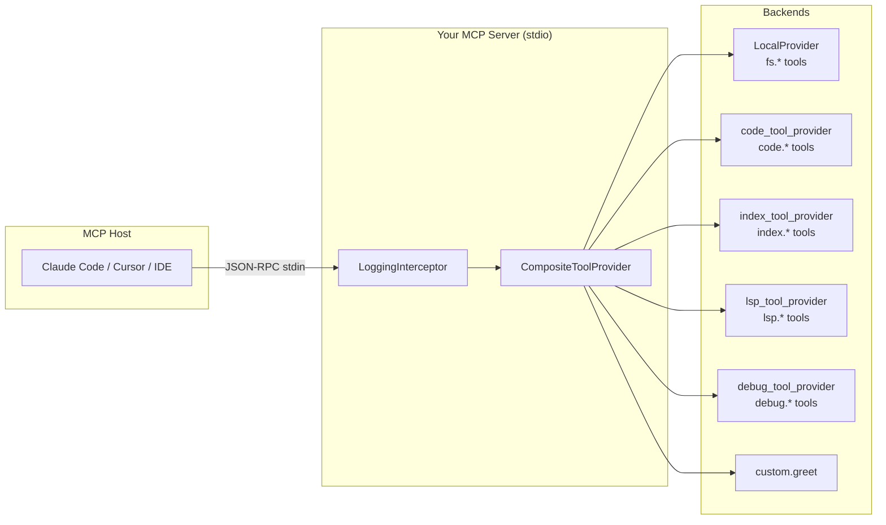

# Building a Custom MCP Server

**Time**: ~60 minutes
**Prerequisites**: Rust 1.85+, familiarity with [Tutorial 11](./11-mcp-server.md) and [Tutorial 17](./17-advanced-mcp-setup.md)

This tutorial builds a custom MCP server binary from scratch using Synwire's tool
composition primitives. By the end you will have a working stdio JSON-RPC server
that exposes file operations, code analysis tools, a custom tool, and a
multi-step investigation workflow -- all wired through a single
`CompositeToolProvider`.

---

## Architecture



The host sends MCP requests over stdin. The server dispatches each tool call
through middleware, resolves the target tool from the `CompositeToolProvider`,
invokes it, and writes the result to stdout.

---

## Step 1: Create the project

```bash
cargo new my-mcp-server
cd my-mcp-server
```

Add dependencies to `Cargo.toml`:

```toml
[dependencies]
synwire = { version = "0.1" }
synwire-core = { version = "0.1" }
synwire-agent = { version = "0.1", features = ["semantic-search"] }
tokio = { version = "1", features = ["full"] }
serde = { version = "1", features = ["derive"] }
serde_json = "1"
tracing = "0.1"
tracing-subscriber = { version = "0.3", features = ["env-filter"] }
```

---

## Step 2: Assemble tools with `CompositeToolProvider`

Synwire ships pre-built tool providers grouped by namespace. Combine them into a
single provider:

```rust,ignore
use std::path::PathBuf;
use std::sync::Arc;
use synwire_agent::vfs::local::LocalProvider;
use synwire_core::tools::{CompositeToolProvider, ToolProvider};
use synwire_core::vfs::vfs_tools;
use synwire_agent::tools::{code_tool_provider, index_tool_provider};

fn build_provider(project: PathBuf) -> Arc<CompositeToolProvider> {
    let vfs = Arc::new(LocalProvider::new(project).expect("valid project path"));

    let mut composite = CompositeToolProvider::new();

    // fs.read, fs.write, fs.edit, fs.grep, fs.glob, fs.tree
    composite.add_provider(vfs_tools(Arc::clone(&vfs) as Arc<_>));

    // code.search, code.definition, code.references, code.trace_callers,
    // code.trace_dataflow, code.fault_localize, and more
    composite.add_provider(code_tool_provider(Arc::clone(&vfs) as Arc<_>));

    // index.run, index.status, index.search, index.hybrid_search
    composite.add_provider(index_tool_provider(Arc::clone(&vfs) as Arc<_>));

    Arc::new(composite)
}
```

Each provider registers its tools under a namespace prefix. When the host calls
`fs.read`, the `CompositeToolProvider` routes it to the VFS provider.

---

## Step 3: Define a custom tool

Use the `#[tool]` derive macro to create a tool in your own namespace:

```rust,ignore
use synwire_derive::tool;
use synwire_core::tools::{ToolOutput, ToolError};

/// Greet a user by name.
///
/// Returns a friendly greeting. Use this tool when the user asks
/// for a personalised welcome message.
#[tool(name = "custom.greet")]
async fn greet(
    /// The name of the person to greet.
    name: String,
    /// Optional language code (default: "en").
    lang: Option<String>,
) -> Result<ToolOutput, ToolError> {
    let greeting = match lang.as_deref().unwrap_or("en") {
        "es" => format!("Hola, {name}!"),
        "fr" => format!("Bonjour, {name}!"),
        "de" => format!("Hallo, {name}!"),
        _ => format!("Hello, {name}!"),
    };
    Ok(ToolOutput::text(greeting))
}
```

Register it alongside the built-in providers:

```rust,ignore
composite.add_tool(greet_tool());
```

---

## Step 4: Wire middleware for logging

Wrap every tool call in a `LoggingInterceptor` so you can observe traffic on
stderr:

```rust,ignore
use synwire_core::tools::middleware::{
    ToolCallInterceptor, LoggingInterceptor, InterceptorStack,
};

fn build_interceptor_stack() -> InterceptorStack {
    let mut stack = InterceptorStack::new();
    stack.push(LoggingInterceptor::new(tracing::Level::DEBUG));
    stack
}
```

The `LoggingInterceptor` emits a `tracing` span for each tool call containing
the tool name, a truncated argument summary, and the wall-clock duration. All
output goes to stderr -- stdout is reserved for the MCP protocol.

---

## Step 5: Add a composed multi-step workflow

Turn a `StateGraph` into a single tool. This example creates `code.investigate`
-- a tool that chains semantic search, file read, and LLM analysis into one
call:

```rust,ignore
use synwire_orchestrator::{StateGraph, CompiledGraph};
use synwire_core::tools::ToolOutput;

fn investigate_tool(
    provider: Arc<CompositeToolProvider>,
) -> impl synwire_core::tools::Tool {
    let mut graph = StateGraph::new("investigate");

    // Node 1: semantic search for the query
    graph.add_node("search", {
        let p = Arc::clone(&provider);
        move |state: &mut InvestigateState| {
            let p = Arc::clone(&p);
            Box::pin(async move {
                let tool = p.get_tool("index.search").expect("index.search registered");
                let result = tool.invoke(serde_json::json!({
                    "query": state.query,
                    "top_k": 3,
                })).await?;
                state.search_results = result.content;
                Ok(())
            })
        }
    });

    // Node 2: read the top-ranked file
    graph.add_node("read", {
        let p = Arc::clone(&provider);
        move |state: &mut InvestigateState| {
            let p = Arc::clone(&p);
            Box::pin(async move {
                let first_file = state.search_results
                    .lines()
                    .next()
                    .unwrap_or("")
                    .to_string();
                let tool = p.get_tool("fs.read").expect("fs.read registered");
                let result = tool.invoke(serde_json::json!({
                    "path": first_file,
                })).await?;
                state.file_content = result.content;
                Ok(())
            })
        }
    });

    // Node 3: produce a summary
    graph.add_node("summarise", |state: &mut InvestigateState| {
        Box::pin(async move {
            state.summary = format!(
                "## Search results\n{}\n\n## Top file content\n{}",
                state.search_results, state.file_content,
            );
            Ok(())
        })
    });

    graph.add_edge("search", "read");
    graph.add_edge("read", "summarise");
    graph.set_entry("search");

    // Convert the graph into a callable tool
    graph.as_tool(
        "code.investigate",
        "Search for code matching a query, read the top result, \
         and return a combined summary. Use when you need to understand \
         how a feature is implemented.",
    )
}
```

Register it:

```rust,ignore
composite.add_tool(investigate_tool(Arc::clone(&provider)));
```

---

## Step 6: Serve via stdio JSON-RPC

The server reads newline-delimited JSON-RPC requests from stdin, dispatches
each tool call through the interceptor stack and provider, and writes responses
to stdout:

```rust,ignore
use tokio::io::{self, AsyncBufReadExt, AsyncWriteExt, BufReader};

async fn serve(
    provider: Arc<CompositeToolProvider>,
    interceptors: InterceptorStack,
) -> Result<(), Box<dyn std::error::Error>> {
    let stdin = BufReader::new(io::stdin());
    let mut stdout = io::stdout();
    let mut lines = stdin.lines();

    while let Some(line) = lines.next_line().await? {
        let request: serde_json::Value = serde_json::from_str(&line)?;

        let method = request["method"].as_str().unwrap_or("");
        match method {
            "tools/list" => {
                let tools = provider.list_tools();
                let response = serde_json::json!({
                    "jsonrpc": "2.0",
                    "id": request["id"],
                    "result": { "tools": tools },
                });
                let mut out = serde_json::to_string(&response)?;
                out.push('\n');
                stdout.write_all(out.as_bytes()).await?;
                stdout.flush().await?;
            }
            "tools/call" => {
                let name = request["params"]["name"].as_str().unwrap_or("");
                let args = request["params"]["arguments"].clone();

                let result = interceptors
                    .wrap(name, &args, || async {
                        let tool = provider
                            .get_tool(name)
                            .ok_or_else(|| format!("unknown tool: {name}"))?;
                        tool.invoke(args.clone()).await
                    })
                    .await;

                let response = match result {
                    Ok(output) => serde_json::json!({
                        "jsonrpc": "2.0",
                        "id": request["id"],
                        "result": {
                            "content": [{ "type": "text", "text": output.content }],
                        },
                    }),
                    Err(e) => serde_json::json!({
                        "jsonrpc": "2.0",
                        "id": request["id"],
                        "result": {
                            "content": [{ "type": "text", "text": e.to_string() }],
                            "isError": true,
                        },
                    }),
                };
                let mut out = serde_json::to_string(&response)?;
                out.push('\n');
                stdout.write_all(out.as_bytes()).await?;
                stdout.flush().await?;
            }
            _ => {
                // Ignore unknown methods (initialize, notifications, etc.)
            }
        }
    }

    Ok(())
}
```

---

## Step 7: Full working `main.rs`

```rust,ignore
use std::path::PathBuf;
use std::sync::Arc;

mod tools; // greet_tool(), investigate_tool()

#[tokio::main]
async fn main() -> Result<(), Box<dyn std::error::Error>> {
    // Send logs to stderr only -- stdout is the MCP transport.
    tracing_subscriber::fmt()
        .with_writer(std::io::stderr)
        .with_env_filter("my_mcp_server=debug,synwire=info")
        .init();

    let project = std::env::args()
        .nth(1)
        .map(PathBuf::from)
        .unwrap_or_else(|| PathBuf::from("."));

    // Assemble all tool providers.
    let provider = build_provider(project);

    // Add custom tools.
    let provider = {
        let mut p = (*provider).clone();
        p.add_tool(greet_tool());
        p.add_tool(investigate_tool(Arc::new(p.clone())));
        Arc::new(p)
    };

    // Build the interceptor stack.
    let interceptors = build_interceptor_stack();

    tracing::info!("MCP server ready, listening on stdin");
    serve(provider, interceptors).await
}
```

Configure it in `.claude/mcp.json`:

```json
{
  "my-tools": {
    "command": "./target/release/my-mcp-server",
    "args": ["/path/to/project"]
  }
}
```

---

## What you learned

- `CompositeToolProvider` merges multiple namespace-grouped providers into one dispatch table
- `vfs_tools()`, `code_tool_provider()`, and `index_tool_provider()` supply pre-built tools under `fs.*`, `code.*`, and `index.*` namespaces
- The `#[tool]` macro creates tools with automatic JSON Schema generation
- `LoggingInterceptor` traces every tool call without touching tool implementations
- `StateGraph::as_tool()` turns a multi-step graph into a single callable tool
- A stdio MCP server is a thin JSON-RPC loop: read stdin, dispatch to `CompositeToolProvider`, write stdout

---

## See also

- [Tutorial 11: Getting Started with the MCP Server](./11-mcp-server.md) -- using the built-in server
- [Tutorial 17: Advanced MCP Server Setup](./17-advanced-mcp-setup.md) -- LSP, DAP, and daemon configuration
- [How-To: MCP Integration](../how-to/mcp-integration.md) -- MCP transport options
- [How-To: Middleware Stack](../how-to/middleware.md) -- custom interceptors
- [How-To: Tool Output Formats](../how-to/tool-output-formats.md) -- TOON, JSON, Markdown output
