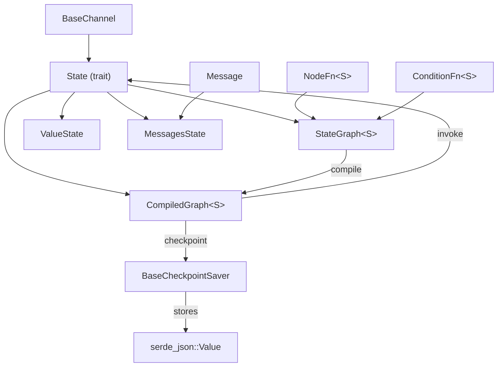

# Data Model: Generic State Trait

**Branch**: `002-generic-state-trait` | **Date**: 2026-03-15

## Entities

### State (trait)

The foundational trait for typed graph state. All graph state types must implement this.

| Attribute | Type | Description |
|-----------|------|-------------|
| (supertrait) | `Send + Sync + Clone + Serialize + DeserializeOwned + 'static` | Required bounds for async graph execution and checkpoint serialisation |

| Method | Signature | Description |
|--------|-----------|-------------|
| `channels` | `fn channels() -> Vec<(String, Box<dyn BaseChannel>)>` | Returns channel configuration for each field. Generated by `#[derive(State)]`. |
| `from_channels` | `fn from_channels(channels: &HashMap<String, Box<dyn BaseChannel>>) -> Result<Self, GraphError>` | Reconstructs state from channel values. Generated by `#[derive(State)]`. |
| `to_value` | `fn to_value(&self) -> Result<Value, GraphError>` | Default: serialises self to JSON Value. Used at checkpoint boundaries. |
| `from_value` | `fn from_value(v: Value) -> Result<Self, GraphError>` | Default: deserialises from JSON Value. Used at checkpoint resume. |

### ValueState (struct)

Backward-compatible wrapper enabling existing Value-based code to work with generic graphs.

| Field | Type | Description |
|-------|------|-------------|
| `0` | `serde_json::Value` | The wrapped JSON value |

Implements `State` with a single passthrough channel. `channels()` returns one `AnyValue` channel keyed `"__value__"`. `from_channels` extracts the `"__value__"` channel.

### MessagesState (struct)

Built-in state type for chat-based agents.

| Field | Type | Channel | Description |
|-------|------|---------|-------------|
| `messages` | `Vec<Message>` | Topic | Conversation history. Accumulates via Topic channel semantics (append, not replace). |

Derives `State` with `#[reducer(topic)]` on `messages`.

### NodeFn\<S\> (type alias)

```
Box<dyn Fn(S) -> BoxFuture<'static, Result<S, GraphError>> + Send + Sync>
```

Boxed async function that transforms typed state. Used as node implementations in `StateGraph<S>`.

### ConditionFn\<S\> (type alias)

```
Box<dyn Fn(&S) -> String + Send + Sync>
```

Boxed function that inspects typed state reference and returns a branch name for conditional edges.

### StateGraph\<S: State\> (struct)

| Field | Type | Description |
|-------|------|-------------|
| `nodes` | `HashMap<String, NodeFn<S>>` | Named node functions |
| `edges` | `Vec<(String, String)>` | Static edges (from, to) |
| `conditional_edges` | `Vec<(String, ConditionFn<S>, HashMap<String, String>)>` | Conditional edges with routing |
| `entry_point` | `Option<String>` | Entry node name |
| `finish_points` | `Vec<String>` | Terminal node names |

Phantom data for `S` is not needed — `S` appears in `NodeFn<S>` and `ConditionFn<S>`.

### CompiledGraph\<S: State\> (struct)

| Field | Type | Description |
|-------|------|-------------|
| `nodes` | `HashMap<String, NodeFn<S>>` | Named node functions (moved from StateGraph) |
| `edges` | `HashMap<String, Vec<String>>` | Resolved edge map |
| `conditional_edges` | `HashMap<String, (ConditionFn<S>, HashMap<String, String>)>` | Resolved conditional edge map |
| `entry_point` | `String` | Entry node name |
| `recursion_limit` | `usize` | Maximum superstep count |

### GraphError (enum — extension)

New variant added:

| Variant | Fields | Description |
|---------|--------|-------------|
| `DeserializationError` | `field: String, message: String` | Failed to deserialise a channel value into a typed field |

## Relationships



## State Transitions

Graph execution flow with typed state:

```mermaid
stateDiagram-v2
    [*] --> Input: S
    Input --> NodeExec: current_node != END
    NodeExec --> EdgeResolve: node_fn(state) -> Result&lt;S&gt;
    EdgeResolve --> NodeExec: next node found
    EdgeResolve --> Checkpoint: checkpoint enabled
    Checkpoint --> NodeExec: S.to_value() -> store -> S::from_value()
    EdgeResolve --> Output: next == END
    Output --> [*]: Result&lt;S&gt;
    NodeExec --> Error: GraphError
    Error --> [*]
```
