# Data Model: Agent Core Runtime

**Feature**: 003-agent-core | **Date**: 2026-03-15 (expanded 2026-03-16, MCP adapters 2026-03-16)

## Entity Overview

```mermaid
erDiagram
    Agent ||--o{ Plugin : "composes"
    Agent ||--|| ExecutionStrategy : "uses"
    Agent ||--o{ Middleware : "stacks"
    Agent ||--o{ Tool : "registers"
    Agent ||--|| Runner : "managed by"
    Agent ||--|| SignalRouter : "routes via"
    Agent ||--o| SandboxConfig : "isolates via"
    Agent ||--o{ McpServerConfig : "connects to"
    Agent ||--|| HookRegistry : "hooks via"
    Agent ||--o| PermissionMode : "enforces"

    Plugin ||--|| PluginStateKey : "declares"
    PluginStateKey ||--|| PluginState : "maps to"

    ExecutionStrategy ||--o{ FsmTransition : "defines (FSM)"
    ExecutionStrategy ||--o{ SignalRoute : "contributes"

    Middleware ||--o{ Tool : "provides"
    Middleware ||--o{ DirectiveFilter : "implements"

    Runner ||--o{ Session : "manages"
    Runner ||--o{ Plugin : "scopes"

    Session ||--|| Usage : "tracks"
    Session ||--o| Session : "forked from"

    Agent ||--|| ToolSearchIndex : "discovers tools via"
    Vfs ||--o{ Middleware : "exposed by"
    Vfs ||--|| ApprovalGate : "gated by"
    StorageLayout ||--o{ WorktreeId : "computes paths for"
    WorktreeId }|--|| RepoId : "belongs to"
    SynwireDaemon ||--o{ RepoId : "manages"
    SynwireDaemon ||--|| StorageLayout : "uses"
    SynwireDaemon ||--|| SemanticIndex : "owns"
    SemanticIndex ||--|| CodeGraph : "builds"
    SemanticIndex ||--o| CommunityState : "detects via"
    SkillLoader ||--o{ AgentSkill : "discovers"
    AgentSkill ||--|| SkillRuntime : "executes via"
    SamplingProvider ||--o| CommunityState : "summarises"
    McpServer ||--|| SynwireDaemon : "connects to"
    McpServer ||--|| SkillLoader : "loads skills"
    McpServer ||--|| ToolSearchIndex : "exposes via"

    MultiServerMcpClient ||--o{ McpClientSession : "manages"
    MultiServerMcpClient ||--o{ ToolCallInterceptor : "composes"
    MultiServerMcpClient ||--|| McpCallbacks : "notifies via"
    McpClientSession ||--|| Connection : "uses"
    ToolProvider ||--o{ Tool : "discovers"
    CompositeToolProvider ||--o{ ToolProvider : "aggregates"
    McpToolProvider ||--|| MultiServerMcpClient : "backed by"
    Tool ||--o| ToolCategory : "classified as"
    Tool ||--o| ToolKind : "kind"
    ToolOutput ||--o| ToolContentType : "content type"
    CompiledGraph ||--o| Tool : "as_tool()"

    DirectiveResult }|--|| Directive : "contains"
    DirectiveResult }|--|| State : "updates"
    Directive ||--o| DirectiveExecutor : "executed by"
    Directive ||--o| DirectiveFilter : "filtered by"

    AgentNode ||--|{ AgentEvent : "emits"
    AgentNode ||--o{ AgentNode : "sub-agents"

    HookRegistry ||--o{ HookCallback : "registers"
    McpServerConfig ||--o{ Tool : "provides"
    ModelInfo ||--|| ModelCapabilities : "describes"
```

## Core Entities

### Directive

Typed effect description returned by agent nodes. Never executed by agent logic — enables pure unit testing.

| Field | Type | Required | Description |
|-------|------|----------|-------------|
| type | `DirectiveVariant` | Y | Discriminant: Emit, SpawnAgent, StopChild, Schedule, RunInstruction, Cron, Stop, SpawnTask, StopTask, Custom |

**Variants**:

| Variant | Fields | Description |
|---------|--------|-------------|
| `Emit` | `event: AgentEvent` | Emit an event to the event stream |
| `SpawnAgent` | `name: String, config: Value` | Request spawning a child agent |
| `StopChild` | `name: String` | Request stopping a child agent |
| `Schedule` | `action: String, delay: Duration` | Schedule a delayed action |
| `RunInstruction` | `instruction: String, input: Value` | Request runtime to execute and route result back |
| `Cron` | `expression: String, action: String` | Schedule recurring action |
| `Stop` | `reason: Option<String>` | Request agent stop |
| `SpawnTask` | `description: String, input: Value` | Spawn a background task, returns task ID |
| `StopTask` | `task_id: String` | Cancel a background task by ID |
| `Custom` | `payload: Box<dyn DirectivePayload>` | User-defined directive |

**Validation**: All variants `Serialize + Deserialize`. Custom variant requires `typetag` registration.
**State transitions**: N/A — directives are data, not stateful.

### `DirectiveResult<S>`

| Field | Type | Required | Description |
|-------|------|----------|-------------|
| state | `S: State` | Y | Updated agent state (applied immediately) |
| directives | `Vec<Directive>` | Y | Deferred effect descriptions (default: empty) |

### ExecutionStrategy

Controls how agent orchestrates actions.

**Implementations**:

| Name | Description | State |
|------|-------------|-------|
| `DirectStrategy` | Executes actions immediately, sequentially | Stateless |
| `FsmStrategy` | Enforces state transitions; rejects invalid actions | `Mutex<FsmStateId>`, transition table |

### FsmTransition

| Field | Type | Required | Description |
|-------|------|----------|-------------|
| from | `FsmStateId` (newtype `String`) | Y | Source state |
| to | `FsmStateId` | Y | Target state |
| action | `ActionId` (newtype `String`) | Y | Action triggering transition |
| guard | `Option<Arc<dyn GuardCondition>>` | N | Optional runtime guard predicate |

**Validation**: Builder validates at `build()` time: all referenced states declared, initial state set, no duplicate (from, action) pairs.

### PluginStateKey (trait)

| Associated Item | Type | Description |
|-----------------|------|-------------|
| `State` | `Send + Sync + Default + Serialize + DeserializeOwned + Clone` | Plugin's state type |
| `KEY` | `&'static str` | Unique serialization key |

### Plugin (trait)

| Hook | Signature | Description |
|------|-----------|-------------|
| `on_user_message` | `(&self, msg: &Message) -> BoxFuture<Result<()>>` | Called on user message |
| `on_event` | `(&self, event: &AgentEvent) -> BoxFuture<Result<()>>` | Called on agent event |
| `before_run` | `(&self, ctx: &RunContext) -> BoxFuture<Result<()>>` | Pre-run hook |
| `after_run` | `(&self, ctx: &RunContext, result: &AgentResult) -> BoxFuture<Result<()>>` | Post-run hook |
| `state_key` | `fn() -> &'static str` | Plugin's state key (for registration) |

### Vfs (trait)

| Method | Return Type | Description |
|--------|-------------|-------------|
| `ls` | `Vec<DirEntry>` | List directory contents |
| `read` | `FileContent` | Read file content |
| `write` | `WriteResult` | Write file |
| `edit` | `EditResult` | Edit file (line-level operations) |
| `grep` | `Vec<GrepMatch>` | Search file contents |
| `glob` | `Vec<GlobEntry>` | Find files by pattern |
| `upload` | `TransferResult` | Upload file to backend |
| `download` | `TransferResult` | Download file from backend |
| `pwd` | `String` | Get current working directory (sync) |
| `cd` | `()` | Change working directory (sync) |
| `rm` | `()` | Remove file/directory |
| `cp` | `()` | Copy file/directory |
| `mv_file` | `()` | Move/rename file |
| `tree` | `TreeNode` | Recursive directory tree |
| `head` | `FileContent` | Read first N lines of file |
| `tail` | `FileContent` | Read last N lines of file |
| `stat` | `FileInfo` | File metadata (size, perms, timestamps) |
| `wc` | `WordCount` | Line/word/byte counts |
| `du` | `DiskUsage` | Disk usage for path |
| `diff` | `DiffResult` | Diff between two files or buffers |
| `find` | `Vec<GlobEntry>` | Find files by complex predicates |
| `mkdir` | `()` | Create directory (recursive) |
| `touch` | `()` | Create or update file timestamp |
| `append` | `WriteResult` | Append content to file |
| `ln` | `()` | Create symlink |
| `chmod` | `()` | Change file permissions |
| `watch` | `WatchStream` | Watch path for changes |
| `check_stale` | `bool` | Check if cached content is stale |
| `index` | `IndexResult` | Trigger indexing of path |
| `index_status` | `IndexStatus` | Query indexing progress |
| `semantic_search` | `Vec<SemanticSearchResult>` | Search by natural language query |
| `skeleton` | `String` | AST skeleton of file |
| `graph_query` | `Vec<GraphNode>` | Query code graph by node |
| `graph_search` | `Vec<GraphNode>` | Search code graph by pattern |
| `hybrid_search` | `Vec<SearchResult>` | Combined text + semantic search |
| `community_search` | `Vec<CommunityResult>` | Search code communities |
| `capabilities` | `VfsCapabilities` | Query supported operations |

All async methods return `BoxFuture<'_, Result<T, VfsError>>`.

### Backend Response Types

| Type | Fields | Description |
|------|--------|-------------|
| `DirEntry` | `name, path, is_dir, size, modified` | Directory listing entry |
| `FileContent` | `content: Vec<u8>, mime_type: Option<String>` | File content |
| `WriteResult` | `path, bytes_written` | Write operation result |
| `EditResult` | `path, edits_applied, content_after` | Edit operation result |
| `GrepMatch` | `file, line_number, column, line_content, before: Vec<String>, after: Vec<String>` | Search match with context |
| `GlobEntry` | `path, is_dir, size` | Glob match entry |
| `TransferResult` | `path, bytes_transferred` | Upload/download result |
| `FileInfo` | `path, size, is_dir, is_symlink, modified, permissions` | File metadata |
| `ExecuteResponse` | `exit_code, stdout, stderr` | Shell execution result |
| `ProcessInfo` | `pid, command, cpu_pct, mem_bytes, parent_pid, state` | Process info |
| `JobInfo` | `id, pid, command, status` | Background job info |
| `ArchiveInfo` | `entries: Vec<ArchiveEntry>, format, compressed_size` | Archive listing |

### GrepOptions

| Field | Type | Default | Description |
|-------|------|---------|-------------|
| `path` | `Option<String>` | `None` (cwd) | Search root |
| `after_context` | `u32` | `0` | Lines after match |
| `before_context` | `u32` | `0` | Lines before match |
| `context` | `Option<u32>` | `None` | Symmetric context |
| `case_insensitive` | `bool` | `false` | Case-insensitive |
| `glob` | `Option<String>` | `None` | File glob filter |
| `file_type` | `Option<String>` | `None` | File type filter |
| `max_matches` | `Option<usize>` | `None` | Max matches |
| `output_mode` | `GrepOutputMode` | `Content` | Output format |
| `multiline` | `bool` | `false` | Multiline matching |
| `line_numbers` | `bool` | `true` | Include line numbers |
| `invert` | `bool` | `false` | Invert match |
| `fixed_string` | `bool` | `false` | Literal (not regex) |

### VfsError

| Code | Variant | Description |
|------|---------|-------------|
| `file_not_found` | `NotFound(String)` | File/directory not found |
| `permission_denied` | `PermissionDenied(String)` | Permission denied |
| `is_directory` | `IsDirectory(String)` | Expected file, got directory |
| `invalid_path` | `PathTraversal { attempted, root }` | Path traversal blocked |
| `scope_violation` | `ScopeViolation { path, scope }` | Operation outside allowed scope |
| `resource_limit` | `ResourceLimit(String)` | Resource exhausted |
| `timeout` | `Timeout(String)` | Operation timed out |
| `operation_denied` | `OperationDenied(String)` | User denied approval |
| `not_supported` | `Unsupported(String)` | Backend doesn't support operation |
| `io` | `Io(std::io::Error)` | I/O error |
| `stale_read` | `StaleRead { path, cached_at, modified_at }` | Cached content is stale |
| `index_not_ready` | `IndexNotReady(String)` | Index not yet built or in progress |
| `index_denied` | `IndexDenied(String)` | Indexing denied by policy |

### Middleware (trait)

| Method | Return | Description |
|--------|--------|-------------|
| `name` | `&str` | Middleware identifier |
| `process` | `BoxFuture<Result<MiddlewareResult>>` | Process request through middleware |
| `tools` | `Vec<Box<dyn Tool>>` | Tools provided by this middleware |
| `system_prompt_additions` | `Option<String>` | Prompt additions |

### MiddlewareResult

| Variant | Description |
|---------|-------------|
| `Continue(AgentResult)` | Pass result to next middleware |
| `Terminate(AgentResult)` | Short-circuit remaining middleware |

### `Agent<D, O>`

Builder API for agent construction.

| Field | Type | Description |
|-------|------|-------------|
| `name` | `String` | Agent name |
| `description` | `String` | Agent description |
| `model` | `Box<dyn BaseChatModel>` | Language model |
| `fallback_model` | `Option<Box<dyn BaseChatModel>>` | Fallback model for rate-limit/unavailability |
| `tools` | `Vec<Box<dyn Tool>>` | Registered tools |
| `allowed_tools` | `Option<Vec<String>>` | Tool whitelist (None = all) |
| `excluded_tools` | `Vec<String>` | Tool blacklist |
| `plugins` | `Vec<Box<dyn Plugin>>` | Composed plugins |
| `middleware` | `Vec<Box<dyn Middleware>>` | Middleware stack |
| `hooks` | `HookRegistry` | Lifecycle hooks |
| `strategy` | `Box<dyn ExecutionStrategy>` | Execution strategy |
| `output_mode` | `OutputMode<O>` | Output mode |
| `output_schema` | `Option<serde_json::Value>` | JSON Schema for structured output |
| `max_turns` | `Option<u32>` | Turn limit (default: 10) |
| `max_budget` | `Option<f64>` | Cost limit in USD |
| `effort` | `Option<EffortLevel>` | Reasoning effort (Low/Medium/High/Max) |
| `thinking` | `Option<ThinkingConfig>` | Thinking/reasoning configuration |
| `permission_mode` | `PermissionMode` | Permission preset (default: Default) |
| `permission_rules` | `Vec<PermissionRule>` | Declarative per-tool permission rules |
| `system_prompt` | `Option<SystemPromptConfig>` | System prompt (append or replace) |
| `mcp_servers` | `HashMap<String, McpServerConfig>` | External MCP server connections |
| `sandbox` | `Option<SandboxConfig>` | Agent-level sandbox settings |
| `debug` | `bool` | Enable verbose debug events |
| `debug_file` | `Option<PathBuf>` | Debug output file path |
| `env` | `HashMap<String, String>` | Environment variables for backends |
| `cwd` | `Option<PathBuf>` | Initial working directory |

### `OutputMode<T>`

| Variant | Description |
|---------|-------------|
| `Tool` | Parse structured output from tool call (default, universal) |
| `Native` | Use model's native structured output |
| `Prompt` | Embed JSON schema in prompt |
| `Custom(Box<dyn OutputParser<T>>)` | User-provided parser |

### `RunContext<D>`

| Field | Type | Description |
|-------|------|-------------|
| `dependencies` | `D` | Typed dependencies |
| `model` | `Arc<dyn BaseChatModel>` | Model reference |
| `retry_count` | `u32` | Current retry count |
| `usage` | `Usage` | Token usage accumulator |
| `metadata` | `HashMap<String, Value>` | Arbitrary metadata |

### AgentEvent

| Variant | Fields | `is_final_response` |
|---------|--------|---------------------|
| `TextDelta` | `content: String` | `false` |
| `ToolCallStart` | `id, name` | `false` |
| `ToolCallDelta` | `id, arguments_delta` | `false` |
| `ToolCallEnd` | `id` | `false` |
| `ToolResult` | `id, output: ToolOutput` | `false` |
| `ToolProgress` | `id, message, progress_pct: Option<f32>` | `false` |
| `StateUpdate` | `patch: Value` | `false` |
| `DirectiveEmitted` | `directive` | `false` |
| `StatusUpdate` | `status: String, progress_pct: Option<f32>` | `false` |
| `UsageUpdate` | `usage: Usage` | `false` |
| `RateLimitInfo` | `utilization_pct, reset_at, allowed: bool` | `false` |
| `TaskNotification` | `task_id, kind: TaskEventKind, payload: Value` | `false` |
| `PromptSuggestion` | `suggestions: Vec<String>` | `false` |
| `TurnComplete` | `reason: TerminationReason` | `true` |
| `Error` | `error: AgentError` | `true` |

### TerminationReason

| Variant | Description |
|---------|-------------|
| `Complete` | Agent finished normally |
| `MaxTurnsExceeded` | Turn limit reached |
| `BudgetExceeded` | Cost limit reached |
| `Stopped` | Graceful stop requested |
| `Aborted` | Force stop |
| `Error` | Terminated due to error |

### Signal

| Field | Type | Description |
|-------|------|-------------|
| `kind` | `SignalKind` | Signal type (UserMessage, Event, Interrupt, Custom) |
| `payload` | `serde_json::Value` | Signal data |
| `source` | `String` | Origin identifier |

### SignalRoute

| Field | Type | Description |
|-------|------|-------------|
| `signal_kind` | `SignalKind` | Which signals this route handles |
| `predicate` | `Option<Arc<dyn Fn(&Signal) -> bool>>` | Optional filter predicate |
| `action` | `Action` | Action to take on match |
| `priority` | `RoutePriority` | Strategy (0), Agent (1), Plugin (2) |

### ApprovalRequest

| Field | Type | Description |
|-------|------|-------------|
| `operation` | `String` | Operation name (write, rm, execute, push) |
| `path` | `Option<String>` | Affected resource path |
| `risk` | `RiskLevel` | Safe, Moderate, Dangerous, Critical |
| `description` | `String` | Human-readable description |

### VfsCapabilities (bitflags)

| Flag | Bit | Description |
|------|-----|-------------|
| `PWD` | 0 | Get working dir |
| `CD` | 1 | Change working dir |
| `LS` | 2 | List directory |
| `TREE` | 3 | Recursive directory tree |
| `READ` | 4 | Read files |
| `HEAD` | 5 | Read first N lines |
| `TAIL` | 6 | Read last N lines |
| `STAT` | 7 | File metadata |
| `WC` | 8 | Line/word/byte counts |
| `DU` | 9 | Disk usage |
| `WRITE` | 10 | Write files |
| `EDIT` | 11 | Edit files |
| `APPEND` | 12 | Append to files |
| `MKDIR` | 13 | Create directories |
| `TOUCH` | 14 | Create/update timestamps |
| `RM` | 15 | Remove files |
| `CP` | 16 | Copy files |
| `MV` | 17 | Move files |
| `LN` | 18 | Create symlinks |
| `CHMOD` | 19 | Change permissions |
| `GREP` | 20 | Search content |
| `GLOB` | 21 | Find files by pattern |
| `FIND` | 22 | Find files by predicate |
| `DIFF` | 23 | Diff files or buffers |
| `UPLOAD` | 24 | Upload files |
| `DOWNLOAD` | 25 | Download files |
| `WATCH` | 26 | Watch for changes |
| `INDEX` | 27 | Trigger indexing |
| `GRAPH` | 28 | Code graph queries |
| `SEMANTIC_SEARCH` | 29 | Semantic search |

## Session Management Entities

### Session

| Field | Type | Description |
|-------|------|-------------|
| `session_id` | `String` | Unique session identifier |
| `created_at` | `DateTime<Utc>` | Creation timestamp |
| `modified_at` | `DateTime<Utc>` | Last modified timestamp |
| `title` | `Option<String>` | User-assigned title |
| `tags` | `Vec<String>` | User-assigned tags |
| `summary` | `Option<String>` | Auto-generated summary |
| `forked_from` | `Option<ForkInfo>` | Parent session and fork point if forked |
| `state` | `S: State` | Current agent state |
| `conversation` | `Vec<Message>` | Message history |
| `plugin_state` | `PluginStateMap` | Serialized plugin state |

### `ForkInfo`

| Field | Type | Description |
|-------|------|-------------|
| `parent_session_id` | `String` | ID of parent session |
| `fork_message_id` | `String` | Message at which fork occurred |

### `SessionMetadata`

| Field | Type | Description |
|-------|------|-------------|
| `session_id` | `String` | Session ID |
| `created_at` | `DateTime<Utc>` | Creation timestamp |
| `modified_at` | `DateTime<Utc>` | Last modified |
| `title` | `Option<String>` | Title |
| `tags` | `Vec<String>` | Tags |
| `summary` | `Option<String>` | Summary |

### `RewindResult`

| Field | Type | Description |
|-------|------|-------------|
| `can_rewind` | `bool` | Whether rewind is possible |
| `files_changed` | `Vec<String>` | Files affected by rewind |
| `insertions` | `u32` | Lines added back |
| `deletions` | `u32` | Lines removed |

## Hook System Entities

### `HookRegistry`

Container for lifecycle hook registrations. Immutable once the agent is built.

### `HookCallback` (trait)

| Method | Signature | Description |
|--------|-----------|-------------|
| `invoke` | `(&self, input: HookInput, signal: &AbortSignal) -> BoxFuture<Result<HookOutput>>` | Execute the hook |

### Hook Types

| Hook | Input | Output | Can Modify |
|------|-------|--------|------------|
| `PreToolUse` | `tool_name, args` | `approve / reject(reason) / modify(new_args)` | Yes (args) |
| `PostToolUse` | `tool_name, args, result` | `passthrough / modify(new_result)` | Yes (result) |
| `PostToolUseFailure` | `tool_name, args, error` | `retry / skip / abort` | Yes (recovery) |
| `Notification` | `event_kind, payload` | `()` (observation only) | No |
| `SubagentStart` | `agent_name, config` | `()` | No |
| `SubagentStop` | `agent_name, reason` | `()` | No |
| `PreCompact` | `token_usage, utilization_pct` | `()` | No |
| `PostCompact` | `summary, tokens_freed` | `()` | No |
| `SessionStart` | `source: New/Resume/Fork, initial_prompt` | `additional_context` | Yes (context) |
| `SessionEnd` | `reason: Complete/Error/Abort/Timeout` | `()` | No |

### `HookMatcher`

| Field | Type | Description |
|-------|------|-------------|
| `pattern` | `Option<String>` | Tool name glob pattern (e.g., `"fs_*"`) |
| `hooks` | `Vec<Box<dyn HookCallback>>` | Callbacks for this matcher |
| `timeout` | `Option<Duration>` | Per-hook timeout (skip on exceed) |

## Model Management Entities

### `ModelInfo`

| Field | Type | Description |
|-------|------|-------------|
| `id` | `String` | Model identifier |
| `display_name` | `String` | Human-readable name |
| `description` | `String` | Model description |
| `capabilities` | `ModelCapabilities` | Feature support flags |
| `context_window` | `u32` | Max context tokens |
| `max_output_tokens` | `u32` | Max output tokens |
| `supported_effort_levels` | `Vec<EffortLevel>` | Supported reasoning levels |

### `ModelCapabilities`

| Field | Type | Description |
|-------|------|-------------|
| `tool_calling` | `bool` | Supports tool use |
| `vision` | `bool` | Supports image input |
| `streaming` | `bool` | Supports streaming output |
| `structured_output` | `bool` | Supports native JSON mode |
| `effort_levels` | `bool` | Supports reasoning effort |

### `EffortLevel`

| Variant | Description |
|---------|-------------|
| `Low` | Minimal reasoning |
| `Medium` | Moderate reasoning |
| `High` | Deep reasoning (default) |
| `Max` | Maximum reasoning |

### `ThinkingConfig`

| Variant | Fields | Description |
|---------|--------|-------------|
| `Adaptive` | — | Model decides reasoning depth |
| `Enabled` | `budget_tokens: u32` | Fixed token budget for reasoning |
| `Disabled` | — | No reasoning/thinking |

### `Usage`

| Field | Type | Description |
|-------|------|-------------|
| `input_tokens` | `u64` | Input tokens consumed |
| `output_tokens` | `u64` | Output tokens generated |
| `cache_read_tokens` | `u64` | Tokens read from cache |
| `cache_creation_tokens` | `u64` | Tokens written to cache |
| `cost_usd` | `f64` | Estimated cost in USD |
| `context_utilization_pct` | `f32` | Context window usage 0.0–1.0 |

## MCP Entities

### `McpServerConfig`

| Variant | Fields | Description |
|---------|--------|-------------|
| `Stdio` | `command, args, env, cwd` | Subprocess with stdio transport |
| `Http` | `url, headers` | HTTP streamable transport |
| `Sse` | `url, headers` | Server-sent events transport |
| `InProcess` | `name, tools` | Embedded MCP server from tool definitions |

### `McpServerStatus`

| Field | Type | Description |
|-------|------|-------------|
| `name` | `String` | Server name |
| `state` | `McpConnectionState` | Connected, Failed, Pending, Disabled |
| `server_info` | `Option<(String, String)>` | Server name + version |
| `tools` | `Vec<McpToolInfo>` | Available tools with annotations |
| `error` | `Option<String>` | Error detail if failed |

### `ElicitationRequest`

| Field | Type | Description |
|-------|------|-------------|
| `server_name` | `String` | Requesting MCP server |
| `message` | `String` | Message to display to user |
| `requested_schema` | `Option<Value>` | Optional input schema |

### `ElicitationResult`

| Variant | Description |
|---------|-------------|
| `Accept(Value)` | User provided input |
| `Decline` | User declined |
| `Cancel` | User cancelled |

## Permission Entities

### `PermissionMode`

| Variant | Description |
|---------|-------------|
| `Default` | Prompt for dangerous operations |
| `AcceptEdits` | Auto-approve file modifications |
| `PlanOnly` | Read-only, no mutations |
| `BypassAll` | Auto-approve everything |
| `DenyUnauthorized` | Deny if no pre-approved rule matches |

### `PermissionRule`

| Field | Type | Description |
|-------|------|-------------|
| `tool_pattern` | `String` | Glob pattern for tool names |
| `behavior` | `PermissionBehavior` | Allow, Deny, Ask |

### `ApprovalDecision`

| Variant | Description |
|---------|-------------|
| `Allow` | Approve this operation |
| `Deny` | Deny this operation |
| `AllowAlways` | Approve and remember for matching pattern |
| `Abort` | Deny and stop the entire agent |

## Tool Entities

### `ToolAnnotations`

| Field | Type | Description |
|-------|------|-------------|
| `read_only` | `bool` | Tool only reads, no side effects |
| `destructive` | `bool` | Tool may cause data loss |
| `open_world` | `bool` | Tool accesses external resources |

### `ToolOutput` (extended)

| Field | Type | Description |
|-------|------|-------------|
| `content` | `String` | Text result for LLM |
| `binary_results` | `Vec<BinaryResult>` | Binary results (bytes + MIME type) |
| `status` | `ToolResultStatus` | Success, Failure, Rejected, Denied |
| `artifact` | `Option<Value>` | Structured artifact |
| `telemetry` | `Option<Value>` | Tool telemetry metadata |

### `ToolResultStatus`

| Variant | Description |
|---------|-------------|
| `Success` | Tool completed successfully |
| `Failure` | Tool failed with error |
| `Rejected` | Tool invocation rejected by hook |
| `Denied` | Tool invocation denied by permission |

## System Prompt Entities

### `SystemPromptConfig`

| Variant | Fields | Description |
|---------|--------|-------------|
| `Append` | `content: String` | Append to base system prompt |
| `Replace` | `content: String` | Completely replace system prompt |

## Sandbox Entities

### `SandboxConfig`

| Field | Type | Description |
|-------|------|-------------|
| `enabled` | `bool` | Enable sandboxing |
| `network` | `Option<NetworkConfig>` | Network isolation rules |
| `filesystem` | `Option<FilesystemConfig>` | Filesystem scope restrictions |
| `allowed_commands` | `Option<Vec<String>>` | Command whitelist |
| `denied_commands` | `Vec<String>` | Command blacklist |

## Error Entities

### `AgentError`

| Variant | Retryable | Description |
|---------|-----------|-------------|
| `Model(ModelError)` | depends on subtype | Model API error |
| `Tool(ToolError)` | default: Continue | Tool execution error |
| `Strategy(StrategyError)` | No | Invalid transition etc. |
| `Middleware(MiddlewareError)` | No | Middleware failure |
| `Directive(DirectiveError)` | No | Directive execution error |
| `Backend(VfsError)` | No | Backend operation error |
| `Session(SessionError)` | No | Session management error |
| `Panic(String)` | No | Caught panic with payload |
| `BudgetExceeded(f64)` | No | Cost limit exceeded |

### `ModelError` subtypes

| Variant | Retryable | Description |
|---------|-----------|-------------|
| `Authentication` | No (Abort) | Auth failure |
| `Billing` | No (Abort) | Billing/quota error |
| `RateLimit` | Yes (Retry) | Rate limited |
| `ServerError` | Yes (Retry) | Provider server error |
| `InvalidRequest` | No | Malformed request |
| `MaxOutputTokens` | No | Output exceeded limit |

## Storage Layout Entities

### `StorageLayout`

| Field | Type | Description |
|-------|------|-------------|
| `product` | `String` | Product name (e.g., "claude-code") |
| `root_override` | `Option<PathBuf>` | Override for all storage paths |

Methods: `data_home()`, `cache_home()`, `session_db(session_id)`, `index_cache(project_id)`, `graph_dir(project_id)`, `communities_dir(project_id)`, `experience_db(project_id)`, `lsp_cache(project_id)`, `models_cache()`, `logs_dir()`, `skills_dir()`, `project_skills_dirname()`, `repos_cache()`, `repo_cache(owner, repo)`, `global_experience_db()`, `global_dependency_db()`, `global_registry()`, `global_config()`

### `RepoId`

Git first-commit hash. Stable across worktrees and directory moves. Fallback: `sha256(canonical_path)`.

| Field | Type | Description |
|-------|------|-------------|
| `id` | `String` | First commit hash or path hash |
| `display_name` | `String` | Human-readable repo/dir name |

### `WorktreeId`

`RepoId` + worktree root path hash. Per-branch index identity.

| Field | Type | Description |
|-------|------|-------------|
| `repo_id` | `RepoId` | Repository family |
| `worktree_hash` | `String` | sha256 of worktree root path |
| `display_name` | `String` | Repo name + branch |

### `StorageMigration` (trait)

| Method | Return | Description |
|--------|--------|-------------|
| `current_version` | `u32` | Current schema version |
| `migrate` | `Result<()>` | Run migration from version A to B |

## Semantic Search Entities

### `SemanticIndex`

Pipeline orchestrating walk, chunk, embed, store.

| Field | Type | Description |
|-------|------|-------------|
| `embeddings` | `Arc<dyn Embeddings>` | Embedding model |
| `reranker` | `Option<Arc<dyn Reranker>>` | Cross-encoder reranker |
| `store_factory` | `StoreFactory` | Vector store constructor |
| `config` | `IndexConfig` | Chunk size, overlap, cache base |

### `IndexConfig`

| Field | Type | Default | Description |
|-------|------|---------|-------------|
| `cache_base` | `Option<PathBuf>` | Platform default | Override cache directory |
| `chunk_size` | `usize` | 1500 | Target chunk size (chars) |
| `chunk_overlap` | `usize` | 200 | Overlap between chunks |

### `SemanticSearchOptions`

| Field | Type | Default | Description |
|-------|------|---------|-------------|
| `top_k` | `Option<usize>` | 10 | Max results |
| `min_score` | `Option<f32>` | 0.0 | Minimum similarity |
| `file_filter` | `Vec<String>` | `[]` | Glob patterns for files |
| `rerank` | `Option<bool>` | true | Use cross-encoder reranking |

### `SemanticSearchResult`

| Field | Type | Description |
|-------|------|-------------|
| `file` | `String` | File path |
| `line_start` | `usize` | Start line (1-indexed) |
| `line_end` | `usize` | End line (1-indexed) |
| `content` | `String` | Matched chunk text |
| `score` | `f32` | Similarity score |
| `symbol` | `Option<String>` | Symbol name from AST |
| `language` | `Option<String>` | Detected language |

### `CodeGraph`

Disk-backed (SQLite WAL) directed graph of code entities.

| Node type | Identity | Description |
|-----------|----------|-------------|
| `File` | path | Source file |
| `Symbol` | (file, name) | Function, type, trait, etc. |

| Edge type | From | To | Description |
|-----------|------|-----|-------------|
| `Calls` | Symbol | Symbol | Function call |
| `Imports` | File | File | Import/use statement |
| `Contains` | File | Symbol | Definition in file |
| `Inherits` | Symbol | Symbol | Trait impl, class extends |

## Tool Search Entities

### `ToolSearchIndex`

Framework-level progressive tool discovery.

| Field | Type | Description |
|-------|------|-------------|
| `tools` | `Vec<ToolDescriptor>` | Registered tools with metadata |
| `embeddings` | `Arc<dyn Embeddings>` | Shared embedding model |
| `index` | LanceDB table | Pre-computed tool+example embeddings |
| `loaded_schemas` | `HashSet<String>` | Schemas already in context (dedup) |

### `ToolDescriptor`

| Field | Type | Description |
|-------|------|-------------|
| `namespace` | `String` | e.g., "file", "search", "graph" |
| `name` | `String` | Namespaced name (e.g., "file.read") |
| `description` | `String` | Max 100 chars, LLM-optimised |
| `parameters` | `JsonSchema` | schemars-generated |
| `example_queries` | `Vec<String>` | 3-5 "when would you need this?" |
| `tags` | `Vec<String>` | Keywords for boosting |

### `DisclosureDepth`

| Variant | ~Tokens | Content |
|---------|---------|---------|
| `Minimal` | 5 | Name only |
| `Summary` | 20 | Name + description |
| `Parameters` | 80 | Name + description + param names/types |
| `Full` | 200-500 | Complete JSON Schema |

## Agent Skills Entities

### `AgentSkill`

Directory following agentskills.io spec.

| Field | Type | Description |
|-------|------|-------------|
| `name` | `String` | 1-64 chars, lowercase+hyphens, matches dir |
| `description` | `String` | 1-1024 chars |
| `license` | `Option<String>` | License |
| `compatibility` | `Option<String>` | 1-500 chars, env requirements |
| `metadata` | `HashMap<String, String>` | Arbitrary key-value (author, version) |
| `allowed_tools` | `Option<String>` | Space-delimited tool list |
| `runtime` | `Option<SkillRuntime>` | Synwire extension: execution backend |
| `body` | `String` | Markdown instructions |
| `scripts_dir` | `Option<PathBuf>` | scripts/ |
| `references_dir` | `Option<PathBuf>` | references/ |
| `assets_dir` | `Option<PathBuf>` | assets/ |

### `SkillRuntime`

| Variant | Engine | Sandboxing |
|---------|--------|------------|
| `Lua` | mlua (LuaJIT/5.4) | Instruction limit (1M default) |
| `Rhai` | rhai native | max_operations (1M default), no imports |
| `Wasm` | extism | Memory limit (64MB default), allowed-tools only |
| `ToolSequence` | native | N/A (composes existing tools) |
| `External` | subprocess | `SandboxConfig` command restrictions |

## Daemon Entities

### `SynwireDaemon`

Singleton per product.

| Field | Type | Description |
|-------|------|-------------|
| `product_name` | `String` | Product identifier |
| `layout` | `StorageLayout` | Path computation |
| `repos` | `HashMap<RepoId, RepoState>` | Managed repositories |
| `embeddings` | `Arc<dyn Embeddings>` | Shared embedding model |
| `socket_path` | `PathBuf` | UDS path |
| `pid_file` | `PathBuf` | PID file path |

### `SamplingProvider` (trait)

| Method | Return | Description |
|--------|--------|-------------|
| `sample` | `BoxFuture<Result<String>>` | Request LLM completion |

Implementations: `McpSampling` (delegates to client), `DirectModel` (uses `BaseChatModel`).

## MCP Adapter Entities

### `MultiServerMcpClient`

Manages connections to N named MCP servers simultaneously.

| Field | Type | Description |
|-------|------|-------------|
| `servers` | `HashMap<String, McpClientSession>` | Named server connections |
| `callbacks` | `McpCallbacks` | Notification callbacks |
| `interceptors` | `Vec<Arc<dyn ToolCallInterceptor>>` | Interceptor chain |
| `tool_name_prefix` | `bool` | Prefix tool names with server name |

### `Connection`

MCP transport variant for server connection.

| Variant | Fields | Description |
|---------|--------|-------------|
| `Stdio` | `command, args, env, cwd` | Child process with stdio |
| `Sse` | `url, headers, timeout` | Legacy SSE transport |
| `StreamableHttp` | `url, headers, timeout, sse_read_timeout` | Current MCP spec transport |
| `WebSocket` | `url, headers` | WebSocket transport |

### `McpClientSession`

Guard-scoped session to a single MCP server. Cleanup on drop.

| Field | Type | Description |
|-------|------|-------------|
| `server_name` | `String` | Server identifier |
| `transport` | `Box<dyn McpTransport>` | Transport implementation |
| `status` | `McpConnectionState` | Current connection state |
| `tools` | `Vec<McpToolInfo>` | Cached tool list |

### `ToolCallInterceptor` (trait)

Onion/middleware for composable tool call wrapping.

| Method | Signature | Description |
|--------|-----------|-------------|
| `intercept` | `(&self, req: McpToolCallRequest, next: InterceptorNext) -> BoxFuture<Result<McpToolCallResult>>` | Wrap tool invocation |

### `McpToolCallRequest`

| Field | Type | Description |
|-------|------|-------------|
| `name` | `String` | Tool name |
| `args` | `Value` | Tool arguments |
| `server_name` | `String` | Target server |
| `headers` | `HashMap<String, String>` | Request headers |
| `context` | `Value` | Runtime context |

### `McpToolCallResult`

| Variant | Description |
|---------|-------------|
| `CallToolResult(Value)` | Raw MCP result |
| `ToolMessage(ToolOutput)` | Converted Synwire output |
| `Command(InterceptorCommand)` | Control flow (short-circuit, retry) |

### `McpCallbacks`

| Field | Type | Description |
|-------|------|-------------|
| `on_logging` | `Option<Box<dyn Fn(LoggingMessage) + Send + Sync>>` | Server log output |
| `on_progress` | `Option<Box<dyn Fn(ProgressNotification) + Send + Sync>>` | Progress notifications |
| `on_elicitation` | `Option<Arc<dyn OnElicitation>>` | User input requests |

### `ToolCategory`

| Variant | Description |
|---------|-------------|
| `Builtin` | Framework-provided tool |
| `Custom` | User-defined (via `#[tool]` or manual impl) |
| `Mcp` | Loaded from MCP server |
| `Remote` | Remote API-backed tool |
| `WorkflowAsTool` | `CompiledGraph::as_tool()` |

### `ToolKind`

| Variant | Description |
|---------|-------------|
| `Read` | Read-only observation |
| `Edit` | Modifies state (files, data) |
| `Search` | Queries/discovers information |
| `Execute` | Runs processes or side effects |
| `Other` | Uncategorised |

### `ToolContentType`

| Variant | Description |
|---------|-------------|
| `Text` | Plain text output |
| `Image` | Image data (bytes + MIME) |
| `File` | File content (path + bytes) |
| `Json` | Structured JSON output |

### `ToolProvider` (trait)

| Method | Return | Description |
|--------|--------|-------------|
| `discover_tools` | `BoxFuture<Vec<Box<dyn Tool>>>` | List all available tools |
| `get_tool` | `BoxFuture<Option<Box<dyn Tool>>>` | Get tool by name |

**Implementations**:

| Name | Description |
|------|-------------|
| `StaticToolProvider` | Fixed set of tools configured at construction |
| `McpToolProvider` | Backed by `MultiServerMcpClient` |
| `CompositeToolProvider` | Aggregates multiple providers |

### `ToolConfig`

Per-tool operational controls.

| Field | Type | Default | Description |
|-------|------|---------|-------------|
| `timeout` | `Option<Duration>` | `None` | Per-tool timeout |
| `timeout_behavior` | `TimeoutBehavior` | `ReturnError` | ReturnError or RaiseException |
| `is_enabled` | `bool` | `true` | Include in LLM schema |
| `max_usage_count` | `Option<u32>` | `None` | Per-session invocation cap |
| `max_result_size` | `usize` | `102400` | Result truncation limit (bytes) |

### `McpAdapterError`

| Variant | Description |
|---------|-------------|
| `ServerNotFound(String)` | Unknown server name |
| `Transport(String)` | Connection/protocol error |
| `ConnectionFailed(String)` | Initial connect failure |
| `Timeout(String)` | Operation timeout |
| `ToolNotFound(String)` | Unknown tool on server |
| `SchemaValidation(String)` | Args failed schema check |
| `UnsupportedContent(String)` | Content type not supported |
Lazy/on-demand only -- zero calls during indexing. Bounded per tool invocation.
